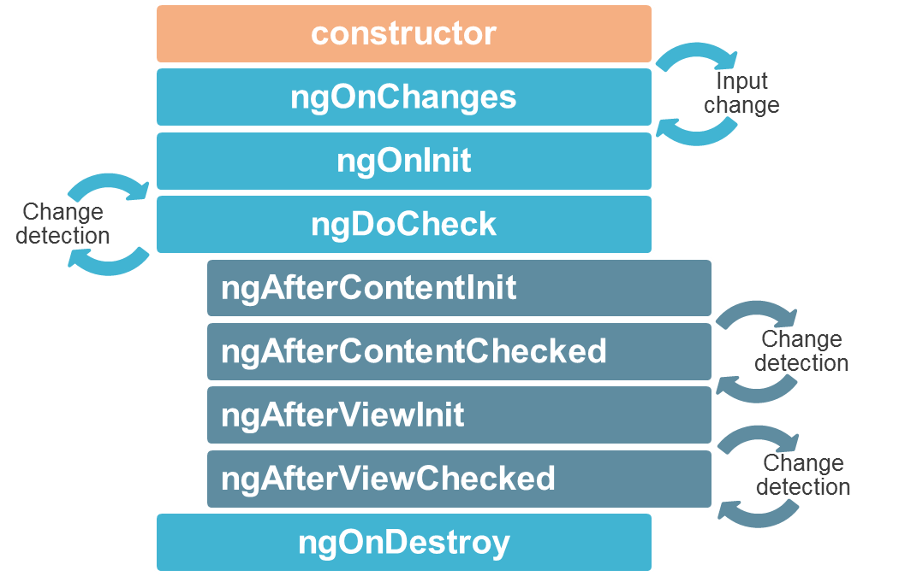
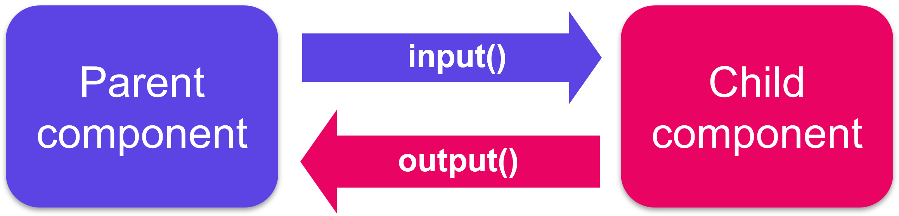

# Components

We've previously seen that:
- a component is a class decorated with the `@Component` decorator
- it is generated via the CLI by the `ng g c component-name` command
- by default, a component is generated with an associated html file and stylesheet file
- the `@Component` decorator has [options](https://angular.io/api/core/Component#description) like `templateUrl`, `styleUrl` or `selector`.

## View encapsulation and styling

You can modify the stylesheet extension of the CLI-generated files in the `angular.json` file under the `schematics` option.

### Encapsulation

Among the `@Component` decorator options, there is one dealing with ViewEncapsulation. Angular provides three types of view encapsulation:
- `ViewEncapsulation.Emulated` (by default): emulates the Shadow DOM, styles are scoped to the component
- `ViewEncapsulation.None`: anything put in the component's stylesheet is available globally throughout the application
- `ViewEncapsulation.Native`: Angular creates Shadow DOM for the component, styles are scoped to the component

:::warning
Under the default option, styles specified in the component's style file are not inherited by any components nested within the template nor by any content projected into the component.
:::

### `:host` selector
Situations may arise where styling the host element of the component from the component's stylesheet is needed. To do so, Angular provides a pseudo-class selector: `:host`.

Let's imagine we require a border on the AppComponent. This is how to add it:

<code-group>
<code-block title="app.component.ts">

```css
:host {
  border: 1px solid black;
}
```
</code-block>
</code-group>

The next example targets the host element again, but only when it also has the active CSS class.

<code-group>
<code-block title="app.component.ts">

```css
:host(.active) {
  border-width: 3px;
}
```
</code-block>
</code-group>

## Lifecycle
A component instance has a lifecycle that starts when Angular instantiates the component class and renders the component view along with its child views. The lifecycle continues with change detection, as Angular checks to see when data-bound properties change, and updates both the view and the component instance as needed. The lifecycle ends when Angular destroys the component instance and removes its rendered template from the DOM.

Angular provides lifecycle hook methods to tap into key events in the lifecycle of a component.



- `ngOnChanges`: called after the constructor and every time input values change. The method receives a SimpleChanges object of current and previous property values.

- `ngOnInit`: called only once. This is where the **component's initialisation** should take place, such as **fetching intial data**. Indeed components should be cheap to construct, so costly operations should be kept out of the constructor. The constructor should do no more than set the initial local variables to simple values.

- `ngDoCheck`: called immediately after `ngOnChanges` on every change detection run, and immediately after `ngOnInit` on the first run. Gives an opportunity to implement a custom change detection algorithm.

- `ngAfterContentInit`: called only once. Invoked after Angular performs any content projection into the component’s view.

- `ngAfterContentChecked`: called after `ngAfterContentInit` and every subsequent `ngDoCheck`.

- `ngAfterViewInit`: called only once. Invoked when the component’s view has been fully initialised.

- `ngAfterViewChecked`: called after `ngAfterViewInit` and every subsequent `ngDoCheck`.

For each lifecycle hook there exists a corresponding interface. Their named is derived from the lifecycle hook's they define minus the `ng`. For instance, to use `ngOnInit()` implement the interface `OnInit`.

## Communication between child and parent components
A common pattern in Angular is sharing data between a parent component and one or more child components. You can implement this pattern by using the `@Input()` and `@Output()` directives. `@Input()` allows a parent component to update data in the child component. Conversely, `@Output()` allows the child to send data to a parent component.



### @Input()

Adding the `@Input()` decorator on a child component's property means that it can receive its value from its parent component. The parent component passes that value through property binding in its template. Such a property **should not be mutated by the child** directly. Mutations should happen in the parent, they will automatically propagate via the property binding.

Here is how the `AppComponent` would communicate to its child component `BlogPostComponent` the title and content of its article.

<code-group>
<code-block title="Parent component">

```ts
// app.component.ts
import { Component } from "@angular/core";
@Component({
  selector: "my-app",
  templateUrl: "./app.component.html"
})
export class AppComponent {
  article = {
    title: "My first awesome article",
    content: "This content is super interesting"
  };
}

// app.component.html
<app-blog-post [title]="article.title" [content]="article.content"><app-blog-post>
```
</code-block>

<code-block title="Child component">

```ts
// blog-post.component.ts
import { Component, Input } from "@angular/core";
@Component({
  selector: "app-blog-post",
  templateUrl: "./blog-post.component.html"
})
export class BlogPostComponent {
  @Input() title: string;
  @Input() content: string;
}

// blog-post.component.html
<article>
  <h3>{{ title }}</h3>
  <p>{{ content }}</p>
</article>
```
</code-block>
</code-group>

To watch for changes on an `@Input()` property, you can use the `ngOnChanges` lifecycle hook.

**Exercise: Pass down each book's info to the BookComponent**
<iframe height='500' width='100%' src="https://stackblitz.com/edit/angular-input-training?ctl=1&embed=1&file=src/app/book/book.component.ts&hideNavigation=1"></iframe>

### @Output()

Child components communicate with their parents by using events: they emit **events** that propagate to their parent. **A good component is agnostic of its environment**, it does not know its parents and does not know if the events it emits will ever be intercepted (or "listened to").

Adding the `@Output()` decorator on a child component's `EventEmitter` property allows data to flow from the child to the parent. The parent component can react to the event through the event binding syntax.

Here is how the `AddTaskComponent` would communicate back to its parent that a new task has been added:

<code-group>
<code-block title="Parent component">

```ts
// app.component.ts
import { Component } from "@angular/core";
@Component({
  selector: "my-app",
  templateUrl: "./app.component.html"
})
export class AppComponent {
  items = ['Do the laundry', 'Wash the dishes', 'Read 20 pages'];

  addItem(item: string): void {
    this.items.push(item);
  }
}

// app.component.html
<h1>My To-do list</h1>
<ul>
  <li *ngFor="let item of items">{{item}}</li>
</ul>
<app-add-task (newTask)="addItem($event)"></app-add-task>
```
</code-block>

<code-block title="Child component">

```ts
// add-task.component.ts
import { Component, EventEmitter, Output } from "@angular/core";
@Component({
  selector: "app-add-task",
  templateUrl: "./add-task.component.html"
})
export class AddTaskComponent {
  @Output() newTask = new EventEmitter<string>();

  addNewTask(task: string): void {
    this.newTask.emit(task);
  }
}

// add-task.component.html
<label>New task: <input #newTask/></label>
<button (click)="addNewTask(newTask.value)">Add</button>
```
</code-block>
</code-group>

You can play with this exemple [here](https://stackblitz.com/edit/angular-output-training-example?file=src/app/app.component.ts).

**Exercise: Books are now borrowable, communicate when books are borrowed to their parent component**
<iframe height='500' width='100%' src="https://stackblitz.com/edit/angular-output-training?ctl=1&embed=1&file=src/app/book/book.component.html&hideNavigation=1"></iframe>

### Local variable in the template

A parent component cannot use data binding (`@Output` or `@Input`) to access a child's properties or methods. A local variable in the template can be used to achieve both.

<code-group>
<code-block title="Parent component">

```ts
// app.component.html
<app-greet #child></app-greet>
<button (click)="child.greetMe()">Greet Me</button>
```
</code-block>

<code-block title="Child component">

```ts
// greet.component.html
<div *ngIf="displayText">Hello User!</div>

// greet.component.ts
import { Component } from '@angular/core'
@Component({
  selector: 'app-greet',
  templateUrl: './greet.component.html'
})
export class GreetComponent {
  displayText: boolean = false

  greetMe(): void {
    this.displayText = true
  }
}
```
</code-block>
</code-group>

### @ViewChild

The `ViewChild` decorator can achieve the same purpose as a template variable but directly inside the parent component's class by injecting the child component into the parent component. Use `VeiwChild` over a local variable whenever you need to coordinate interactions between several child components.

In this exemple, the `MenuComponent` gets access to the `MenuItemComponent`:

<code-group>
<code-block title="Parent component">

```ts
// menu.component.html
<menu-item [menuText]="'Contact Us'"></menu-item>

// menu.component.ts
@Component({
  selector: 'app-menu',
  templateUrl: './menu.component.html'
})

export class MenuComponent{
  @ViewChild(MenuItemComponent) menu: MenuItem
}
```
</code-block>
<code-block title="Child component">

```ts
// menu-item.component.html
<p>{{menuText}}</p>

// menu-item.component.ts
@Component({
  selector: 'app-menu-item',
  templateUrl: './menu-item.component.html'
})

export class MenuItemComponent {
  @Input() menuText: string;
}
```
</code-block>
</code-group>

In case the parent component contains several instances of the same child component, they can each be queried via template reference variable:

<code-group>
<code-block title="Parent component">

```ts
// menu.component.html
<menu-item #contactUs [menuText]="'Contact Us'"></menu-item>
<menu-item #aboutUs [menuText]="'About Us'"></menu-item>

// menu.component.ts
@Component({
  selector: 'app-menu',
  templateUrl: './menu.component.html'
})

export class MenuComponent{
  @ViewChild('aboutUs') aboutItem: MenuItem
  @ViewChild('contactUs') contactItem: MenuItem
}
```
</code-block>
<code-block title="Child component">

```ts
// menu-item.component.html
<p>{{menuText}}</p>

// menu-item.component.ts
@Component({
  selector: 'app-menu-item',
  templateUrl: './menu-item.component.html'
})

export class MenuItemComponent {
  @Input() menuText: string;
}
```
</code-block>
</code-group>

Components injected via `@ViewChild` become available in the `ngAfterViewInit` lifecycle hook. To query all children of a certain type, use the decortor `@ViewChildren`.

## Content projection

With `@Input`, we were able to pass data to a child component, but what about passing HTML elements or even other components?

Since Angular components are declared as tags, we can place other elements or content inside their tags. In the following example, the string `My profile` acts as the content of the `NavigationLink` component:

<code-group>
<code-block title="Parent component">

```html
<!-- in a parent component's template-->
<app-navigation-link [url]="/profile">My profile<app-navigation-link>
```
</code-block>
<code-block title="Child component">

```html
<!-- navigation-link.component.html -->
<div>
  <a [routerLink]="url"><ng-content></ng-content></a>
</div>
```
</code-block>
</code-group>

Whatever is written between the child component's tags in the parent component gets injected in the child's template and replaces the `<ng-content>` tags.

Any HTML content, including other angular components can be projected. This feature is particularly useful in components that serve as a *container* rather than for *content*, such as dialog windows or layout elements:

<code-group>
<code-block title="Child component">

```html
<!-- my-popin.component.html -->
<div class="popin">
  <div class="popin-header">
    <ng-content select="[slot=header]">></ng-content>
  </div>

  <main class="popin-content">
    <ng-content></ng-content>
  </main>

  <div class="popin-actions">
    <ng-content select="[slot=actions]"></ng-content>
  </div>
</div>
```
</code-block>
<code-block title="Parent component">

```html
<!-- in a parent component template -->
<my-popin>
  <h1 slot="header">Popin title</h1>
  <p>Popin content</p>
  <button slot="actions">OK</button>
</my-popin>
```
</code-block>
</code-group>

In addition to the default `<ng-content>`, you can **name** other `<ng-content>` tags to distribute content to multiple locations in the child. You achieve this by using the `select` attribute on the `<ng-content>` tag and adding the chosen value as an attribute on the element to project.

## Practical work: Decompose the app
1. Refactor the `LoginFormComponent` to extract the code and template related to a film details. To that purpose, create with the CLI a `FilmComponent`, there will be as many instances of `FilmComponent` as there are films. Use `@Input()` to pass data from the `LoginFormComponent` to each `FilmComponent`.
2. Create another component with the CLI: `FilmSearchComponent`. It will contain a search form and the `FilmComponent` list below:

```html
<div id="search-film">
  <form>
    <label for="search">Search :</label>
    <input id="search" type="text" name="title"/>
  </form>

  <ul class="films">
    <!-- list of <app-film> -->
  </ul>
</div>
```

3. Insert this `FilmSearchComponent` alongside the `LoginFormComponent` in the `AppComponent` and move the corresponding code in this new component.
4. Display the `FilmSearchComponent` component only if the user is logged in. You will have to communicate the `loggedIn` variable from the `LoginFormComponent` to the `AppComponent` via an `@Output()`.
5. In the `FilmSearchComponent`, assign the `films` variable to an empty `[]` array initially. When submitting the search form, run a `searchFilms()` method that will put the 3 sample films in this list.

## To go further
Learn about context aware content projection using [ngTemplateOutlet](https://indepth.dev/posts/1405/ngtemplateoutlet)