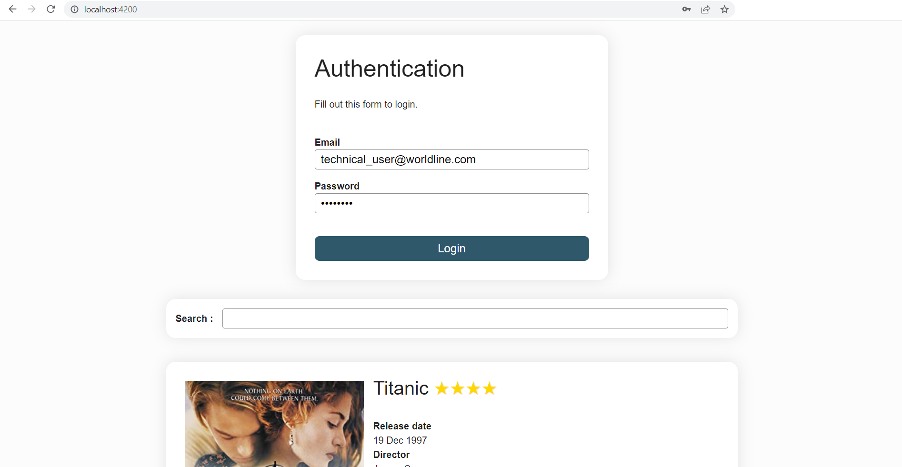
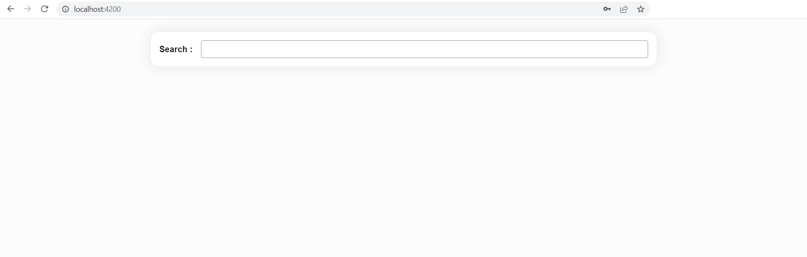
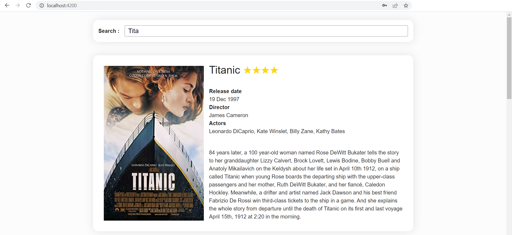

# Components

We've previously seen that:
- a component is a class decorated with the `@Component` decorator
- it is generated via the CLI by the `ng g c component-name` command
- by default, a component is generated with an associated html file and stylesheet file
- the `@Component` decorator has [options](https://angular.dev/api/core/Component#description) like `templateUrl`, `styleUrl` or `selector`.

## View encapsulation and styling

You can modify the stylesheet extension of the CLI-generated files in the `angular.json` file under the `schematics` option.

### Encapsulation

Among the `@Component` decorator options, there is one dealing with ViewEncapsulation. Angular provides three types of view encapsulation:
- `ViewEncapsulation.Emulated` (by default): emulates the Native scoping, styles are scoped to the component
- `ViewEncapsulation.None`: anything put in the component's stylesheet is available globally throughout the application
- `ViewEncapsulation.ShadowDom`: Angular creates Shadow DOM for the component, styles are scoped to the component

:::warning
Under the default option, styles specified in the component's style file are not inherited by any components nested within the template nor by any content projected into the component.
:::

### `:host` selector
Situations may arise where styling the host element of the component from the component's stylesheet is needed. To do so, Angular provides a pseudo-class selector: `:host`.

Let's imagine we require a border on the LoginFormComponent. This is how to add it without having to add a `<div>` around the `<form>` and the `<ul>`:

<CodeGroup>
<CodeGroupItem title="login-form.component.scss">

```css
:host {
  border: 1px solid black;
}
```
</CodeGroupItem>
</CodeGroup>

The next example targets the host element again, but only when it also has the active CSS class.

<CodeGroup>
<CodeGroupItem title="login-form.component.scss">

```css
:host(.active) {
  border-width: 3px;
}
```
</CodeGroupItem>
</CodeGroup>

## Lifecycle
A component instance has a lifecycle that starts when Angular instantiates the component class and renders the component view along with its child views. The lifecycle continues with change detection, as Angular checks to see when data-bound properties change, and updates both the view and the component instance as needed. The lifecycle ends when Angular destroys the component instance and removes its rendered template from the DOM.

Angular provides lifecycle hook methods to tap into key events in the lifecycle of a component.


- `ngOnChanges`: called after the constructor and every time input values change. The method receives a SimpleChanges object of current and previous property values.

- `ngOnInit`: called only once. This is where the **component's initialisation** should take place, such as **fetching initial data**. Indeed components should be cheap to construct, so costly operations should be kept out of the constructor. The constructor should do no more than set the initial local variables to simple values.

- `ngDoCheck`: called immediately after `ngOnChanges` on every change detection run, and immediately after `ngOnInit` on the first run. Gives an opportunity to implement a custom change detection algorithm.

- `ngAfterContentInit`: called only once. Invoked after Angular performs any content projection into the component’s view.

- `ngAfterContentChecked`: called after `ngAfterContentInit` and every subsequent `ngDoCheck`.

- `ngAfterViewInit`: called only once. Invoked when the component’s view has been fully initialised.

- `ngAfterViewChecked`: called after `ngAfterViewInit` and every subsequent `ngDoCheck`.

For each lifecycle hook there exists a corresponding interface. Their name is derived from the lifecycle hook's they define minus the `ng`. For instance, to use `ngOnInit()` implement the interface `OnInit`.

## Communication between child and parent components
A common pattern in Angular is sharing data between a parent component and one or more child components. You can implement this pattern by using the `@Input()` and `@Output()` directives. `@Input()` allows a parent component to update data in the child component. Conversely, `@Output()` allows the child to send data to a parent component.


### @Input()

Adding the `@Input()` decorator on a child component's property means that it can receive its value from its parent component. The parent component passes that value through property binding in its template. Such a property **should not be mutated by the child** directly. Mutations should happen in the parent, they will automatically propagate via the property binding.

Here is how the `AppComponent` would communicate to its child component `BlogPostComponent` the title and content of its article.

<CodeGroup>
<CodeGroupItem title="Parent component">

```ts
// app.component.ts
import { Component } from "@angular/core"
@Component({
  selector: "app-root",
  templateUrl: "./app.component.html"
})
export class AppComponent {
  article = {
    title: "My first awesome article",
    content: "This content is super interesting"
  };
}

// app.component.html
<app-blog-post [title]="article.title" [content]="article.content"><app-blog-post>
```
</CodeGroupItem>

<CodeGroupItem title="Child component">

```ts
// blog-post.component.ts
import { Component, Input } from "@angular/core"
@Component({
  selector: "app-blog-post",
  templateUrl: "./blog-post.component.html"
})
export class BlogPostComponent {
  @Input() title: string
  @Input() content: string
}

// blog-post.component.html
<article>
  <h3>{{ title }}</h3>
  <p>{{ content }}</p>
</article>
```
</CodeGroupItem>
</CodeGroup>

To watch for changes on an `@Input()` property, you can use the `ngOnChanges` lifecycle hook.

::: details input() function to work with Signals (Angular 17+)
The *zone.js* library serves as a critical foundation for change detection in Angular, enabling the framework to automatically track asynchronous operations like HTTP calls, timers or user interactions. By creating execution contexts, *zone.js* allows Angular to know when to update the user interface without manual intervention from developers. As you become proficient in Angular, understanding how Zone.js manages change detection is of great help to optimise the code and tackle complex use cases. Since Angular 17 and particularly the introduction of reactive programming features in Angular, the reliance on *zone.js* is being reconsidered as it is considered an overhead that is not always optimised. As of Angular 19, it is possible to experimentally opt-out of using *zone.js* to manage change detection. Developers are encouraged to explore new reactive paradigms, such as signals and the refined change detection strategies as alternatives to enhance performance and streamline state management. As you advance your Angular skills, staying abreast of these changes will empower you to build more optimised and maintainable applications.

As of Angular 17, it is possible to shift from using the traditional `@Input()` decorator to the more functional `input()` method to communicate data from a parent to a child component. This change is part of Angular's effort to improve performance and simplify change detection while moving away from the overhead of *zone.js*. While `@Input()` automatically triggers change detection through *zone.js*, the `input()` function allows developers to create reactive inputs that are closely integrated with Angular’s new signal-based architecture.

For example:

```ts
import { Component, signal, input } from '@angular/core'

@Component({
  selector: 'app-parent',
  template: `<app-child [childValue]="parentValue()"></app-child>`
})
export class ParentComponent {
  parentValue = signal('Hello from Parent!')
}

@Component({
  selector: 'app-child',
  template: `<p>Received Value: {{ childValue }}</p>`
})
export class ChildComponent {
  childValue = input('Default Value')
}
```

In this example, the ParentComponent uses a signal to pass a reactive value to the ChildComponent, which defines `childValue` using the `input()` function.

When creating reactive inputs using the `input()` function in Angular, you have the flexibility to define whether an input can have a default value or if it is required. When you specify a default value for an input using the `input()` function, it means that the component can operate with that initial value if no external data is passed in from a parent component. This can be particularly useful for creating components that have sensible defaults. If the parent does not provide a value, the component will still render without issues. On the other hand, required inputs indicate that the parent component **must** provide a value for that input.

```ts
import {Component, input} from '@angular/core'

@Component({/*...*/})
export class CustomSlider {
  // Declare a required input named 'value'. 
  value = input.required<number>()
  // Create a computed expression that reads the value input
  label = computed(() => `The slider's value is ${this.value()}`)
}
```
And here is how you must pass data to the required `value` input:

```html
<custom-slider [value]="50"></custom-slider>
```

As you can see, as long as the application is using *zone.js*, the parent doesn't have to pass a Signal, it can pass regular values or primitives.
:::

**Exercise: Pass down each book's info to the BookComponent**
<iframe height='500' width='100%' src="https://stackblitz.com/fork/github/ocunidee/atpw-input/tree/master?ctl=1&embed=1&file=src/app/book/book.component.ts&hideNavigation=1&title=input"></iframe>

### @Output()

Child components communicate with their parents by using events: they emit **events** that propagate to their parent. **A good component is agnostic of its environment**, it does not know its parents and does not know if the events it emits will ever be intercepted (or "listened to").

Adding the `@Output()` decorator on a child component's `EventEmitter` property allows data to flow from the child to the parent. The parent component can react to the event through the event binding syntax.

Here is how the `AddTaskComponent` would communicate back to its parent that a new task has been added:

<CodeGroup>
<CodeGroupItem title="Parent component">

```ts
// app.component.ts
import { Component } from "@angular/core"
@Component({
  selector: "my-app",
  templateUrl: "./app.component.html"
})
export class AppComponent {
  items = ['Do the laundry', 'Wash the dishes', 'Read 20 pages']

  addItem(item: string): void {
    this.items.push(item)
  }
}

// app.component.html
<h1>My To-do list</h1>
<ul>
  @for(item of items; track item) {
    <li>{{item}}</li>
  }
</ul>
<app-add-task (newTask)="addItem($event)"></app-add-task>
```
</CodeGroupItem>

<CodeGroupItem title="Child component">

```ts
// add-task.component.ts
import { Component, EventEmitter, Output } from "@angular/core"
@Component({
  selector: "app-add-task",
  templateUrl: "./add-task.component.html"
})
export class AddTaskComponent {
  @Output() newTask = new EventEmitter<string>()

  addNewTask(task: string): void {
    this.newTask.emit(task)
  }
}

// add-task.component.html
<label>New task: <input #newTask/></label>
<button (click)="addNewTask(newTask.value)">Add</button>
```
</CodeGroupItem>
</CodeGroup>

You can play with this example [here](https://stackblitz.com/fork/github/ocunidee/atpw-output-exemple/tree/master?file=src/app/app.component.ts&title=output%20exemple).

::: details output() function (Angular 17+)
The same way `input()` is replacing `@Input()`, `output()` is replacing `@Output()`. Here is the above exemple using the new `output()` function.

<CodeGroup>
<CodeGroupItem title="Parent component">

```ts
// app.component.ts
import { Component } from "@angular/core"
@Component({
  selector: "my-app",
  templateUrl: "./app.component.html"
})
export class AppComponent {
  items = ['Do the laundry', 'Wash the dishes', 'Read 20 pages']

  addItem(item: string): void {
    this.items.push(item)
  }
}

// app.component.html
<h1>My To-do list</h1>
<ul>
  @for(item of items; track item) {
    <li>{{item}}</li>
  }
</ul>
<app-add-task (newTask)="addItem($event)"></app-add-task>
```
</CodeGroupItem>

<CodeGroupItem title="Child component">

```ts
// add-task.component.ts
import { Component, output } from "@angular/core"
@Component({
  selector: "app-add-task",
  templateUrl: "./add-task.component.html"
})
export class AddTaskComponent {
  newTask = output<string>()

  addNewTask(task: string): void {
    this.newTask.emit(task)
  }
}

// add-task.component.html
<label>New task: <input #newTask/></label>
<button (click)="addNewTask(newTask.value)">Add</button>
```
</CodeGroupItem>
</CodeGroup>

:::

**Exercise: Books are now borrowable, communicate when books are borrowed to their parent component**
<iframe height='500' width='100%' src="https://stackblitz.com/fork/github/ocunidee/atpw-output-exercise/tree/master?ctl=1&embed=1&file=src/app/book/book.component.html&hideNavigation=1&title=output%20exercise"></iframe>

### Local variable in the template

A parent component cannot use data binding (`@Output` or `@Input`) to access a child's properties or methods. A local variable in the template can be used to achieve both.

<CodeGroup>
<CodeGroupItem title="Parent component">

```ts
// app.component.html
<app-greet #child></app-greet>
<button (click)="child.greetMe()">Greet Me</button>
```
</CodeGroupItem>

<CodeGroupItem title="Child component">

```ts
// greet.component.html
<div *ngIf="displayText">Hello User!</div>

// greet.component.ts
import { Component } from '@angular/core'
@Component({
  selector: 'app-greet',
  templateUrl: './greet.component.html'
})
export class GreetComponent {
  displayText: boolean = false

  greetMe(): void {
    this.displayText = true
  }
}
```
</CodeGroupItem>
</CodeGroup>

### @ViewChild

The `ViewChild` decorator can achieve the same purpose as a template variable but directly inside the parent component's class by injecting the child component into the parent component. Use `ViewChild` over a local variable whenever you need to coordinate interactions between several child components.

In this example, the `MenuComponent` gets access to the `MenuItemComponent`:

<CodeGroup>
<CodeGroupItem title="Parent component">

```ts
// menu.component.html
<app-menu-item [menuText]="'Contact Us'"></app-menu-item>

// menu.component.ts
@Component({
  selector: 'app-menu',
  templateUrl: './menu.component.html'
})

export class MenuComponent{
  @ViewChild(MenuItemComponent) menu: MenuItemComponent
}
```
</CodeGroupItem>
<CodeGroupItem title="Child component">

```ts
// menu-item.component.html
<p>{{menuText}}</p>

// menu-item.component.ts
@Component({
  selector: 'app-menu-item',
  templateUrl: './menu-item.component.html'
})

export class MenuItemComponent {
  @Input() menuText: string
}
```
</CodeGroupItem>
</CodeGroup>

In case the parent component contains several instances of the same child component, they can each be queried via template reference variable:

<CodeGroup>
<CodeGroupItem title="Parent component">

```ts
// menu.component.html
<app-menu-item #contactUs [menuText]="'Contact Us'"></app-menu-item>
<app-menu-item #aboutUs [menuText]="'About Us'"></app-menu-item>

// menu.component.ts
@Component({
  selector: 'app-menu',
  templateUrl: './menu.component.html'
})

export class MenuComponent{
  @ViewChild('aboutUs') aboutItem: MenuItemComponent
  @ViewChild('contactUs') contactItem: MenuItemComponent
}
```
</CodeGroupItem>
<CodeGroupItem title="Child component">

```ts
// menu-item.component.html
<p>{{menuText}}</p>

// menu-item.component.ts
@Component({
  selector: 'app-menu-item',
  templateUrl: './menu-item.component.html'
})

export class MenuItemComponent {
  @Input() menuText: string
}
```
</CodeGroupItem>
</CodeGroup>

Components injected via `@ViewChild` become available in the `ngAfterViewInit` lifecycle hook. To query all children of a certain type, use the decorator `@ViewChildren`.

## Content projection

With `@Input`, we were able to pass data to a child component, but what about passing HTML elements or even other components?

Since Angular components are declared as tags, we can place other elements or content inside their tags. In the following example, the string `My profile` acts as the content of the `NavigationLink` component:

<CodeGroup>
<CodeGroupItem title="Parent component">

```html
<!-- in a parent component's template-->
<app-navigation-link [url]="/profile">My profile<app-navigation-link>
```
</CodeGroupItem>
<CodeGroupItem title="Child component">

```html
<!-- navigation-link.component.html -->
<div>
  <a [routerLink]="url"><ng-content></ng-content></a>
</div>
```
</CodeGroupItem>
</CodeGroup>

Whatever is written between the child component's tags in the parent component gets injected in the child's template and replaces the `<ng-content>` tags.

Any HTML content, including other angular components can be projected. This feature is particularly useful in components that serve as a *container* rather than for *content*, such as dialog windows or layout elements:

<CodeGroup>
<CodeGroupItem title="Child component">

```html
<!-- my-popin.component.html -->
<div class="popin">
  <div class="popin-header">
    <ng-content select="[slot=header]"></ng-content>
  </div>

  <main class="popin-content">
    <ng-content></ng-content>
  </main>

  <div class="popin-actions">
    <ng-content select="[slot=actions]"></ng-content>
  </div>
</div>
```
</CodeGroupItem>
<CodeGroupItem title="Parent component">

```html
<!-- in a parent component template -->
<my-popin>
  <h1 slot="header">Popin title</h1>
  <p>Popin content</p>
  <button slot="actions">OK</button>
</my-popin>
```
</CodeGroupItem>
</CodeGroup>

In addition to the default `<ng-content>`, you can **name** other `<ng-content>` tags to distribute content to multiple locations in the child. You achieve this by using the `select` attribute on the `<ng-content>` tag and adding the chosen value as an attribute on the element to project.

## Practical work: Decompose the app
1. Refactor the `LoginFormComponent` to extract the code and template related to a film details. To that purpose, create with the CLI a `FilmComponent` (`ng g c components/film`). There will be as many instances of `FilmComponent` as there are films (move the `<li></li>` tag and its content to the new component). Use `@Input()` to pass data from the `LoginFormComponent` to each `FilmComponent`. 

:::tip
Don't forget to add the `FilmComponent` to the array of imports of the `LoginFormComponent` decorator in order to be able to use  `<app-film></app-film>` in the template.
:::

2. Create another component with the CLI: `FilmSearchComponent`. It will contain a search form and the `FilmComponent` list below:

```html
<form (ngSubmit)="searchFilms()">
  <label for="search">Search :</label>
  <input id="search" type="text" name="title"/>
</form>

<ul class="films">
  <!-- list of <app-film> -->
</ul>
```
Do not replace the comment with the list of `FilmComponent` yet. This will be done in the next step.

:::tip
Don't forget to add the `FormsModule` to the imports array of the `FilmSearchComponent` since its template makes use of the `ngSubmit` event.
:::

3. Insert this `FilmSearchComponent` under the `LoginFormComponent` in the `AppComponent` and move the necessary code (html and ts) from the `LoginFormComponent` to this new component, delete the unused code.

::: details Expected result of step 3

:::

4. Display the `FilmSearchComponent` component only if the user is logged in. You will have to communicate the `loggedIn` variable from the `LoginFormComponent` to the `AppComponent` via an `@Output()` (transform the field *loggedIn*). You will need an `onLogin()` method in the `AppComponent`.
5. In the `FilmSearchComponent`, assign the `films` variable to an empty `[]` array initially. When submitting the search form, run a `searchFilms()` method that will put the 3 sample films in this list.
6. Commit

::: details Expected result





:::

## To go further
- Learn about context aware content projection using [ngTemplateOutlet](https://angular.love/ngtemplateoutlet-the-secret-to-customisation)

- Angular 14 has introduced *standalone components* and there were taken out of beta in Angular 15. You can learn more about them [here](https://blog.ninja-squad.com/2022/05/12/a-guide-to-standalone-components-in-angular/)

- Check this [page](https://angular.dev/guide/components/inputs) out to go more in depth about the new `input()` function and this [page](https://angular.dev/guide/components/outputs) to learn more about the new `output()` function