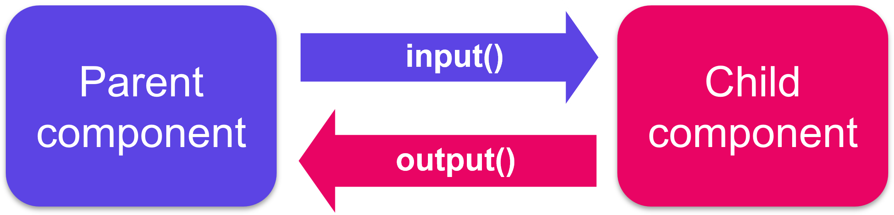
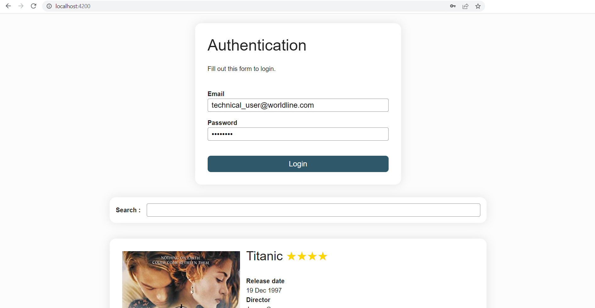
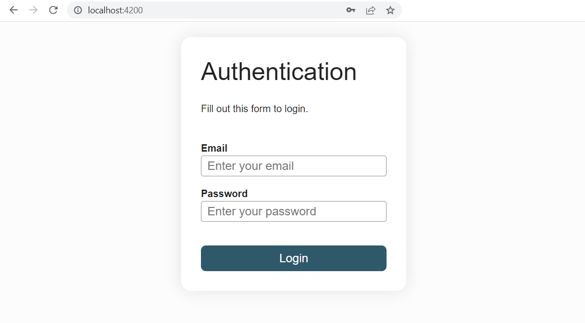

# Components

We've previously seen that:
- a component is a class decorated with the `@Component` decorator
- it is generated via the CLI by the `ng g c component-name` command
- by default, a component is generated with an associated html file and stylesheet file
- the `@Component` decorator has [options](https://angular.dev/api/core/Component#description) like `templateUrl`, `styleUrl` or `selector`.

## View encapsulation and styling

You can modify the stylesheet extension of the CLI-generated files in the `angular.json` file under the `schematics` option.

### Encapsulation
Among the `@Component` decorator options, there is one dealing with ViewEncapsulation. Angular provides three types of view encapsulation:
- `ViewEncapsulation.Emulated` (by default): emulates the Native scoping, styles are scoped to the component
- `ViewEncapsulation.None`: anything put in the component's stylesheet is available globally throughout the application
- `ViewEncapsulation.ShadowDom`: Angular creates Shadow DOM for the component, styles are scoped to the component

:::warning
Under the default option, styles specified in the component's style file are not inherited by any components nested within the template nor by any content projected into the component. Using the same selector, the styles defined in the component stylesheet have the priority over those defined in the global stylesheet of the project (styles.scss).
:::

### `:host` selector
Situations may arise where styling the host element of the component from the component's stylesheet is needed. To do so, Angular provides a pseudo-class selector: `:host`.

Let's imagine we require a border on the LoginFormComponent. This is how to add it without having to add a `<div>` around the `<form>` and the `<ul>`:

<CodeGroup>
<CodeGroupItem title="login-form.component.scss">

```css
:host {
  border: 1px solid black;
}
```
</CodeGroupItem>
</CodeGroup>

The next example targets the host element again, but only when it also has the *active* CSS class applied to it.

<CodeGroup>
<CodeGroupItem title="login-form.component.scss">

```css
:host(.active) {
  border-width: 3px;
}
```
</CodeGroupItem>
</CodeGroup>

## Lifecycle
A component instance has a lifecycle that starts when Angular instantiates the component class and renders the component view along with its child views. The lifecycle continues with change detection, as Angular checks to see when data-bound properties change, and updates both the view and the component instance as needed. The lifecycle ends when Angular destroys the component instance and removes its rendered template from the DOM.

Angular provides lifecycle hook methods to tap into key events in the lifecycle of a component.


- `ngOnChanges`: called after the constructor and every time input values change (from the class variables defined as `input()` or previously decorated with `@Input()`). The method receives a SimpleChanges object of current and previous property values.

- `ngOnInit`: called only once. This is where the **component's initialisation** should take place, such as **fetching initial data**. Indeed components should be cheap to construct, so costly operations should be kept out of the constructor. The constructor should do no more than set the initial local variables to simple values.

- `ngDoCheck`: called immediately after `ngOnChanges` on every change detection run of the parent component, and immediately after `ngOnInit` on the first run. Gives an opportunity to implement a custom change detection algorithm.

- `ngAfterContentInit`: called only once. Invoked after Angular performs any content projection into the component’s view. Content projection is the html we place in between the html tags of the component.

- `ngAfterContentChecked`: called after `ngAfterContentInit` and every subsequent `ngDoCheck`.

- `ngAfterViewInit`: called only once. Invoked when the component’s view has been fully initialised, meaning it's own child components have been fully rendered.

- `ngAfterViewChecked`: called after `ngAfterViewInit` and every subsequent `ngDoCheck`.

For each lifecycle hook there exists a corresponding interface. Their name is derived from the lifecycle hook's they define minus the `ng`. For instance, to use `ngOnInit()` implement the interface `OnInit`.

With the introduction of Signals in Angular 17+, the use of the lifecyle hooks is most likely going to decline. Only `ngOnInit` and `ngAfterViewInit` were already commonplace with sometimes the use of `ngOnChanges` which won't be used anymore thanks to the reactivity of the signal defined through the `input()` function.

## Change detection

### Zone.js
The *Zone.js* library has been the invisible orchestrator behind Angular's "magical" change detection system since the framework's inception, functioning as a sophisticated **monkey-patching library** that performs runtime modification of existing JavaScript objects and functions. Specifically, *zone.js* intercepts and wraps **all asynchronous** browser APIs—including setTimeout, setInterval, Promises, DOM events, XMLHttpRequests, and more by dynamically replacing their native implementations with enhanced wrapper versions that maintain the same external interface but add zone-aware tracking capabilities.

When you call setTimeout in your Angular application, you're actually calling *zone.js*'s patched version, which records the operation within an execution context called a "zone", executes the original browser setTimeout, and then triggers Angular's change detection when the timer completes. This instrumentation allows Angular to automatically detect when asynchronous operations finish and potentially modify application state, **triggering change detection cycles** without requiring you to manually notify the framework of data changes, creating the seamless, "just works" experience that Angular is known for.

However, this broad-spectrum approach comes with **performance overhead** and complexity that can become a bottleneck for performance-critical applications, as *zone.js* must monitor every async operation regardless of whether it actually affects the UI, and can be considered somewhat invasive since it modifies global browser APIs. 

### Going zoneless
This performance overhead is why Angular has decided to give the possibility to developers to shift away from *zone.js*. To do that, the community was extensively consulted through RFCs (Request for Comments) and a **new class** was introduced in Angular 17, the **Signal** class. A signal is a wrapper around a value that **notifies interested consumers when that value changes**. Signals can contain any value, from primitives to complex data structures. With signals, *zone.js* is not necessary anymore for the UI rendering to be reactive to data changes or user interactions. 

In **zoneless change detection** (experimental in Angular 18/19, in developer preview in Angular 20.0, stable in Angular 20.2 and the default for new apps created in Angular 21), the paradigm is shifting towards a more precise reactive model where components explicitly declare their dependencies through signals, and change detection runs only when these reactive primitives actually change their values. This transition eliminates the need for *zone.js*'s global async monitoring, reduces bundle size, improves performance through **fine-grained reactivity**, and gives developers explicit control over when and how change detection occurs—though it requires a more deliberate approach to state management and may necessitate manual change detection triggering in scenarios where a project is integrating with non-signal-based code or third-party libraries that don't leverage Angular's new reactive primitives.

From a developer experience perspective, working in a zoneless environment does introduce a learning curve compared to Angular's traditional automatic change detection. Developers need to understand:
- when to use signals versus traditional state management,
- how to structure component dependencies,
- and how to handle edge cases where the framework won't automatically detect changes.

:::tip Exercise: Spotting change detection cycles
You can discover more about change detection cycles and when they run in a zoneless environment with the following example application: 

<iframe height='500' width='100%' src="https://stackblitz.com/edit/angular-zoneless-change-detection?ctl=1&embed=1&file=src/app/app.component.ts&hideExplorer=1&hideNavigation=1&title=Zoneless%20change%20detection"></iframe>

You will find an [article](https://angular.love/the-latest-in-angular-change-detection-zoneless-signals) explaining in depth how change detection works in Angular at the bottom of this chapter.

::: details Optimisation with change detection strategy *OnPush*

Among the `@Component` decorator options, there is one dealing with the change detection strategy the component uses:

The Angular team states than an application that works well with components that use the `ChangeDetectionStrategy.OnPush` instead of the `ChangeDetectionStrategy.Default` has all the chances of working seemlessly when transitionning to signals and zoneless. This change detection strategy is far more efficient than the default one. You can generate components using this strategy through the CLI automatically by configuring the component schematics in the following way:

```sh
ng config schematics.@schematics/angular.component.changeDetection OnPush
```

This line just adds the following in the `angular.json` file (CLI config file): 
```json
...
"@schematics/angular": {
  "component": {
    "changeDetection": "OnPush"
  }
}
```

With this configuration, all the new components you create will have the following line added automatically in their `@Component` decorator: 

```ts{6}
@Component({
  selector: 'app-test',
  imports: [],
  templateUrl: './test.component.html',
  styleUrl: './test.component.scss',
  changeDetection: ChangeDetectionStrategy.OnPush
})
export class TestComponent {

}
```

The article previously mentionned that you can find at the bottom of the page explains how the *Default* and *OnPush* change detection strategies defer and why one is more efficient than the other.

You need to be aware of the caveats of using the *OnPush* strategy to not encounter situations where you thought change would be propagated but you don't see anything different in your UI. One of them is preserving the reference of an object used in the template when changing one of its properties instead of mutating the whole object. This will not invoke change detection in that node of the component tree as *OnPush* only detects reference changes. You also have to be aware of how the framework behaves when child nodes of *OnPush* components use the *Default* change detection strategy. This is all covered in the following [page](https://angular.dev/best-practices/skipping-subtrees#using-onpush) of the documentation.
:::

## An introduction to Signals
## Signals

So far, we've used signals in each example without really defining what they are, how to use them and what their API is. We know that they can wrap any value and that the current value they contain can be retrieved by invoking them. Let's dive a little deeper.

It is a wrapper around a value that notifies interested consumers when that value changes. Angular can track where the signal is used when we call it's getter function (invoking the signal). There are two types of signals: writable ones that can also be read and read-only signals.

### signal()
The `signal()` function creates a writable signal that holds a value and provides methods to read and update it. You can initialize it with any value, and Angular will track dependencies whenever you read from it by calling the signal as a function. To update the value, you can use `set()` to replace it entirely or `update()` to modify it based on the current value.

<CodeGroup>
<CodeGroupItem title="TS">

```typescript
import { Component, signal } from '@angular/core'

@Component({
  selector: 'app-birthday',
  imports: [],
  templateUrl: './birthday.component.html',
  styleUrl: './birthday.component.scss',
  changeDetection: ChangeDetectionStrategy.OnPush
})
export class BirthdayComponent {
  protected readonly user = signal({ name: 'Alice', age: 25 })

  celebrateBirthday() {
    this.user.update(current => ({ ...current, age: current.age + 1 }))
  }
}
```
</CodeGroupItem>

<CodeGroupItem title="HTML">

```html
<p>User: {{ user().name }} ({{ user().age }} years old)</p>
<button (click)="celebrateBirthday()">Birthday!</button>
```
</CodeGroupItem>
</CodeGroup>

### computed()
The `computed()` function creates a read-only signal that automatically derives its value from other signals. Whenever any of the signals it depends on change, the computed signal recalculates its value automatically. This is perfect for creating derived state that stays in sync with your source data without manual updates.

<CodeGroup>
<CodeGroupItem title="TS">

```typescript
import { CurrencyPipe } from '@angular/common'
import { ChangeDetectionStrategy, Component, computed, signal } from '@angular/core'
import { FormsModule } from '@angular/forms'

@Component({
  selector: 'app-shopping-cart',
  imports: [FormsModule, CurrencyPipe],
  templateUrl: './shopping-cart.html',
  styleUrl: './shopping-cart.scss',
  changeDetection: ChangeDetectionStrategy.OnPush
})
export class ShoppingCartComponent {
  protected readonly quantity = signal(2)

  // Price decreases with quantity (bulk pricing)
  protected readonly price = computed(() => {
    const quantity = this.quantity()
    if (quantity >= 10) return 8  // 8€ each for 10+ items
    if (quantity >= 5) return 9   // 9€ each for 5-9 items
    return 10                // 10€ each for 1-4 items
  })

  // Automatically recalculates when price or quantity changes
  protected readonly total = computed(() => this.price() * this.quantity())
}
```
</CodeGroupItem>

<CodeGroupItem title="HTML">

```html
<label>
  Quantity:
  <input type="number" [(ngModel)]="quantity" min="0">
</label>
<p>Price per item: {{ price() | currency:'EUR' }}</p>
<p>Total: {{ total() | currency:'EUR' }}</p>
```
</CodeGroupItem>
</CodeGroup>

### effect()
The `effect()` function allows you to perform side effects when signals change, such as logging, making API calls, or updating local storage. Effects run automatically whenever any signal they read from changes, making them perfect for reacting to state changes without cluttering your component logic.

<CodeGroup>
<CodeGroupItem title="TS">

```typescript
import { ChangeDetectionStrategy, Component, signal, effect } from '@angular/core'
import { FormsModule } from '@angular/forms'

@Component({
  selector: 'app-settings',
  imports: [FormsModule],
  templateUrl: './settings.component.html',
  styleUrl: './settings.component.scss',
  changeDetection: ChangeDetectionStrategy.OnPush
})
export class SettingsComponent {
  protected readonly theme = signal(localStorage.getItem('theme') ?? 'light')

  constructor() {
    // Automatically saves theme to localStorage when it changes
    // Effects need to run in an injection context such as inside the constructor
    effect(() => {
      const currentTheme = this.theme()
      localStorage.setItem('theme', currentTheme)
      document.body.className = currentTheme
      console.log(`Theme changed to: ${currentTheme}`)
    })
  }
}
```
</CodeGroupItem>

<CodeGroupItem title="HTML">

```html
<label>
  Theme: 
  <select [(ngModel)]="theme">
    <option value="light">Light</option>
    <option value="dark">Dark</option>
  </select>
</label>
<p>Current theme: {{ theme() }}</p>
```
</CodeGroupItem>

<CodeGroupItem title="styles.scss">

```css

.dark {
  background-color: #333;
  color: white;
}

.light {
  background-color: white;
  color: black;
}
```
</CodeGroupItem>
</CodeGroup>

### linkedSignal()
The `linkedSignal()` function creates a signal that can derive its value from other signals (like computed) but also allows manual updates when needed. This is useful when you want a signal that usually follows another signal's value but occasionally needs to be overridden manually.

<CodeGroup>
<CodeGroupItem title="TS">

```typescript
import { ChangeDetectionStrategy, Component, signal, linkedSignal } from '@angular/core'
import { FormsModule } from '@angular/forms'

@Component({
  selector: 'app-user-profile',
  imports: [FormsModule],
  templateUrl: './user-profile.component.html',
  styleUrl: './user-profile.component.scss',
  changeDetection: ChangeDetectionStrategy.OnPush
})
export class UserProfileComponent {
  protected readonly firstName = signal('John')
  protected readonly lastName = signal('Doe')
  
  // Usually derives from firstName + lastName, but can be manually overridden via the input in the html
  protected readonly preferredName = linkedSignal(() => `${this.firstName()} ${this.lastName()}`)

  // Reset to auto-generated value based on firstName + lastName
  resetPreferredName() {
    this.preferredName.set(`${this.firstName()} ${this.lastName()}`)
  }
}
```
</CodeGroupItem>

<CodeGroupItem title="HTML">

```html
<label>First name
  <input [(ngModel)]="firstName">
</label>
<label>Last name
  <input [(ngModel)]="lastName">
</label>
<p>Auto-generated display name: {{ preferredName() }}</p>
<label>Preferred name
  <input [(ngModel)]="preferredName">
</label>
<button (click)="resetPreferredName()">Reset to default</button>
```
</CodeGroupItem>
</CodeGroup>

## Communication between child and parent components
A common pattern in Angular is sharing data between a parent component and one or more child components. You can implement this pattern by using the `input()` and `output()` signals. `input()` allows a parent component to update data in the child component. Conversely, `output()` allows the child to create events and hence send data back to a parent component.



::: details Before Signals and Angular 17
`input()` and `output()` signals were introduced in Angular 17. Their ancestors are the decorators `Input()` and `Output()`. Both syntax can be used in lieu and place of each other as long as Angular uses the zone.js library. In each subsequent paragraphs, both the signal and decorator syntax will be presented to accommodate older generation projects.

Use signals if you are starting out on a new project. If you are on a legacy project in Angular 17+, use signals in new components and refactor progressively the already existing components. This will greatly help when Angular drops zone.js support in future versions as less refactoring will be needed.
:::

### input()
In Angular's signal-based world, passing data from parent to child components is accomplished using the `input()` function, creating reactive input properties that automatically propagate changes throughout the component tree. The syntax involves declaring an input signal using `input<Type>()` in the child component, which creates a read-only signal that receives values from the parent template. You can omit the generic notation if the type can be infered from the default value of the input. You can provide default values using `input<Type>(defaultValue)`, for example, `name = input('Anonymous')` creates a string input that defaults to 'Anonymous' if no value is provided from the parent.

For critical data that must always be provided, you can use `input.required<Type>()` instead, such as `userId = input.required<number>()`, which enforces at compile-time that the **parent template** must supply this value. In the parent template, you bind to inputs using **standard property binding syntax** like `<child-component [name]="parentName" [userId]="currentUserId"></child-component>`.

Signal-based inputs **automatically trigger change detection in the child component** whenever the parent's values change, creating seamless reactive data flow without any manual intervention. The required inputs provide an additional safety net, if you forget to bind a required input in the template, TypeScript will catch this error at compile time, preventing runtime bugs where critical data might not have been passed (you can still allow to pass undefined but the template requires the property binding to be present).

Here is how the `AppComponent` would communicate to its children `BlogPostComponent` the title and content of the articles.

<CodeGroup>
<CodeGroupItem title="Parent component (app-root)">

```ts
// app.component.ts
import { Component, signal } from "@angular/core"
@Component({
  selector: "app-root",
  templateUrl: "./app.component.html"
})
export class AppComponent {
  protected readonly article = signal({
    title: "My first awesome article",
    content: "This content is super interesting"
  })
  protected readonly draftArticle = signal({
    title: "My second article"
  })
}
```

```html
<!-- app.component.html -->
<h1>Welcome to my blog</h1>
<app-blog-post [title]="article().title" [content]="article().content"></app-blog-post>
<app-blog-post [title]="draftArticle().title"></app-blog-post>
```

</CodeGroupItem>

<CodeGroupItem title="Child component (app-blog-post)">

```ts
// blog-post.component.ts
import { Component, input } from "@angular/core"
@Component({
  selector: "app-blog-post",
  templateUrl: "./blog-post.component.html"
})
export class BlogPostComponent {
  protected readonly title = input.required<string>()
  protected readonly content = input('No content available')
}
```

```html
<!-- blog-post.component.html -->
<article>
  <h2>{{ title() }}</h2>
  <p>{{ content() }}</p>
</article>
```

</CodeGroupItem>
</CodeGroup>

As you can see, since `content` is not a required input of the `BlogPostComponent`, the parent component doesn't have to bind to this property in the template and the child will display 'No content available' by default.

::: details @Input() decorator (before Angular 17)
Adding the `@Input()` decorator on a child component's property means that it can receive its value from its parent component. The parent component passes that value through property binding in its template. Such a property **should not be mutated by the child** directly. Mutations should happen in the parent, they will automatically propagate via the property binding.

Here is how the `AppComponent` would communicate to its child component `BlogPostComponent` the title and content of its article.

<CodeGroup>
<CodeGroupItem title="Parent component">

```ts
// app.component.ts
import { Component } from "@angular/core"
@Component({
  selector: "app-root",
  templateUrl: "./app.component.html"
})
export class AppComponent {
  article = {
    title: "My first awesome article",
    content: "This content is super interesting"
  }
}

// app.component.html
<h1>Welcome to my blog</h1>
<app-blog-post [title]="article.title" [content]="article.content"><app-blog-post>
```
</CodeGroupItem>

<CodeGroupItem title="Child component">

```ts
// blog-post.component.ts
import { Component, Input } from "@angular/core"
@Component({
  selector: "app-blog-post",
  templateUrl: "./blog-post.component.html"
})
export class BlogPostComponent {
  @Input() title: string
  @Input() content: string
}

// blog-post.component.html
<article>
  <h3>{{ title }}</h3>
  <p>{{ content }}</p>
</article>
```
</CodeGroupItem>
</CodeGroup>

To watch for changes on an `@Input()` property, you can use the `ngOnChanges` lifecycle hook.
:::

**Exercise: Pass down each book's info to the BookComponent**
<iframe height='500' width='100%' src="https://stackblitz.com/fork/github/ocunidee/atpw-input/tree/master?ctl=1&embed=1&file=src/app/book/book.component.ts&hideNavigation=1&title=input"></iframe>

### output()

Child components communicate with their parents by using events: they emit **events** that propagate to their parent. **A good component is agnostic of its environment**, it does not know its parents and does not know if the events it emits will ever be intercepted (or "listened to").

The `output()` function can be used to emit values or void (to signify that an event has happened with no value associated) to the parent component. You can emit values to consumers by using the emit method on the variable that stores the `output()`. The parent can subscribe to changes via template event bindings (the `()` syntax in the template)

<CodeGroup>
<CodeGroupItem title="Child component">

```ts
// add-task.component.ts
import { Component, output } from '@angular/core'

@Component({
  selector: 'app-add-task',
  templateUrl: './add-ask.component.html',
  styleUrl: './add-ask.component.scss'
})
export class AddTaskComponent {
  readonly newTask = output<string>()

  addNewTask(element: HTMLInputElement): void {
    this.newTask.emit(element.value)
    element.value = ''
  }
}

// add-task.component.html
<label>New task: <input #newTaskElement/></label>
<button (click)="addNewTask(newTaskElement)">Add</button>
```
</CodeGroupItem>

<CodeGroupItem title="Parent component">

```ts
// app.component.ts
import { Component } from "@angular/core"
@Component({
  selector: "my-app",
  templateUrl: "./app.component.html"
})
export class AppComponent {
  protected readonly items = signal(['Do the laundry', 'Wash the dishes', 'Read 20 pages'])

  addItem(item: string): void {
    this.items.update(items => [...items, item])
  }
}

// app.component.html
<h1>My To-do list</h1>
<ul>
  @for(item of items(); track item) {
    <li>{{item}}</li>
  }
</ul>
<app-add-task (newTask)="addItem($event)"></app-add-task>
```
</CodeGroupItem>
</CodeGroup>

You can play with this example [here](https://stackblitz.com/fork/github/ocunidee/atpw-output-example/tree/master?file=src/app/app.component.ts&title=output%20example).

::: details @Output() decorator (before Angular 17)
The same way `input()` is replacing `@Input()`, `output()` is replacing `@Output()`. Here is the above example using the old `@Output()` decorator.

Adding the `@Output()` decorator on a child component's `EventEmitter` property allows data to flow from the child to the parent. The parent component can react to the event through the event binding syntax.

Here is how the `AddTaskComponent` would communicate back to its parent that a new task has been added:

<CodeGroup>
<CodeGroupItem title="Parent component">

```ts
// app.component.ts
import { Component } from "@angular/core"
@Component({
  selector: "my-app",
  templateUrl: "./app.component.html"
})
export class AppComponent {
  items = ['Do the laundry', 'Wash the dishes', 'Read 20 pages']

  addItem(item: string): void {
    this.items.push(item)
  }
}

// app.component.html
<h1>My To-do list</h1>
<ul>
  @for(item of items; track item) {
    <li>{{item}}</li>
  }
</ul>
<app-add-task (newTask)="addItem($event)"></app-add-task>
```
</CodeGroupItem>

<CodeGroupItem title="Child component">

```ts
// add-task.component.ts
import { Component, EventEmitter, Output } from "@angular/core"
@Component({
  selector: "app-add-task",
  templateUrl: "./add-task.component.html"
})
export class AddTaskComponent {
  @Output() newTask = new EventEmitter<string>()

  addNewTask(task: string): void {
    this.newTask.emit(task)
  }
}

// add-task.component.html
<label>New task: <input #newTask/></label>
<button (click)="addNewTask(newTask.value)">Add</button>
```
</CodeGroupItem>
</CodeGroup>

You can play with this example [here](https://stackblitz.com/fork/github/ocunidee/atpw-output-example/tree/master?file=src/app/app.component.ts&title=output%20example).
:::

**Exercise: Books are now borrowable, communicate when books are borrowed to their parent component**
<iframe height='500' width='100%' src="https://stackblitz.com/fork/github/ocunidee/atpw-output-exercise/tree/master?ctl=1&embed=1&file=src/app/book/book.component.html&hideNavigation=1&title=output%20exercise"></iframe>

### Local variable in the template

A parent component cannot use data binding (`output()` or `input()`) to access **all** of the child's **properties and methods**. A local variable in the template, defined using an hashtag `#`, can be used to achieve both.

<CodeGroup>
<CodeGroupItem title="Parent component">

```ts
// app.component.html
<app-greet #child></app-greet>
<button (click)="child.greetUser()">Greet Me</button>
```
</CodeGroupItem>

<CodeGroupItem title="Child component">

```ts
// greet.component.html
@if (displayText()) {
  <p>Hello User!</p>
}

// greet.component.ts
import { Component, signal } from '@angular/core'
@Component({
  selector: 'app-greet',
  templateUrl: './greet.component.html'
})
export class GreetComponent {
  private readonly shouldDisplayText = signal(false)

  greetUser(): void {
    this.shouldDisplayText.set(true)
  }
}
```
</CodeGroupItem>
</CodeGroup>

### viewChild()

The `viewChild()` function can achieve the same purpose as a template variable but directly **inside the parent component's class** by injecting the child component into the parent component. Use `viewChild()` over a local template variable (#) whenever you need to coordinate interactions between several child components from the typescript class.

Just like for the `input()` function, consider using `viewChild.required` if you are certain the component, element or template ref you are querying will always match (for example, it is not nested in an `@if` in the template).

In this example, the `MenuComponent` gets access to the `MenuItemComponent`:

<CodeGroup>
<CodeGroupItem title="Parent component">

```ts
// menu.component.html
<app-menu-item [menuText]="'Contact Us'"></app-menu-item>

// menu.component.ts
@Component({
  selector: 'app-menu',
  imports: [MenuItemComponent],
  templateUrl: './menu.component.html'
})

export class MenuComponent{
  protected readonly menu = viewChild.required(MenuItemComponent) // Signal<MenuItemComponent>
}
```
</CodeGroupItem>
<CodeGroupItem title="Child component">

```ts
// menu-item.component.html
<p>{{menuText()}}</p>

// menu-item.component.ts
@Component({
  selector: 'app-menu-item',
  templateUrl: './menu-item.component.html'
})

export class MenuItemComponent {
  protected readonly menuText = input.required<string>()
}
```
</CodeGroupItem>
</CodeGroup>

In case the parent component contains several instances of the same child component, they can each be queried via template reference variables:

<CodeGroup>
<CodeGroupItem title="Parent component">

```ts
// menu.component.html
<app-menu-item #contactUs [menuText]="'Contact Us'"></app-menu-item>
<app-menu-item #aboutUs [menuText]="'About Us'"></app-menu-item>

// menu.component.ts
@Component({
  selector: 'app-menu',
  imports: [MenuItemComponent],
  templateUrl: './menu.component.html'
})

export class MenuComponent{
  protected readonly aboutItem = viewChild('aboutUs') // Signal<MenuItemComponent | undefined>, with no required the signal may be undefined
  protected readonly contactItem = viewChild.required('contactUs') // Signal<MenuItemComponent>
}
```
</CodeGroupItem>
<CodeGroupItem title="Child component">

```ts
// menu-item.component.html
<p>{{menuText()}}</p>

// menu-item.component.ts
@Component({
  selector: 'app-menu-item',
  templateUrl: './menu-item.component.html'
})

export class MenuItemComponent {
  protected readonly menuText = input.required<string>()
}
```
</CodeGroupItem>
</CodeGroup>

To query all children component of a certain type, use the `viewChildren()` function.

:::details @ViewChild decorator (before Angular 17)
The `@ViewChild` decorator can achieve the same purpose as a template variable but directly inside the parent component's class by injecting the child component into the parent component. Use `@ViewChild` over a local variable whenever you need to coordinate interactions between several child components.

In this example, the `MenuComponent` gets access to the `MenuItemComponent`:

<CodeGroup>
<CodeGroupItem title="Parent component">

```ts
// menu.component.html
<app-menu-item [menuText]="'Contact Us'"></app-menu-item>

// menu.component.ts
@Component({
  selector: 'app-menu',
  imports: [MenuItemComponent],
  templateUrl: './menu.component.html'
})

export class MenuComponent{
  @ViewChild(MenuItemComponent) menu: MenuItemComponent
}
```
</CodeGroupItem>
<CodeGroupItem title="Child component">

```ts
// menu-item.component.html
<p>{{menuText}}</p>

// menu-item.component.ts
@Component({
  selector: 'app-menu-item',
  templateUrl: './menu-item.component.html'
})

export class MenuItemComponent {
  @Input() menuText: string
}
```
</CodeGroupItem>
</CodeGroup>

In case the parent component contains several instances of the same child component, they can each be queried via template reference variables:

<CodeGroup>
<CodeGroupItem title="Parent component">

```ts
// menu.component.html
<app-menu-item #contactUs [menuText]="'Contact Us'"></app-menu-item>
<app-menu-item #aboutUs [menuText]="'About Us'"></app-menu-item>

// menu.component.ts
@Component({
  selector: 'app-menu',
  imports: [MenuItemComponent],
  templateUrl: './menu.component.html'
})

export class MenuComponent{
  @ViewChild('aboutUs') aboutItem: MenuItemComponent
  @ViewChild('contactUs') contactItem: MenuItemComponent
}
```
</CodeGroupItem>
<CodeGroupItem title="Child component">

```ts
// menu-item.component.html
<p>{{menuText}}</p>

// menu-item.component.ts
@Component({
  selector: 'app-menu-item',
  templateUrl: './menu-item.component.html'
})

export class MenuItemComponent {
  @Input() menuText: string
}
```
</CodeGroupItem>
</CodeGroup>

Components injected via `@ViewChild` become available in the `ngAfterViewInit` lifecycle hook. To query all children of a certain type, use the decorator `@ViewChildren`.
:::

## Content projection

With `input()`, we were able to pass data to a child component, but what about passing HTML elements or even other components?

Since Angular components are declared as tags, we can place other elements or content inside their tags. In the following example, the string `My profile` acts as the content of the `NavigationLink` component:

<CodeGroup>
<CodeGroupItem title="Parent component">

```html
<!-- in a parent component's template-->
<app-navigation-link [url]="/profile">My profile<app-navigation-link>
```
</CodeGroupItem>
<CodeGroupItem title="Child component">

```html
<!-- navigation-link.component.html -->
<div>
  <a [routerLink]="url"><ng-content></ng-content></a>
</div>
```
</CodeGroupItem>
</CodeGroup>

Whatever is written between the child component's tags in the parent component gets injected in the child's template and replaces the `<ng-content>` tags.

Any HTML content, including other angular components can be projected. This feature is particularly useful in components that serve as a *container* rather than for *content*, such as dialog windows or layout elements:

<CodeGroup>
<CodeGroupItem title="Child component">

```html
<!-- my-popin.component.html -->
<div class="popin-header">
  <ng-content select="[slot=header]"></ng-content>
</div>

<main class="popin-content">
  <ng-content></ng-content>
</main>

<div class="popin-actions">
  <ng-content select="[slot=actions]"></ng-content>
</div>
```
</CodeGroupItem>
<CodeGroupItem title="Parent component">

```html
<!-- in a parent component template -->
<my-popin>
  <h1 slot="header">Popin title</h1>
  <p>Popin content</p>
  <button slot="actions">OK</button>
  <button slot="actions">Cancel</button>
</my-popin>
```
</CodeGroupItem>
</CodeGroup>

In addition to the default `<ng-content>`, you can **name** other `<ng-content>` tags to distribute content to multiple locations in the child. You achieve this by using the `select` attribute on the `<ng-content>` tag and adding the chosen value as an attribute on the element to project.

## Practical work: Decompose the app
0. (optional) Run the schematics config command: 
```sh
ng config schematics.@schematics/angular.component.changeDetection OnPush
```
And add the `ChangeDetectionStrategy.OnPush` to the `LoginFormComponent` decorator.

1. Refactor the `LoginFormComponent` to extract the code and template related to a film details. To that purpose, create with the CLI a `FilmComponent` (`ng g c components/film`). There will be as many instances of `FilmComponent` as there are films (move the `<li></li>` tag and its content to the new component). Use `input.required<Film>()` to pass data from the `LoginFormComponent` to each `FilmComponent`. 

:::tip
Don't forget to add the `FilmComponent` to the array of imports of the `LoginFormComponent` decorator in order to be able to use  `<app-film></app-film>` in the template.
:::

2. Create another component with the CLI: `FilmSearchComponent`. It will contain a search form and the `FilmComponent` list below:

```html
<form (ngSubmit)="searchFilms()">
  <label for="search">Search :</label>
  <input id="search" type="text" name="title"/>
</form>

<ul class="films">
  <!-- list of <app-film> -->
</ul>
```
Do not replace the comment with the list of `FilmComponent` yet. Do it in the next step.

:::tip
Don't forget to add the `FormsModule` to the imports array of the `FilmSearchComponent` since its template makes use of the `ngSubmit` event.
:::

3. Insert this `FilmSearchComponent` under the `LoginFormComponent` in the `AppComponent` and move the necessary code (html and ts) from the `LoginFormComponent` to this new component, delete the unused code.

::: details Expected result of step 3

:::

4. Display the `FilmSearchComponent` component only if the user is logged in. You will have to communicate the `loggedIn` variable from the `LoginFormComponent` to the `AppComponent` via an `output()` (transform the field *loggedIn*). You will need a `login()` method in the `AppComponent`.

5. In the `FilmSearchComponent`, assign the `films` variable to the signal of an empty `[]` array initially. When submitting the search form, run a `searchFilms()` method that will put the 3 sample films in this list.

6. Commit

::: details Expected result



:::

## To go further and learn about the past of Angular
- Everything you need to know about change detection and how it works behind the scenes is [here](https://angular.love/the-latest-in-angular-change-detection-zoneless-signals)

- Learn more about the *OnPush* change detection strategy and the pitfalls you may encounter when opting the use it [here](https://angular.dev/best-practices/skipping-subtrees#using-onpush)

- Learn about context aware content projection using [ngTemplateOutlet](https://angular.love/ngtemplateoutlet-the-secret-to-customisation)

- Angular 14 has introduced *standalone components* and there were taken out of beta in Angular 15. You can learn more about them [here](https://blog.ninja-squad.com/2022/05/12/a-guide-to-standalone-components-in-angular/)

- Check this [page](https://angular.dev/guide/components/inputs) out to go more in depth about the new `input()` function and this [page](https://angular.dev/guide/components/outputs) to learn more about the new `output()` function