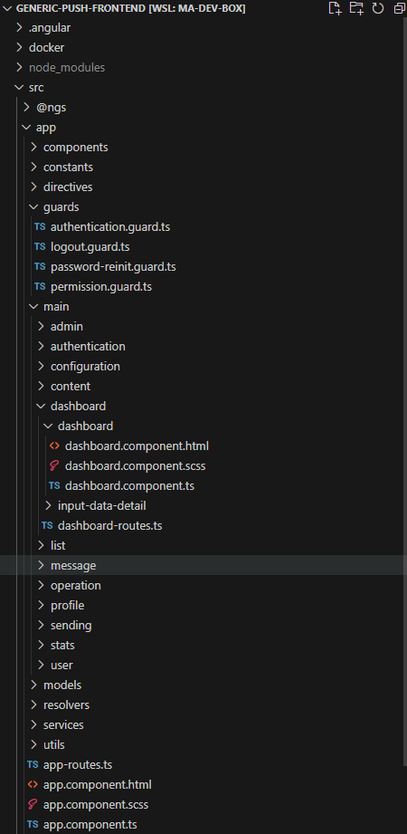

# First steps

We have just used the Angular CLI command `ng new <my-project>`. This command creates a workspace with a root-level application named *my-project* and installs the necessary Angular npm packages in the new workspace. The workspace root folder contains various support and configuration files.

Creating an initial skeleton application at the root level of the workspace along with its end-to-end tests is the default behaviour of the `ng new` command. This behaviour is suitable for a **multi-repo** development style where each application resides in its own workspace. It is also the recommanded way for beginner and intermediate users.

Angular also supports workspaces with multiple projects. This is appropriate for a **monorepo** development style where there is a single repository and a global configuration for all Angular projects in it. It is also suitable for advanced users who are, for instance, developing shareable libraries.

To get started developing with a multi-project workspace, the initial root-level application generation should be skipped.

``` bash
ng new my-workspace --create-application false
```

You can then generate apps and libraries with names that are unique whithin the workspace.

``` bash
cd my-workspace
ng generate application my-first-app
```
Generated applications go into the `projects/` folder instead of a top-level `src` folder.

## File structure

Our previously created project has the following folders and files:
- `.eslintrc.json`: the default ESLint configuration of the workspace
- `tsconfig.json`: the base TypeScript configuration for projects in the workspace
- `tsconfig.app.json`: the root application TypeScript configuration file which inherits from the base one
- `tsconfig.spec.json`: the e2e tests TypeScript configuration file which inherits from the base one
- `README.md`: introductory documentation for the root app
- `package.json`: configures npm package dependencies that are available to all projects in the workspace
- `package-lock.json`: provides version information for all packages installed into node_modules by the npm client
- `angular.json`: CLI configuration, including configuration options for build, serve, and test tools that the CLI uses
- `.gitignore`: Specifies intentionally untracked files that Git should ignore
- `.editorconfig`: Configuration for code editors
- `src`: Source files for the root-level application project
- `node_modules`: Provides npm packages to the entire workspace

:::tip
To ensure that all developers working on a project use the same library versions, it is possible to [block the version numbers](https://docs.npmjs.com/cli/v7/configuring-npm/package-json#dependencies) via the `package.json` file.
:::

The `src` folder contains:
- `styles.scss`: Lists CSS files that supply styles for a project. The extension reflects the style preprocessor you have configured for the project.
- `main.ts`: The main entry point for your application
- `index.html`: The main HTML page that is served when someone visits your site. The CLI automatically adds all JavaScript and CSS files when building your app, so you typically don't need to add any `<script>` or `<link>` tags here manually.
- `favicon.ico`: An icon to use for this application in the bookmark bar
- `assets`: Contains image and other asset files to be copied as-is when you build your application
- `app`: Contains the component files in which your application logic and data are defined

The `app` folder contains:
- `app.module.ts`: Defines the root module, named AppModule, that tells Angular how to assemble the application. Initially declares only the `AppComponent`. As you add more components to the app, they must be declared here.
- `app-routing.module.ts`: Defines a routing module for the `AppModule`
- `app.component.html`: Defines the HTML template associated with the root `AppComponent`
- `app.component.scss`: Defines the base stylesheet for the root `AppComponent`
- `app.component.ts`: Defines the logic for the app's root component, named `AppComponent`. The view associated with this root component is the root of the view hierarchy.
- `app.component.spec.ts`: Defines a unit test for the root `AppComponent`


## Text interpolation in templates

Like any other component, the shell AppComponent is distributed over three files.
Open the component class file (`app.component.ts`) and change the value of the title property to 'Search films'

```typescript
// app.component.ts
import { Component } from '@angular/core'

@Component({
  selector: 'app-root',
  templateUrl: './app.component.html',
  styleUrls: ['./app.component.scss']
})
export class AppComponent {
  title = 'Search Films'
}
```

Open the component template file (`app.component.html`) and delete the default template generated by the Angular CLI. Replace it with the following line of HTML.
```html
<!-- app.component.html -->
<h1>{{title}}</h1>
```
The double curly braces are Angular's *interpolation binding syntax*. This interpolation binding presents the component's title property value inside the HTML header tag.

The browser refreshes and displays the new application title.

::: v-pre
The simplest way to insert data dynamically into your components is through text interpolation, using the `{{myVariable}}` syntax. Inside double curly braces, you can specify any valid JavaScript expression that don't have or promote side-effects.
:::

JavaScript expressions that have or promote side effects include:
- assignements (`=`, `+=`, ...)
- operators such as `new`, `typeof` or `instanceof`
- increment and decrement operators `++` and `--`

Add two fields after the title variable in the `app.component.ts` file:
```typescript
// app.component.ts
title = 'Search Films'
orderReference = 'ABCXYZ'
price = 17.3
```

In the template:
```html
<!--app.component.html-->
<h1>{{title}}</h1>
<p>Order ref. {{ orderReference }} - Total: {{ price.toFixed(2) + "€" }}</p>
```

The template has access to all the non-private members of the component class. Changing the visibility of `price` to `private` will render this error: *Property 'price' is private and only accessible within class 'AppComponent'.*

Interpolation only works on textual content of elements. You can not use it to change the value of HTML attributes or to insert HTML code. For this, you will need to resort to directives, which we will see later in the training.

In this example, we formatted the price manually. We will later see that Angular provides a way to declare reusable formatters: **pipes**.


## Working with components

The `AppComponent` is only the root component of an Angular application. A web application is made of small reusable components, embedded in higher level components to form the layout, the arrangement of your elements on the page. This structure can be described as a component tree. Angular creates, updates, and destroys components as the user moves through the application. The app can take action at each moment in this lifecycle through optional lifecycle hooks, like `ngOnInit()`.


Let's create a second component. It is advised to generate components using the [Angular CLI](https://angular.io/cli/generate#component).

```bash
ng g c child #shorthand for ng generate component child
```

The `ng g c` command added a `child` folder containing the `ChildComponent` files in the `app` folder.

```typescript
// child.component.ts
import { Component } from '@angular/core'

@Component({
  selector: 'app-child',
  templateUrl: './child.component.html',
  styleUrls: ['./child.component.scss']
})
export class ChildComponent {

}
```

To link the components together, the child components are declared in their parent's component template, using their selector as a tag. A component can be reused as many times as desired. The `ChildComponent`'s selector is `app-child`. Including this component as a child to the `AppComponent` is done as follows:

```html
<!-- app.component.html -->
<h1>{{title}}</h1>
<app-child></app-child>
```

:::tip
Angular automatically prefixes selectors so that components imported from external libraries are easier to spot. For instance, components from the Material Angular library are all prefixed with `mat-`. You can change the app prefix in the `angular.json` configuration file so that it reflects your application name.
:::

## NgModules
Behind the scene, the `ng g c` command also declared the `Child` component in the `AppModule`.

```typescript {12}
// app.module.ts
import { NgModule } from '@angular/core'
import { BrowserModule } from '@angular/platform-browser'

import { AppRoutingModule } from './app-routing.module'
import { AppComponent } from './app.component'
import { ChildComponent } from './child/child.component'

@NgModule({
  declarations: [
    AppComponent,
    ChildComponent
  ],
  imports: [
    BrowserModule,
    AppRoutingModule
  ],
  providers: [],
  bootstrap: [AppComponent]
})
export class AppModule { }
```

An NgModule is defined by a class decorated with `@NgModule()`. The `@NgModule()` decorator is a function that takes a single metadata object, whose properties describe the module. The most important properties are as follows:

- `declarations`: The components, directives, and pipes that belong to this NgModule.
- `exports`: The subset of declarations that should be visible and usable in the component templates of other NgModules. (the `AppModule` has no reason to export anything because other modules don't need to import the root NgModule)
- `imports`: Other modules whose exported classes are needed by component templates declared in this NgModule.
- `providers`: Creators of services that this NgModule contributes to the global collection of services; they become accessible in all parts of the app. (You can also specify providers at the component level.)
- `bootstrap`: The main application view, called the root component, which hosts all other app views. Only the root NgModule should set the bootstrap property.

While a small application might have only one NgModule, as the app grows, it is a good practice to refactor the root module into feature modules that represent collections of related functionality. You then either import these modules into the root module (eagerly loaded) or lazy load them asynchronously via the router.

## Organising your files
Here is the folder structure we will strive to achieve in the Search Films application:


This folder structure is best suited to simple projects that have only one module, the `AppModule`. As a project grows, feature modules will be introduced and the structure can evolve to this:



:::tip
By default, the CLI will always generate in the `app` folder. You can tell it to generate in another folder by passing the path before the name of the element you want it to generate. For instance `ng generate component components/test` will generate the `TestComponent` 4 files in `app/components/test`. The `components` folder is created by the CLI if doesn't already exist, as well as the `test` folder.
:::

As the complexity of the folder structure of the application increases, it is a good practice to add aliases in the `tsconfig.json` file. Let's do it now to avoid a tedious refactoring later:
```json
"compilerOptions": { 
  ...
  "paths": {
    "@models/*": ["src/app/models/*"],
    "@services/*": ["src/app/services/*"],
    "@guards/*": ["src/app/guards/*"],
    "@pipes/*": ["src/app/pipes/*"],
    "@components/*": ["src/app/components/*"]
  }
}
```
VsCode will automatically use those paths for the imports instead of relative ones that can be tough to read or debug.


## Practical work: Your first component

1. Remove all the changes made since the commit introducing ESLint as we won't need them moving forward.

2. Most apps strive for a consistent look across the application. The CLI generated an empty `styles.scss` for this purpose. Copy paste the content of the SCSS stylesheet that will serve as basis for all the practical work, downloadable here: [styles.scss](https://worldline.github.io/angular-training/styles.scss) in it.

3. Create a new component login-form containing the following authentication form (don't forget to generate it in the *components* folder):
```html
<form id="login-form">
  <h1>Authentication</h1>
  <p>Fill out this form to login.</p>

  <label for="email">Email</label>
  <input type="text" placeholder="Enter your email" id="email" required/>

  <label for="psw">Password</label>
  <input type="password" placeholder="Enter your password" id="psw" required/>

  <button type="submit">Login</button>
</form>

```

4. Delete the existing content of the `AppComponent` template (html file of the component), and display the `LoginFormComponent` instead with `<app-login-form></app-login-form>`. Check that the CLI has added the `LoginFormComponent` to the list of `declarations` in the `AppModule`.

5. Complete the `login-form.component.ts` file: add a field `title = 'Authentication'`. Then, use text interpolation in the template to pass the title from the component ts file to the h1 tag.

6. Don't forget to commit

::: details Expected result

:::
