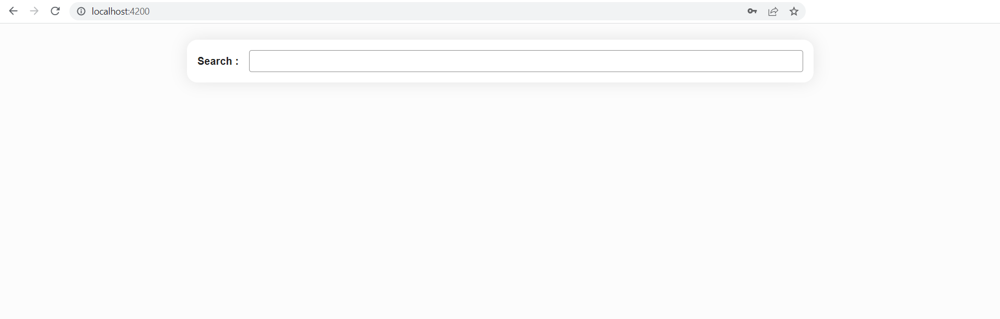

# Composants

Nous avons vu précédemment que :
- un composant est une classe décorée avec le décorateur `@Component`
- il est généré via CLI par la commande `ng g c component-name`
- par défaut, un composant est généré avec un fichier html et une feuille de style associés
- le décorateur `@Component` a des [options](https://angular.dev/api/core/Component#description) comme `templateUrl`, `styleUrl` ou `selector`.

## Encapsulation de vue et style

Vous pouvez modifier l'extension de feuille de style des fichiers générés par CLI dans le fichier `angular.json` sous l'option `schematics`.

### Encapsulation
Parmi les options du décorateur `@Component`, il y en a une qui traite de ViewEncapsulation. Angular fournit trois types d'encapsulation de vue :
- `ViewEncapsulation.Emulated` (par défaut) : émule le scoping natif, les styles sont limités au composant
- `ViewEncapsulation.None` : tout ce qui est mis dans la feuille de style du composant est disponible globalement dans toute l'application
- `ViewEncapsulation.ShadowDom` : Angular crée un Shadow DOM pour le composant, les styles sont limités au composant

:::warning
Sous l'option par défaut, les styles spécifiés dans le fichier de style du composant ne sont hérités par aucun composant imbriqué dans son template ni par aucun contenu projeté dans le composant. En utilisant le même sélecteur dans les deux fichiers, le style défini dans le fichier de style du composant à la priorité sur celui défini dans le fichier de style global (styles.scss).
:::

### Sélecteur CSS `:host`
Des situations peuvent survenir où styler l'élément hôte du composant à partir de sa propre feuille de style est nécessaire. Pour ce faire, Angular fournit un sélecteur de pseudo-classe : `:host`.

Imaginons que nous ayons besoin d'une bordure sur le LoginFormComponent. Voici comment l'ajouter sans rajouter de `<div>` pour englober le `<form>` et le `<ul>` :

<CodeGroup>
<CodeGroupItem title="login-form.component.scss">

```css
:host {
  border: 1px solid black
}
```
</CodeGroupItem>
</CodeGroup>

L'exemple suivant cible à nouveau l'élément hôte, mais uniquement lorsqu'il possède également la classe CSS active.

<CodeGroup>
<CodeGroupItem title="login-form.component.scss">

```css
:host(.active) {
  border-width: 3px
}
```
</CodeGroupItem>
</CodeGroup>

## Lifecycle
Une instance de composant a un cycle de vie qui commence lorsqu'Angular instancie la classe du composant et présente la vue du composant avec ses vues enfants. Le cycle de vie se poursuit avec la détection des modifications, car Angular vérifie quand les propriétés liées aux données changent et met à jour à la fois la vue et l'instance de composant si nécessaire. Le cycle de vie se termine lorsqu'Angular détruit l'instance du composant et retire son template du DOM.

Angular fournit des méthodes de hook pour exploiter les événements clés du cycle de vie d'un composant.


- `ngOnChanges`: appelée après le constructeur et chaque fois que les valeurs input changent (la valeur des variables de la classe définies via la fonction `input()` ou anciennement décorées avec `@Input()`). La méthode reçoit un objet SimpleChanges qui contient les valeurs actuelles et précédentes des propriétés annotées d'@Input().

- `ngOnInit`: appelée une seule fois. C'est là que l'**initialisation du composant** doit avoir lieu, tel que **la récupération des données initiales**. En effet, les composants doivent être peu coûteux à construire, les opérations coûteuses doivent donc être tenues à l'écart du constructeur. Le constructeur ne doit pas faire plus que donner des valeurs initiales simples aux variables de la classe.

- `ngDoCheck`: appelée immédiatement après `ngOnChanges` à chaque exécution du cycle de détection du changement, et immédiatement après `ngOnInit` lors de la première exécution. Donne la possibilité de mettre en œuvre un algorithme de détection du changement personnalisé.

- `ngAfterContentInit`: appelée une seule fois. Invoquée après qu'Angular ait effectué une projection de contenu dans la vue du composant. La projection de contenu correspond à l'html qui est placé entre les balises html de notre composant.

- `ngAfterContentChecked`: appelée après `ngAfterContentInit` et chaque `ngDoCheck` suivant.

- `ngAfterViewInit`: appelée une seule fois. Appelée lorsque la vue du composant a été complètement initialisée, c'est-à-dire quand la vue de ses propres composants enfant a fini d'être initialisée.

- `ngAfterViewChecked`: appelée après `ngAfterViewInit` et chaque `ngDoCheck` suivant.

Pour chaque hook du cycle de vie il existe une interface correspondante. Leurs noms sont dérivés du nom du hook de cycle de vie correspondant moins le `ng`. Par exemple, pour utiliser `ngOnInit()`, implémentez l'interface `OnInit`.

Avec l'introduction des Signaux dans Angular 17+, l'usage des hooks de cycle de vie va sûrement décroitre. Uniquement `ngOnInit` et `ngAfterViewInint` étaient couramment utilisés avec de temps en temps l'usage de `ngOnChanges`. Ce dernier ne va plus avoir de raison d'être utilisé grâce au caractère réactif du signal `input()`.

## Détection du changement

### Zone.js
La bibliothèque *Zone.js* a été l'orchestrateur invisible derrière le système de détection du changement "magique" d'Angular depuis les débuts du framework, fonctionnant comme une bibliothèque de **monkey-patching** sophistiquée qui effectue des modifications au runtime des objets et fonctions JavaScript existants. Plus précisément, *zone.js* intercepte et enveloppe **toutes les APIs asynchrones** du navigateur, y compris setTimeout, setInterval, Promises, événements DOM, XMLHttpRequests, et plus, en remplaçant dynamiquement leurs implémentations natives par des versions wrapper qui conservent la même interface externe mais ajoutent des capacités de suivi sensibles aux zones.

Lorsqu'on appelle setTimeout dans notre application Angular, on appele en réalité la version patchée de *zone.js*, qui enregistre l'opération dans un contexte d'exécution appelé "zone", exécute le setTimeout d'origine du navigateur et ensuite **déclenche la détection du changement** d'Angular lorsque le timer se termine. Cet outil permet à Angular de détecter automatiquement quand les opérations asynchrones se terminent et modifient potentiellement l'état de l'application, déclenchant des cycles de détection du changement sans nécessiter qu'on informe manuellement le framework des changements de données, créant ainsi l'expérience transparente et "ça fonctionne tout seul" pour laquelle Angular est connu.

Cependant, cette approche entraîne un **coût de performance** et une complexité qui peuvent se faire ressentir pour les applications très complexes, car *zone.js* doit surveiller chaque opération asynchrone, qu'elle affecte ou non l'interface utilisateur, et peut être considérée comme quelque peu invasive puisqu'elle modifie les APIs globales du navigateur.

### Se séparer de Zone.js (zoneless)
Ce **coût de performance** est la raison pour laquelle Angular a décidé de donner la possibilité aux développeurs de se passer de *zone.js*. Pour ce faire, la communauté a été largement consultée à travers des RFC (Request for Comments) et une **nouvelle classe** a été introduite dans Angular 17, la classe **Signal**. Un signal est un wrapper autour d'une valeur qui **notifie les consommateurs intéressés lorsque cette valeur change**. Les signaux peuvent contenir n'importe quelle valeur, des primitives aux structures de données complexes. Avec les signaux, *zone.js* n'est plus nécessaire pour que le rendu de l'interface utilisateur soit réactif aux changements de données ou aux interactions utilisateur.

Dans la **détection du changement sans zone** (expérimentale en Angular 18/19, en aperçu développeur en Angular 20.0, stable à partir d'Angular 20.2 et l'option par défaut en Angular 21), le paradigme évolue vers un modèle réactif plus précis où les composants déclarent explicitement leurs dépendances à travers des signaux, et la détection du changement s'exécute seulement lorsque ces primitives réactives changent réellement leurs valeurs. Cette transition élimine le besoin de la surveillance asynchrone globale de zone.js, réduit la taille des bundles, améliore la performance grâce à une **réactivité plus fine** et donne aux développeurs un contrôle explicite sur quand et comment la détection du changement se produit, bien que cela nécessite une approche plus délibérée de la gestion de l'état et puisse nécessiter le déclenchement manuel de la détection du changement dans des scénarios où un projet s'intègre à du code non basé sur les signaux ou utilise des bibliothèques tierces qui ne tirent pas parti des nouvelles primitives réactives d'Angular.

D'un point de vue expérience développeur, travailler dans un environnement sans zone présente une courbe d'apprentissage par rapport à la traditionnelle détection automatique du changement d'Angular. Les développeurs doivent comprendre :
- quand utiliser des signaux par rapport à une gestion d'état traditionnelle,
- comment structurer les dépendances des composants,
- et comment gérer les cas particuliers où le framework ne détectera pas automatiquement les changements.

Vous pouvez découvrir plus sur les cycles de détection du changement et quand ils s'exécutent dans un environnement sans zone avec l'exemple d'application suivant : 
<iframe height='900' width='100%' src="https://stackblitz.com/github.com/Ocunidee/atpw-zoneless/tree/master?ctl=1&embed=1&file=src/app/signal-counter/signal-counter.component.ts&hideNavigation=1&view=preview&title=Zoneless change detection"></iframe>

Vous trouverez un [article](https://angular.love/the-latest-in-angular-change-detection-zoneless-signals) expliquant en profondeur comment la détection du changement fonctionne dans Angular au bas de ce chapitre.

::: details Optimisation avec la stratégie de détection du changement *OnPush*

Parmi les options du décorateur `@Component`, l'une d'entre elles concerne la stratégie de détection de changements à laquelle le composant souscrit :

L'équipe Angular affirme qu'une application qui fonctionne bien avec des composants utilisant `ChangeDetectionStrategy.OnPush` au lieu de `ChangeDetectionStrategy.Default` a toutes les chances de fonctionner sans problème lors de la transition vers les signaux et le mode zoneless. Cette stratégie de détection de changements est bien plus efficace que celle par défaut. Vous pouvez générer des composants utilisant cette stratégie automatiquement via la CLI en configurant les schematics de composants de la manière suivante :

```sh
ng config schematics.@schematics/angular.component.changeDetection OnPush
```

Cette ligne de commande ajoute la partie suivante dans le fichier `angular.json` (fichier de configuration du CLI):
```json
...
"@schematics/angular": {
  "component": {
    "changeDetection": "OnPush"
  }
}
```

Avec cette configuration, tous les nouveaux composants générés par le CLI auront cette ligne qui sera automatiquement aux options de leur décorateur `@Component`:

```ts{6}
@Component({
  selector: 'app-test',
  imports: [],
  templateUrl: './test.component.html',
  styleUrl: './test.component.scss',
  changeDetection: ChangeDetectionStrategy.OnPush
})
export class TestComponent {

}
```

L'article mentionné précédemment que vous pouvez trouver en bas de la page explique comment les stratégies de détection de changements *Default* et *OnPush* diffèrent et pourquoi l'une est plus efficace que l'autre.

Vous devez être conscient(e) des pièges liés à l'utilisation de la stratégie *OnPush* pour ne pas rencontrer de situations où vous pensiez qu'un changement serait propagé mais où vous ne voyez rien de différent dans votre interface utilisateur. L'un d'entre eux est de préserver la référence d'un objet utilisé dans le template lors de la modification de l'une de ses propriétés au lieu de muter l'objet entier. Cela n'invoquera pas la détection de changements dans ce nœud de l'arbre de composants car *OnPush* ne détecte que les changements de référence. Vous devez également être conscient(e) de la façon dont le framework se comporte lorsque les composants enfants de composants *OnPush* utilisent la stratégie de détection de changements *Default*. Tout cela est couvert dans la [page](https://angular.dev/best-practices/skipping-subtrees#using-onpush) suivante de la documentation.
:::

## Une introduction aux signaux
Jusqu'à présent, nous avons utilisé des signaux dans chaque exemple sans vraiment définir ce qu'ils sont, comment les utiliser et quelle est leur API. Nous savons qu'ils peuvent encapsuler n'importe quelle valeur et que la valeur qu'ils contiennent actuellement peut être récupérée en les invoquant. Approfondissons un peu.

C'est un wrapper autour d'une valeur qui notifie les consommateurs intéressés lorsque cette valeur change. Angular peut suivre où le signal est utilisé lorsque nous appelons sa fonction getter (en invoquant le signal). Il existe deux types de signaux : les signaux modifiables qui peuvent également être lus et les signaux en lecture seule.

### signal()
La fonction `signal()` crée un WritableSignal qui contient une valeur et fournit des méthodes pour la lire et la mettre à jour. Vous pouvez l'initialiser avec n'importe quelle valeur, et Angular suivra les dépendances (chaque fois que vous la lirez en appelant le signal comme une fonction). Pour mettre à jour la valeur, vous pouvez utiliser `set()` pour la remplacer entièrement ou `update()` pour la modifier en fonction de la valeur actuelle.

<CodeGroup>
<CodeGroupItem title="TS">

```typescript
import { Component, signal } from '@angular/core'

@Component({
  selector: 'app-birthday',
  imports: [],
  templateUrl: './birthday.component.html',
  styleUrl: './birthday.component.scss',
  changeDetection: ChangeDetectionStrategy.OnPush
})
export class BirthdayComponent {
  protected readonly user = signal({ name: 'Alice', age: 25 })

  celebrateBirthday() {
    this.user.update(current => ({ ...current, age: current.age + 1 }))
  }
}
```
</CodeGroupItem>

<CodeGroupItem title="HTML">

```html
<p>User: {{ user().name }} ({{ user().age }} years old)</p>
<button (click)="celebrateBirthday()">Birthday!</button>
```
</CodeGroupItem>
</CodeGroup>

### computed()
La fonction `computed()` crée un signal en lecture seule qui dérive automatiquement sa valeur d'autres signaux. Chaque fois qu'un des signaux dont il dépend change, le signal `computed()` recalcule automatiquement sa valeur. Ceci est parfait pour créer un état dérivé qui reste synchronisé avec les données source sans mises à jour manuelles.

<CodeGroup>
<CodeGroupItem title="TS">

```typescript
import { CurrencyPipe } from '@angular/common'
import { ChangeDetectionStrategy, Component, computed, signal } from '@angular/core'
import { FormsModule } from '@angular/forms'

@Component({
  selector: 'app-shopping-cart',
  imports: [FormsModule, CurrencyPipe],
  templateUrl: './shopping-cart.html',
  styleUrl: './shopping-cart.scss',
  changeDetection: ChangeDetectionStrategy.OnPush
})
export class ShoppingCartComponent {
  protected readonly quantity = signal(2)

  // Price decreases with quantity (bulk pricing)
  protected readonly price = computed(() => {
    const quantity = this.quantity()
    if (quantity >= 10) return 8  // 8€ each for 10+ items
    if (quantity >= 5) return 9   // 9€ each for 5-9 items
    return 10                // 10€ each for 1-4 items
  })

  // Automatically recalculates when price or quantity changes
  protected readonly total = computed(() => this.price() * this.quantity())
}
```
</CodeGroupItem>

<CodeGroupItem title="HTML">

```html
<label>
  Quantity:
  <input type="number" [(ngModel)]="quantity" min="0">
</label>
<p>Price per item: {{ price() | currency:'EUR' }}</p>
<p>Total: {{ total() | currency:'EUR' }}</p>
```
</CodeGroupItem>
</CodeGroup>

### effect()
La fonction `effect()` vous permet de propager des effets secondaires lorsque les signaux changent, tels que logger, faire des appels API, ou mettre à jour le stockage local. Les effets s'exécutent automatiquement chaque fois qu'un signal qu'ils lisent change, ce qui les rend parfaits pour réagir aux changements d'état sans encombrer la logique de votre composant.

<CodeGroup>
<CodeGroupItem title="TS">

```typescript
import { ChangeDetectionStrategy, Component, signal, effect } from '@angular/core'
import { FormsModule } from '@angular/forms'

@Component({
  selector: 'app-settings',
  imports: [FormsModule],
  templateUrl: './settings.component.html',
  styleUrl: './settings.component.scss',
  changeDetection: ChangeDetectionStrategy.OnPush
})
export class SettingsComponent {
  protected readonly theme = signal(localStorage.getItem('theme') ?? 'light')

  constructor() {
    // Automatically saves theme to localStorage when it changes
    // Effects need to run in an injection context such as inside the constructor
    effect(() => {
      const currentTheme = this.theme()
      localStorage.setItem('theme', currentTheme)
      document.body.className = currentTheme
      console.log(`Theme changed to: ${currentTheme}`)
    })
  }
}
```
</CodeGroupItem>

<CodeGroupItem title="HTML">

```html
<label>
  Theme: 
  <select [(ngModel)]="theme">
    <option value="light">Light</option>
    <option value="dark">Dark</option>
  </select>
</label>
<p>Current theme: {{ theme() }}</p>
```
</CodeGroupItem>

<CodeGroupItem title="styles.scss">

```css

.dark {
  background-color: #333;
  color: white;
}

.light {
  background-color: white;
  color: black;
}
```
</CodeGroupItem>
</CodeGroup>

### linkedSignal()
La fonction `linkedSignal()` crée un signal qui peut dériver sa valeur d'autres signaux (comme computed) mais permet également des mises à jour manuelles si nécessaire. Ceci est utile lorsque vous voulez un signal qui suit habituellement la valeur d'un autre signal mais qui doit occasionnellement être remplacé manuellement.

<CodeGroup>
<CodeGroupItem title="TS">

```typescript
import { ChangeDetectionStrategy, Component, signal, linkedSignal } from '@angular/core'
import { FormsModule } from '@angular/forms'

@Component({
  selector: 'app-user-profile',
  imports: [FormsModule],
  templateUrl: './user-profile.component.html',
  styleUrl: './user-profile.component.scss',
  changeDetection: ChangeDetectionStrategy.OnPush
})
export class UserProfileComponent {
  protected readonly firstName = signal('John')
  protected readonly lastName = signal('Doe')
  
  // Usually derives from firstName + lastName, but can be manually overridden via the input in the html
  protected readonly preferredName = linkedSignal(() => `${this.firstName()} ${this.lastName()}`)

  // Reset to auto-generated value based on firstName + lastName
  resetPreferredName() {
    this.preferredName.set(`${this.firstName()} ${this.lastName()}`)
  }
}
```
</CodeGroupItem>

<CodeGroupItem title="HTML">

```html
<label>First name
  <input [(ngModel)]="firstName">
</label>
<label>Last name
  <input [(ngModel)]="lastName">
</label>
<p>Auto-generated display name: {{ preferredName() }}</p>
<label>Preferred name
  <input [(ngModel)]="preferredName">
</label>
<button (click)="resetPreferredName()">Reset to default</button>
```
</CodeGroupItem>
</CodeGroup>

## Communication entre les composants enfant et parent
Une pratique courante dans Angular est le partage de données entre un composant parent et un ou plusieurs composants enfants. Pour ce faire, vous pouvez utiliser les signaux `input()` et `output()`. `input()` permet à un composant parent de mettre à jour les données dans le composant enfant. Inversement, `output()` permet à l'enfant de créer des événements and ainsi d'envoyer des données à un composant parent.


::: details Before Signals and Angular 17
Les signaux `input()` et `output()` ont été introduits dans Angular 17. Leurs ancêtres sont les décorateurs `Input()` et `Output()`. Les deux syntaxes peuvent être utilisées en lieu et place l'une de l'autre tant qu'Angular utilise la bibliothèque zone.js. Dans chacun des paragraphes suivants, les deux syntaxes (signal et décorateur) seront présentées pour s'adapter aux projets de génération antérieure.

Utilisez les signaux si vous démarrez un nouveau projet. Si vous travaillez sur un projet legacy en Angular 17+, utilisez les signaux dans les nouveaux composants et refactorisez progressivement les composants déjà existants. Cela aidera grandement lorsqu'Angular abandonnera le support de zone.js dans les versions futures, car moins de refactoring sera nécessaire.
:::

### input()
Dans le monde d'Angular basé sur les signaux, le passage de données des composants parents aux composants enfants s'effectue en utilisant la fonction `input()`, créant des propriétés input réactives qui propagent automatiquement les changements dans l'arbre des composants. La syntaxe implique de déclarer un signal input en utilisant `input<Type>()` dans le composant enfant, ce qui crée un signal en lecture seule qui reçoit des valeurs depuis le template parent. Vous pouvez omettre la notation générique si le type peut être déduit de la valeur par défaut de l'entrée. Vous pouvez fournir des valeurs par défaut en utilisant `input<Type>(defaultValue)`. Par exemple, `name = input('Anonymous')` crée une entrée de type string qui prend 'Anonymous' par défaut si aucune valeur n'est fournie par le parent.

Pour les données critiques qui doivent toujours être fournies (et pour lesquelles une valeur par défaut ne fait pas sens), vous pouvez utiliser la notation `input.required<Type>()` à la place, tel que `userId = input.required<number>()`. Ceci impose qu'au moment de la compilation le **template parent** doive fournir cette valeur. Dans le template parent, vous liez les input en utilisant la **syntaxe de property binding** habituelle comme `<child-component [name]="parentName" [userId]="currentUserId"></child-component>`.

Les input basés sur les signaux **déclenchent automatiquement la détection de changements dans le composant enfant** chaque fois que les valeurs du parent changent, créant un flux de données réactif fluide sans aucune intervention manuelle. Les inputs requis fournissent un filet de sécurité supplémentaire : si vous oubliez de lier un input requis dans le template, TypeScript détectera cette erreur au moment de la compilation, évitant les bugs d'exécution où des données critiques auraient pu ne pas être transmises (vous pouvez toujours autoriser le passage de undefined mais le template requiert que le property binding soit présent).

Voici comment l'`AppComponent` communique à ses enfants `BlogPostComponent` le titre et le contenu des articles.

<CodeGroup>
<CodeGroupItem title="Parent component (app-root)">

```ts
// app.component.ts
import { Component, signal } from "@angular/core"
@Component({
  selector: "app-root",
  templateUrl: "./app.component.html"
})
export class AppComponent {
  protected readonly article = signal({
    title: "My first awesome article",
    content: "This content is super interesting"
  })
  protected readonly draftArticle = signal({
    title: "My second article"
  })
}
```

```html
<!-- app.component.html -->
<h1>Welcome to my blog</h1>
<app-blog-post [title]="article().title" [content]="article().content"></app-blog-post>
<app-blog-post [title]="draftArticle().title"></app-blog-post>
```

</CodeGroupItem>

<CodeGroupItem title="Child component (app-blog-post)">

```ts
// blog-post.component.ts
import { Component, input } from "@angular/core"
@Component({
  selector: "app-blog-post",
  templateUrl: "./blog-post.component.html"
})
export class BlogPostComponent {
  protected readonly title = input.required<string>()
  protected readonly content = input('No content available')
}
```

```html
<!-- blog-post.component.html -->
<article>
  <h2>{{ title() }}</h2>
  <p>{{ content() }}</p>
</article>
```

</CodeGroupItem>
</CodeGroup>

Comme vous pouvez le voir, puisque `content` n'est pas un input requis du `BlogPostComponent`, le composant parent n'a pas besoin de lier cette propriété dans le template et le composant enfant affichera 'No content available' par défaut.

::: details Décorateur @Input() (avant Angular 17)
L'ajout du décorateur `@Input()` sur une propriété d'un composant enfant signifie qu'il peut recevoir sa valeur de son composant parent. Le composant parent transmet cette valeur via property binding dans son template. Une telle propriété **ne devrait pas être mutée par l'enfant** directement. Les mutations doivent se produire dans le parent, elles se propageront automatiquement via le property binding.

Voici comment l'`AppComponent` communiquerait à son composant enfant `BlogPostComponent` le titre et le contenu de son article.

<CodeGroup>
<CodeGroupItem title="Composant parent">

```ts
// app.component.ts
import { Component } from "@angular/core"
@Component({
  selector: "app-root",
  templateUrl: "./app.component.html"
})
export class AppComponent {
  article = {
    title: "My first awesome article",
    content: "This content is super interesting"
  };
}

// app.component.html
<app-blog-post [title]="article.title" [content]="article.content"><app-blog-post>
```
</CodeGroupItem>

<CodeGroupItem title="Composant enfant">

```ts
// blog-post.component.ts
import { Component, Input } from "@angular/core"
@Component({
  selector: "app-blog-post",
  templateUrl: "./blog-post.component.html"
})
export class BlogPostComponent {
  @Input() title: string
  @Input() content: string
}

// blog-post.component.html
<article>
  <h3>{{ title }}</h3>
  <p>{{ content }}</p>
</article>
```
</CodeGroupItem>
</CodeGroup>

Pour surveiller les changements sur une propriété `@Input()`, vous pouvez utiliser le hook de cycle de vie `ngOnChanges`.
:::


**Exercice : Transmettez les informations de chaque livre au BookComponent**
<iframe height='500' width='100%' src="https://stackblitz.com/fork/github/ocunidee/atpw-input/tree/master?ctl=1&embed=1&file=src/app/book/book.component.ts&hideNavigation=1&title=input"></iframe>

### output()

Les composants enfants communiquent avec leurs parents à l'aide d'événements : ils émettent des **événements** qui se propagent à leur parent. **Un bon composant est agnostique de son environnement**, il ne connaît pas ses parents et ne sait pas si les événements qu'il émet seront un jour interceptés (ou "écoutés").

La fonction `output()` peut être utilisée pour émettre des valeurs ou void (pour signifier qu’un événement s'est produit sans valeur associée) vers le composant parent. Vous pouvez émettre des valeurs vers les consommateurs en utilisant la méthode emit sur la variable qui stocke le `output()`. Le parent peut s’abonner aux changements via l'event binding (la syntaxe `()` dans le template).

<CodeGroup>
<CodeGroupItem title="Child component">

```ts
// add-task.component.ts
import { Component, output } from '@angular/core'

@Component({
  selector: 'app-add-task',
  templateUrl: './add-ask.component.html',
  styleUrl: './add-ask.component.scss'
})
export class AddTaskComponent {
  readonly newTask = output<string>()

  addNewTask(element: HTMLInputElement): void {
    this.newTask.emit(element.value)
    element.value = ''
  }
}

// add-task.component.html
<label>New task: <input #newTaskElement/></label>
<button (click)="addNewTask(newTaskElement)">Add</button>
```
</CodeGroupItem>

<CodeGroupItem title="Parent component">

```ts
// app.component.ts
import { Component } from "@angular/core"
@Component({
  selector: "my-app",
  templateUrl: "./app.component.html"
})
export class AppComponent {
  protected readonly items = signal(['Do the laundry', 'Wash the dishes', 'Read 20 pages'])

  addItem(item: string): void {
    this.items.update(items => [...items, item])
  }
}

// app.component.html
<h1>My To-do list</h1>
<ul>
  @for(item of items(); track item) {
    <li>{{item}}</li>
  }
</ul>
<app-add-task (newTask)="addItem($event)"></app-add-task>
```
</CodeGroupItem>
</CodeGroup>

Vous pouvez jouer avec cet exemple [ici](https://stackblitz.com/fork/github/ocunidee/atpw-output-exemple/tree/master?file=src/app/app.component.ts&title=output%20exemple).

::: details Décorateur @Output() (avant Angular 17)
De la même manière que `input()` remplace `@Input()`, `output()` remplace `@Output()`. Voici l’exemple ci-dessus utilisant l'ancien décorateur `@Output()`.

L'ajout du décorateur `@Output()` sur une propriété de type `EventEmitter` d'un composant enfant permet aux données de circuler de l'enfant vers le parent. Le composant parent peut réagir à l'événement via la syntaxe d'event binding.

Voici comment le `AddTaskComponent` communiquerait à son parent qu'une nouvelle tâche a été ajoutée :

<CodeGroup>
<CodeGroupItem title="Composant parent">

```ts
// app.component.ts
import { Component } from "@angular/core"
@Component({
  selector: "my-app",
  templateUrl: "./app.component.html"
})
export class AppComponent {
  items = ['Do the laundry', 'Wash the dishes', 'Read 20 pages']

  addItem(item: string): void {
    this.items.push(item)
  }
}

// app.component.html
<h1>My To-do list</h1>
<ul>
  @for(item of items; track item) {
    <li>{{item}}</li>
  }
</ul>
<app-add-task (newTask)="addItem($event)"></app-add-task>
```
</CodeGroupItem>

<CodeGroupItem title="Composant enfant">

```ts
// add-task.component.ts
import { Component, EventEmitter, Output } from "@angular/core"
@Component({
  selector: "app-add-task",
  templateUrl: "./add-task.component.html"
})
export class AddTaskComponent {
  @Output() newTask = new EventEmitter<string>()

  addNewTask(task: string): void {
    this.newTask.emit(task)
  }
}

// add-task.component.html
<label>New task: <input #newTask/></label>
<button (click)="addNewTask(newTask.value)">Add</button>
```
</CodeGroupItem>
</CodeGroup>

Vous pouvez expérimenter avec cet exemple [ici](https://stackblitz.com/fork/github/ocunidee/atpw-output-exemple/tree/master?file=src/app/app.component.ts&title=output%20exemple).
:::

**Exercice : les livres sont désormais empruntables, communiquez lorsque les livres sont empruntés à leur composant parent**
<iframe height='500' width='100%' src="https://stackblitz.com/fork/github/ocunidee/atpw-output-exercise/tree/master?ctl=1&embed=1&file=src/app/book/book.component.html&hideNavigation=1&title=output%20exercise"></iframe>

### Variable locale dans le template

Un composant parent ne peut pas utiliser le data binding (`output()` ou `input()`) pour accéder à **toutes** les **propriétés ou méthodes** d'un enfant. Une variable locale dans le template, définie via l'usage du hashtag `#`, peut être utilisée pour réaliser les deux.

<CodeGroup>
<CodeGroupItem title="Parent component">

```ts
// app.component.html
<app-greet #child></app-greet>
<button (click)="child.greetUser()">Greet Me</button>
```
</CodeGroupItem>

<CodeGroupItem title="Child component">

```ts
// greet.component.html
@if (displayText()) {
  <p>Hello User!</p>
}

// greet.component.ts
import { Component, signal } from '@angular/core'
@Component({
  selector: 'app-greet',
  templateUrl: './greet.component.html'
})
export class GreetComponent {
  private readonly shouldDisplayText = signal(false)

  greetUser(): void {
    this.shouldDisplayText.set(true)
  }
}
```
</CodeGroupItem>
</CodeGroup>

### viewChild()

La fonction `viewChild()` permet le même objectif qu'une variable de template, mais directement **à l'intérieur de la classe du composant parent** en injectant le composant enfant dans le composant parent. Utilisez `viewChild()` plutôt qu'une variable de template locale (#) lorsque vous devez coordonner les interactions entre plusieurs composants enfants depuis la classe TypeScript.

Tout comme pour la fonction `input()`, envisagez d'utiliser `viewChild.required` si vous êtes certain que le composant, l'élément ou la référence de template que vous requêtez correspondra toujours (par exemple, il n'est pas imbriqué dans un `@if` dans le template).

Dans cet exemple, le `MenuComponent` a accès au `MenuItemComponent` :

<CodeGroup>
<CodeGroupItem title="Parent component">

```ts
// menu.component.html
<app-menu-item [menuText]="'Contact Us'"></app-menu-item>

// menu.component.ts
@Component({
  selector: 'app-menu',
  imports: [MenuItemComponent],
  templateUrl: './menu.component.html'
})

export class MenuComponent{
  protected readonly menu = viewChild.required(MenuItemComponent) // Signal<MenuItemComponent>
}
```
</CodeGroupItem>
<CodeGroupItem title="Child component">

```ts
// menu-item.component.html
<p>{{menuText()}}</p>

// menu-item.component.ts
@Component({
  selector: 'app-menu-item',
  templateUrl: './menu-item.component.html'
})

export class MenuItemComponent {
  protected readonly menuText = input.required<string>()
}
```
</CodeGroupItem>
</CodeGroup>

Dans le cas où le composant parent contient plusieurs instances du même composant enfant, chacune peut être requêtée via des variables de référence du template :

<CodeGroup>
<CodeGroupItem title="Parent component">

```ts
// menu.component.html
<app-menu-item #contactUs [menuText]="'Contact Us'"></app-menu-item>
<app-menu-item #aboutUs [menuText]="'About Us'"></app-menu-item>

// menu.component.ts
@Component({
  selector: 'app-menu',
  imports: [MenuItemComponent],
  templateUrl: './menu.component.html'
})

export class MenuComponent{
  protected readonly aboutItem = viewChild('aboutUs') // Signal<MenuItemComponent | undefined>, with no required the signal may be undefined
  protected readonly contactItem = viewChild.required('contactUs') // Signal<MenuItemComponent>
}
```
</CodeGroupItem>
<CodeGroupItem title="Child component">

```ts
// menu-item.component.html
<p>{{menuText()}}</p>

// menu-item.component.ts
@Component({
  selector: 'app-menu-item',
  templateUrl: './menu-item.component.html'
})

export class MenuItemComponent {
  protected readonly menuText = input.required<string>()
}
```
</CodeGroupItem>
</CodeGroup>

Pour requêtée tous les composants enfants d’un certain type, utilisez la fonction viewChildren().

:::details Décorateur @ViewChild (avant Angular 17)
Le décorateur `@ViewChild` peut accomplir le même objectif qu'une variable de template mais directement à l'intérieur de la classe du composant parent en injectant le composant enfant dans le composant parent. Utilisez `@ViewChild` sur une variable locale chaque fois que vous devez coordonner les interactions entre plusieurs composants enfants.

Dans cet exemple, le `MenuComponent` obtient l'accès au `MenuItemComponent` :

<CodeGroup>
<CodeGroupItem title="Composant parent">

```ts
// menu.component.html
<app-menu-item [menuText]="'Contact Us'"></app-menu-item>

// menu.component.ts
@Component({
  selector: 'app-menu',
  imports: [MenuItemComponent],
  templateUrl: './menu.component.html'
})

export class MenuComponent{
  @ViewChild(MenuItemComponent) menu: MenuItemComponent
}
```
</CodeGroupItem>
<CodeGroupItem title="Composant enfant">

```ts
// menu-item.component.html
<p>{{menuText}}</p>

// menu-item.component.ts
@Component({
  selector: 'app-menu-item',
  templateUrl: './menu-item.component.html'
})

export class MenuItemComponent {
  @Input() menuText: string;
}
```
</CodeGroupItem>
</CodeGroup>

Dans le cas où le composant parent contient plusieurs instances du même composant enfant, elles peuvent chacune être récupérées via une variable de référence du template :

<CodeGroup>
<CodeGroupItem title="Composant parent">

```ts
// menu.component.html
<app-menu-item #contactUs [menuText]="'Contact Us'"></app-menu-item>
<app-menu-item #aboutUs [menuText]="'About Us'"></app-menu-item>

// menu.component.ts
@Component({
  selector: 'app-menu',
  imports: [MenuItemComponent],
  templateUrl: './menu.component.html'
})

export class MenuComponent{
  @ViewChild('aboutUs') aboutItem: MenuItemComponent
  @ViewChild('contactUs') contactItem: MenuItemComponent
}
```
</CodeGroupItem>
<CodeGroupItem title="Composant enfant">

```ts
// menu-item.component.html
<p>{{menuText}}</p>

// menu-item.component.ts
@Component({
  selector: 'app-menu-item',
  templateUrl: './menu-item.component.html'
})

export class MenuItemComponent {
  @Input() menuText: string
}
```
</CodeGroupItem>
</CodeGroup>

Les composants injectés via `@ViewChild` deviennent disponibles dans le hook de cycle de vie `ngAfterViewInit`. Pour récupérer tous les enfants d'un certain type, utilisez le décorateur `@ViewChildren`.
:::

## Projection de contenu

Avec `input()`, nous avons pu transmettre des données à un composant enfant, mais qu'en est-il de la transmission d'éléments HTML ou même d'autres composants ?

Étant donné que les composants Angular sont déclarés en tant que balises, nous pouvons placer d'autres éléments ou contenus à l'intérieur de leurs balises. Dans l'exemple suivant, la chaîne `My profile` fait office de contenu du composant `NavigationLink` :

<CodeGroup>
<CodeGroupItem title="Composant parent">

```html
<!-- in a parent component's template-->
<app-navigation-link [url]="/profile">My profile<app-navigation-link>
```
</CodeGroupItem>
<CodeGroupItem title="Composant enfant">

```html
<!-- navigation-link.component.html -->
<div>
  <a [routerLink]="url"><ng-content></ng-content></a>
</div>
```
</CodeGroupItem>
</CodeGroup>

Tout ce qui est écrit entre les balises du composant enfant dans le composant parent est injecté dans le template de l'enfant et remplace les balises `<ng-content>`.

Tout contenu HTML, y compris d'autres composants Angular, peut être projeté. Cette fonctionnalité est particulièrement utile dans les composants qui servent de *conteneur* plutôt que de *contenu*, tels que les fenêtres de dialogue ou les éléments de mise en page :

<CodeGroup>
<CodeGroupItem title="Composant enfant">

```html
<!-- my-popin.component.html -->
<div class="popin-header">
  <ng-content select="[slot=header]"></ng-content>
</div>

<main class="popin-content">
  <ng-content></ng-content>
</main>

<div class="popin-actions">
  <ng-content select="[slot=actions]"></ng-content>
</div>
```
</CodeGroupItem>
<CodeGroupItem title="Composant parent">

```html
<!-- in a parent component template -->
<my-popin>
  <h1 slot="header">Popin title</h1>
  <p>Popin content</p>
  <button slot="actions">OK</button>
  <button slot="actions">Cancel</button>
</my-popin>
```
</CodeGroupItem>
</CodeGroup>

En plus du `<ng-content>` par défaut, vous pouvez **nommer** d'autres balises `<ng-content>` pour distribuer le contenu à plusieurs emplacements dans l'enfant. Vous y parvenez en utilisant l'attribut `select` sur la balise `<ng-content>` et en ajoutant la valeur choisie comme attribut sur l'élément à projeter.

## TP : Décomposer l'application
0. (optionel) Lancez la ligne de commande suivante pour configurer la schematics de création des composants
```sh
ng config schematics.@schematics/angular.component.changeDetection OnPush
```
Et ajoutez la stratégie de détection du changement `ChangeDetectionStrategy.OnPush` dans le décorateur `LoginFormComponent`.

1. Refactorisez le `LoginFormComponent` pour extraire le code et le template liés aux détails d'un film. Pour cela, créez avec le CLI un `FilmComponent` (`ng g c components/film`). Il y aura autant d'instances de `FilmComponent` qu'il y a de films (déplacez la balise `<li></li>` et son contenu vers le nouveau composant). Utilisez `input.required<Film>()` pour transmettre les données du `LoginFormComponent` à chaque `FilmComponent`.

:::tip
N'oublbiez pas d'ajouter le `FilmComponent` au tableau des imports du decorateur du `LoginFormComponent` afin de pouvoir utiliser `<app-film></app-film>` dans le template.
:::

2. Créez un autre composant avec le CLI : `FilmSearchComponent`. Il contiendra un formulaire de recherche et la liste de `FilmComponent` ci-dessous :

```html
<form (ngSubmit)="searchFilms()">
  <label for="search">Search :</label>
  <input id="search" type="text" name="title"/>
</form>

<ul class="films">
  <!-- list of <app-film> -->
</ul>
```
Ne remplacez pas déjà le commentaire par la liste des `FilmComponent`. C'est le but du point 3.

:::tip
N'oubliez pas d'ajouter le `FormsModule` au tableau des imports du `FilmSearchComponent` comme son template utilise l'événement `ngSubmit`.
:::

3. Insérez ce `FilmSearchComponent` en dessous du `LoginFormComponent` dans le template de l'`AppComponent` et déplacez le code nécessaire (html et ts) du `LoginFormComponent` vers ce nouveau composant, supprimez le code qui n'est plus utilisé.

::: details Résultat attendu de l'étape 3

:::

4. Affichez le composant `FilmSearchComponent` uniquement si l'utilisateur est connecté. Vous devrez communiquer la variable `loggedIn` du `LoginFormComponent` à l'`AppComponent` via un `output()` (transformez le champ *loggedIn*). Vous aurez besoin d'une méthode `login()` dans l'`AppComponent`.

5. Dans le `FilmSearchComponent`, affectez initialement le signal de la variable `films` à un tableau `[]` vide. Lors de la soumission du formulaire de recherche, exécutez une méthode `searchFilms()` qui mettra les 3 exemples de films dans cette liste.

6. Commitez

::: details Résultat attendu





:::

## Pour aller plus loin et en apprendre plus sur le passé d'Angular
- Tout ce que vous devez savoir sur la détection des changements et sur son fonctionnement en coulisses se trouve [ici](https://angular.love/the-latest-in-angular-change-detection-zoneless-signals)

- En savoir plus sur la stratégie de détection des changements *OnPush* et sur les pièges que vous pourriez rencontrer lorsque vous choisissez de l'utiliser [ici](https://angular.dev/best-practices/skipping-subtrees#using-onpush)

- En savoir plus sur la projection de contenu contextuelle en utilisant [ngTemplateOutlet](https://angular.love/ngtemplateoutlet-the-secret-to-customisation)

- Angular 14 a introduit les *standalone components* en version beta dans le framework et Angular 15 a rendu leur API stable. Vous pouvez en apprendre plus sur ce type de composants [ici](https://blog.ninja-squad.com/2022/05/12/a-guide-to-standalone-components-in-angular/)

- Pour en apprendre plus sur la nouvelle fonction `input()`, allez consulter cette [page](https://angular.dev/guide/components/inputs) et [celle-ci](https://angular.dev/guide/components/outputs) sur la nouvelle fonction `output()`