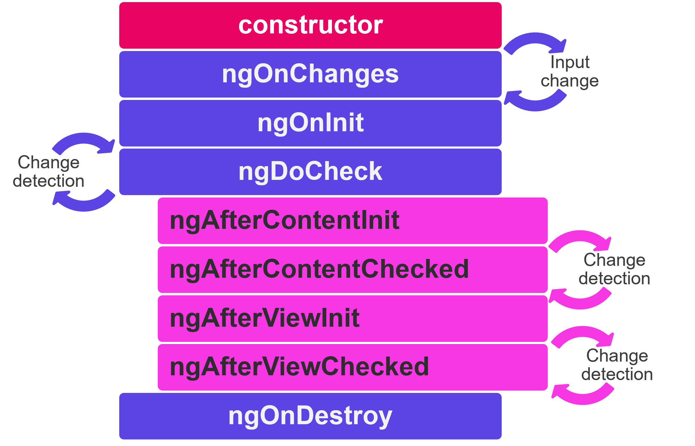

# Composants

Nous avons vu précédemment que :
- un composant est une classe décorée avec le décorateur `@Component`
- il est généré via CLI par la commande `ng g c component-name`
- par défaut, un composant est généré avec un fichier html et une feuille de style associés
- le décorateur `@Component` a des [options](https://angular.dev/api/core/Component#description) comme `templateUrl`, `styleUrl` ou `selector`.

## Encapsulation de vue et style

Vous pouvez modifier l'extension de feuille de style des fichiers générés par CLI dans le fichier `angular.json` sous l'option `schematics`.

### Encapsulation
Parmi les options du décorateur `@Component`, il y en a une qui traite de ViewEncapsulation. Angular fournit trois types d'encapsulation de vue :
- `ViewEncapsulation.Emulated` (par défaut) : émule le scoping natif,, les styles sont limités au composant
- `ViewEncapsulation.None` : tout ce qui est mis dans la feuille de style du composant est disponible globalement dans toute l'application
- `ViewEncapsulation.ShadowDom` : Angular crée un Shadow DOM pour le composant, les styles sont limités au composant

:::warning
Sous l'option par défaut, les styles spécifiés dans le fichier de style du composant ne sont hérités par aucun composant imbriqué dans son template ni par aucun contenu projeté dans le composant.
:::

### Sélecteur CSS `:host`
Des situations peuvent survenir où styler l'élément hôte du composant à partir de sa propre feuille de style est nécessaire. Pour ce faire, Angular fournit un sélecteur de pseudo-classe : `:host`.

Imaginons que nous ayons besoin d'une bordure sur le LoginFormComponent. Voici comment l'ajouter sans rajouter de `<div>` pour englober le `<form>` et le `<ul>` :

<CodeGroup>
<CodeGroupItem title="login-form.component.scss">

```css
:host {
  border: 1px solid black
}
```
</CodeGroupItem>
</CodeGroup>

L'exemple suivant cible à nouveau l'élément hôte, mais uniquement lorsqu'il possède également la classe CSS active.

<CodeGroup>
<CodeGroupItem title="login-form.component.scss">

```css
:host(.active) {
  border-width: 3px
}
```
</CodeGroupItem>
</CodeGroup>

## Lifecycle
Une instance de composant a un cycle de vie qui commence lorsqu'Angular instancie la classe du composant et présente la vue du composant avec ses vues enfants. Le cycle de vie se poursuit avec la détection des modifications, car Angular vérifie quand les propriétés liées aux données changent et met à jour à la fois la vue et l'instance de composant si nécessaire. Le cycle de vie se termine lorsqu'Angular détruit l'instance du composant et retire son template du DOM.

Angular fournit des méthodes de hook pour exploiter les événements clés du cycle de vie d'un composant.



- `ngOnChanges`: appelée après le constructeur et chaque fois que les valeurs input changent. La méthode reçoit un objet SimpleChanges qui contient les valeurs actuelles et précédentes des propriétés annotées d'@Input().

- `ngOnInit`: appelée une seule fois. C'est là que l'**initialisation du composant** doit avoir lieu, tel que **la récupération des données initiales**. En effet, les composants doivent être peu coûteux à construire, les opérations coûteuses doivent donc être tenues à l'écart du constructeur. Le constructeur ne doit pas faire plus que donner des valeurs initiales simples aux variables de la classe.

- `ngDoCheck`: appelée immédiatement après `ngOnChanges` à chaque exécution du cycle de détection du changement, et immédiatement après `ngOnInit` lors de la première exécution. Donne la possibilité de mettre en œuvre un algorithme de détection du changement personnalisé.

- `ngAfterContentInit`: appelée une seule fois. Invoquée après qu'Angular ait effectué une projection de contenu dans la vue du composant.

- `ngAfterContentChecked`: appelée après `ngAfterContentInit` et chaque `ngDoCheck` suivant.

- `ngAfterViewInit`: appelée une seule fois. Appelée lorsque la vue du composant a été complètement initialisée.

- `ngAfterViewChecked`: appelée après `ngAfterViewInit` et chaque `ngDoCheck` suivant.

Pour chaque hook du cycle de vie il existe une interface correspondante. Leurs noms sont dérivés du nom du hook de cycle de vie correspondant moins le `ng`. Par exemple, pour utiliser `ngOnInit()`, implémentez l'interface `OnInit`.

## Communication entre les composants enfant et parent
Une pratique courante dans Angular est le partage de données entre un composant parent et un ou plusieurs composants enfants. Pour ce faire, vous pouvez utiliser les directives `@Input()` et `@Output()`. `@Input()` permet à un composant parent de mettre à jour les données dans le composant enfant. Inversement, `@Output()` permet à l'enfant d'envoyer des données à un composant parent.


### @Input()

L'ajout du décorateur `@Input()` sur une propriété d'un composant enfant signifie qu'il peut recevoir sa valeur de son composant parent. Le composant parent transmet cette valeur via property binding dans son template. Une telle propriété **ne devrait pas être mutée par l'enfant** directement. Les mutations doivent se produire dans le parent, elles se propageront automatiquement via le property binding.

Voici comment l'`AppComponent` communiquerait à son composant enfant `BlogPostComponent` le titre et le contenu de son article.

<CodeGroup>
<CodeGroupItem title="Composant parent">

```ts
// app.component.ts
import { Component } from "@angular/core"
@Component({
  selector: "app-root",
  templateUrl: "./app.component.html"
})
export class AppComponent {
  article = {
    title: "My first awesome article",
    content: "This content is super interesting"
  };
}

// app.component.html
<app-blog-post [title]="article.title" [content]="article.content"><app-blog-post>
```
</CodeGroupItem>

<CodeGroupItem title="Composant enfant">

```ts
// blog-post.component.ts
import { Component, Input } from "@angular/core"
@Component({
  selector: "app-blog-post",
  templateUrl: "./blog-post.component.html"
})
export class BlogPostComponent {
  @Input() title: string
  @Input() content: string
}

// blog-post.component.html
<article>
  <h3>{{ title }}</h3>
  <p>{{ content }}</p>
</article>
```
</CodeGroupItem>
</CodeGroup>

Pour surveiller les changements sur une propriété `@Input()`, vous pouvez utiliser le hook de cycle de vie `ngOnChanges`.


::: details Fonction `input()` pour travailler avec les signaux (Angular 17+)
La librairie *zone.js* constitue une base essentielle pour la détection des changements dans Angular, permettant au framework de suivre automatiquement les opérations asynchrones telles que les appels HTTP, les timers ou les interactions utilisateur. En créant des contextes d'exécution, *zone.js* permet à Angular de savoir quand mettre à jour l'interface utilisateur sans intervention manuelle de la part des développeurs. Lors de votre montée en compétence en Angular, comprendre comment *Zone.js* gère la détection des changements est très utile pour optimiser le code et traiter des cas complexes. Depuis Angular 17 et particulièrement avec l'introduction des fonctionnalités de programmation réactive dans Angular, la dépendance à *zone.js* est en train d'être réévaluée, car elle est considérée comme une surcharge qui n'est pas toujours optimisée. Depuis Angular 19, il est possible de choisir expérimentalement de ne pas utiliser *zone.js* pour gérer la détection des changements. Les développeurs sont encouragés à explorer de nouveaux paradigmes réactifs, tels que les signaux comme alternative pour améliorer les performances et rationaliser la gestion de l'état. En développant vos compétences en Angular, rester informé de ces changements vous permettra de créer des applications plus optimisées et maintenables.

Depuis Angular 17, il est possible de passer de l'utilisation du décorateur traditionnel `@Input()` à la méthode plus fonctionnelle `input()` pour communiquer entre un composant parent et un composant enfant. Ce changement fait partie des efforts d'Angular pour améliorer les performances et simplifier la détection des changements tout en se distanciant de la surcharge de *zone.js*. Alors que `@Input()` déclenche automatiquement la détection des changements via *zone.js*, la fonction `input()` permet aux développeurs de créer des inputs réactifs qui sont intégrées à la nouvelle architecture basée sur les signaux d'Angular.

Par exemple :

```ts
import { Component, signal, input } from '@angular/core'

@Component({
  selector: 'app-parent',
  template: `<app-child [childValue]="parentValue()"></app-child>`
})
export class ParentComponent {
  parentValue = signal('Hello from Parent!')
}

@Component({
  selector: 'app-child',
  template: `<p>Valeur reçue : {{ childValue }}</p>`
})
export class ChildComponent {
  childValue = input('Valeur par défaut')
}
```

Dans cet exemple, le `ParentComponent` utilise un signal pour passer une valeur réactive au `ChildComponent`, qui définit `childValue` à l'aide de la fonction `input()`. Cette approche réduit la dépendance à *zone.js* tout en améliorant les performances et la réactivité.

Lors de la création d'inputs réactifs à l'aide de la fonction `input()` dans Angular, vous avez la flexibilité de définir si un input a une valeur par défaut ou si elle est requise. Lorsque vous spécifiez une valeur par défaut pour un input en utilisant la fonction `input()`, cela signifie que le composant peut fonctionner avec cette valeur initiale si aucune donnée externe n'est passée à partir d'un composant parent. Cela peut être particulièrement utile pour créer des composants ayant des valeurs par défaut raisonnables. Si le parent ne fournit pas de valeur, le composant s'affichera toujours sans problème. D'autre part, les inputs requis indiquent que le composant parent **doit** fournir une valeur pour cet input.

```ts
import { Component, input } from '@angular/core'

@Component({/*...*/})
export class CustomSlider {
  // Déclarer une entrée requise nommée 'value'. 
  value = input.required<number>()
  // Créer une expression calculée qui lit la valeur d'entrée
  label = computed(() => `La valeur du curseur est ${this.value()}`)
}
```
Et voici comment vous devez passer des données à l'input `value` requis :

```html
<custom-slider [value]="50"></custom-slider>
```
Comme on peut le voir ici, le composant parent n'a pas besoin de passer un Signal à `value` tant que l'application utilise *zone.js*.
:::

**Exercice : Transmettez les informations de chaque livre au BookComponent**
<iframe height='500' width='100%' src="https://stackblitz.com/edit/angular-input-training?ctl=1&embed=1&file=src/app/book/book.component.ts&hideNavigation=1"></iframe>

### @Output()

Les composants enfants communiquent avec leurs parents à l'aide d'événements : ils émettent des **événements** qui se propagent à leur parent. **Un bon composant est agnostique de son environnement**, il ne connaît pas ses parents et ne sait pas si les événements qu'il émet seront un jour interceptés (ou "écoutés").

L'ajout du décorateur `@Output()` sur une propriété de type `EventEmitter` d'un composant enfant permet aux données de circuler de l'enfant vers le parent. Le composant parent peut réagir à l'événement via la syntaxe d'event binding.

Voici comment le `AddTaskComponent` communiquerait à son parent qu'une nouvelle tâche a été ajoutée :

<CodeGroup>
<CodeGroupItem title="Composant parent">

```ts
// app.component.ts
import { Component } from "@angular/core"
@Component({
  selector: "my-app",
  templateUrl: "./app.component.html"
})
export class AppComponent {
  items = ['Do the laundry', 'Wash the dishes', 'Read 20 pages']

  addItem(item: string): void {
    this.items.push(item)
  }
}

// app.component.html
<h1>My To-do list</h1>
<ul>
  @for(item of items; track item) {
    <li>{{item}}</li>
  }
</ul>
<app-add-task (newTask)="addItem($event)"></app-add-task>
```
</CodeGroupItem>

<CodeGroupItem title="Composant enfant">

```ts
// add-task.component.ts
import { Component, EventEmitter, Output } from "@angular/core"
@Component({
  selector: "app-add-task",
  templateUrl: "./add-task.component.html"
})
export class AddTaskComponent {
  @Output() newTask = new EventEmitter<string>()

  addNewTask(task: string): void {
    this.newTask.emit(task)
  }
}

// add-task.component.html
<label>New task: <input #newTask/></label>
<button (click)="addNewTask(newTask.value)">Add</button>
```
</CodeGroupItem>
</CodeGroup>

Vous pouvez expérimenter avec cet exemple [ici](https://stackblitz.com/edit/angular-output-training-example?file=src/app/app.component.ts).

::: details Fonction output() (Angular 17+)
De la même manière que `input()` remplace `@Input()`, `output()` remplace `@Output()`. Voici l'exemple d'au-dessus en faisant usage de la fonction `output()`.

<CodeGroup>
<CodeGroupItem title="Parent component">

```ts
// app.component.ts
import { Component } from "@angular/core"
@Component({
  selector: "my-app",
  templateUrl: "./app.component.html"
})
export class AppComponent {
  items = ['Do the laundry', 'Wash the dishes', 'Read 20 pages']

  addItem(item: string): void {
    this.items.push(item)
  }
}

// app.component.html
<h1>My To-do list</h1>
<ul>
  @for(item of items; track item) {
    <li>{{item}}</li>
  }
</ul>
<app-add-task (newTask)="addItem($event)"></app-add-task>
```
</CodeGroupItem>

<CodeGroupItem title="Child component">

```ts
// add-task.component.ts
import { Component, output } from "@angular/core"
@Component({
  selector: "app-add-task",
  templateUrl: "./add-task.component.html"
})
export class AddTaskComponent {
  newTask = output<string>()

  addNewTask(task: string): void {
    this.newTask.emit(task)
  }
}

// add-task.component.html
<label>New task: <input #newTask/></label>
<button (click)="addNewTask(newTask.value)">Add</button>
```
</CodeGroupItem>
</CodeGroup>

:::

**Exercice : les livres sont désormais empruntables, communiquez lorsque les livres sont empruntés à leur composant parent**
<iframe height='500' width='100%' src="https://stackblitz.com/edit/angular-output-training?ctl=1&embed=1&file=src/app/book/book.component.html&hideNavigation=1"></iframe>

### Variable locale dans le template

Un composant parent ne peut pas utiliser le data binding (`@Output` ou `@Input`) pour accéder aux propriétés ou méthodes d'un enfant. Une variable locale dans le template peut être utilisée pour réaliser les deux.

<CodeGroup>
<CodeGroupItem title="Composant parent">

```ts
// app.component.html
<app-greet #child></app-greet>
<button (click)="child.greetMe()">Greet Me</button>
```
</CodeGroupItem>

<CodeGroupItem title="Composant enfant">

```ts
// greet.component.html
<div *ngIf="displayText">Hello User!</div>

// greet.component.ts
import { Component } from '@angular/core'
@Component({
  selector: 'app-greet',
  templateUrl: './greet.component.html'
})
export class GreetComponent {
  displayText: boolean = false

  greetMe(): void {
    this.displayText = true
  }
}
```
</CodeGroupItem>
</CodeGroup>

### @ViewChild

Le décorateur `ViewChild` peut accomplir le même objectif qu'une variable de template mais directement à l'intérieur de la classe du composant parent en injectant le composant enfant dans le composant parent. Utilisez `ViewChild` sur une variable locale chaque fois que vous devez coordonner les interactions entre plusieurs composants enfants.

Dans cet exemple, le `MenuComponent` obtient l'accès au `MenuItemComponent` :

<CodeGroup>
<CodeGroupItem title="Composant parent">

```ts
// menu.component.html
<app-menu-item [menuText]="'Contact Us'"></app-menu-item>

// menu.component.ts
@Component({
  selector: 'app-menu',
  templateUrl: './menu.component.html'
})

export class MenuComponent{
  @ViewChild(MenuItemComponent) menu: MenuItemComponent
}
```
</CodeGroupItem>
<CodeGroupItem title="Composant enfant">

```ts
// menu-item.component.html
<p>{{menuText}}</p>

// menu-item.component.ts
@Component({
  selector: 'app-menu-item',
  templateUrl: './menu-item.component.html'
})

export class MenuItemComponent {
  @Input() menuText: string;
}
```
</CodeGroupItem>
</CodeGroup>

Dans le cas où le composant parent contient plusieurs instances du même composant enfant, elles peuvent chacune être récupérées via une variable de référence du template :

<CodeGroup>
<CodeGroupItem title="Composant parent">

```ts
// menu.component.html
<app-menu-item #contactUs [menuText]="'Contact Us'"></app-menu-item>
<app-menu-item #aboutUs [menuText]="'About Us'"></app-menu-item>

// menu.component.ts
@Component({
  selector: 'app-menu',
  templateUrl: './menu.component.html'
})

export class MenuComponent{
  @ViewChild('aboutUs') aboutItem: MenuItemComponent
  @ViewChild('contactUs') contactItem: MenuItemComponent
}
```
</CodeGroupItem>
<CodeGroupItem title="Composant enfant">

```ts
// menu-item.component.html
<p>{{menuText}}</p>

// menu-item.component.ts
@Component({
  selector: 'app-menu-item',
  templateUrl: './menu-item.component.html'
})

export class MenuItemComponent {
  @Input() menuText: string
}
```
</CodeGroupItem>
</CodeGroup>

Les composants injectés via `@ViewChild` deviennent disponibles dans le hook de cycle de vie `ngAfterViewInit`. Pour récupérer tous les enfants d'un certain type, utilisez le décorateur `@ViewChildren`.

## Projection de contenu

Avec `@Input`, nous avons pu transmettre des données à un composant enfant, mais qu'en est-il de la transmission d'éléments HTML ou même d'autres composants ?

Étant donné que les composants Angular sont déclarés en tant que balises, nous pouvons placer d'autres éléments ou contenus à l'intérieur de leurs balises. Dans l'exemple suivant, la chaîne `My profile` fait office de contenu du composant `NavigationLink` :

<CodeGroup>
<CodeGroupItem title="Composant parent">

```html
<!-- in a parent component's template-->
<app-navigation-link [url]="/profile">My profile<app-navigation-link>
```
</CodeGroupItem>
<CodeGroupItem title="Composant enfant">

```html
<!-- navigation-link.component.html -->
<div>
  <a [routerLink]="url"><ng-content></ng-content></a>
</div>
```
</CodeGroupItem>
</CodeGroup>

Tout ce qui est écrit entre les balises du composant enfant dans le composant parent est injecté dans le template de l'enfant et remplace les balises `<ng-content>`.

Tout contenu HTML, y compris d'autres composants Angular, peut être projeté. Cette fonctionnalité est particulièrement utile dans les composants qui servent de *conteneur* plutôt que de *contenu*, tels que les fenêtres de dialogue ou les éléments de mise en page :

<CodeGroup>
<CodeGroupItem title="Composant enfant">

```html
<!-- my-popin.component.html -->
<div class="popin">
  <div class="popin-header">
    <ng-content select="[slot=header]"></ng-content>
  </div>

  <main class="popin-content">
    <ng-content></ng-content>
  </main>

  <div class="popin-actions">
    <ng-content select="[slot=actions]"></ng-content>
  </div>
</div>
```
</CodeGroupItem>
<CodeGroupItem title="Composant parent">

```html
<!-- in a parent component template -->
<my-popin>
  <h1 slot="header">Popin title</h1>
  <p>Popin content</p>
  <button slot="actions">OK</button>
</my-popin>
```
</CodeGroupItem>
</CodeGroup>

En plus du `<ng-content>` par défaut, vous pouvez **nommer** d'autres balises `<ng-content>` pour distribuer le contenu à plusieurs emplacements dans l'enfant. Vous y parvenez en utilisant l'attribut `select` sur la balise `<ng-content>` et en ajoutant la valeur choisie comme attribut sur l'élément à projeter.

## TP : Décomposer l'application
1. Refactorisez le `LoginFormComponent` pour extraire le code et le template liés aux détails d'un film. Pour cela, créez avec le CLI un `FilmComponent` (`ng g c components/film`). Il y aura autant d'instances de `FilmComponent` qu'il y a de films (déplacez la balise `<li></li>` et son contenu vers le nouveau composant). Utilisez `@Input()` pour transmettre les données du `LoginFormComponent` à chaque `FilmComponent`.
2. Créez un autre composant avec le CLI : `FilmSearchComponent`. Il contiendra un formulaire de recherche et la liste de `FilmComponent` ci-dessous :

```html
<form (ngSubmit)="searchFilms()">
  <label for="search">Search :</label>
  <input id="search" type="text" name="title"/>
</form>

<ul class="films">
  <!-- list of <app-film> -->
</ul>
```
Ne remplacez pas déjà le commentaire par la liste des `FilmComponent`. C'est le but du point 3.

3. Insérez ce `FilmSearchComponent` en dessous du `LoginFormComponent` dans le template de l'`AppComponent` et déplacez le code nécessaire (html et ts) du `LoginFormComponent` vers ce nouveau composant, supprimez le code qui n'est plus utilisé.

::: details Résultat attendu de l'étape 3

:::

4. Affichez le composant `FilmSearchComponent` uniquement si l'utilisateur est connecté. Vous devrez communiquer la variable `loggedIn` du `LoginFormComponent` à l'`AppComponent` via un `@Output()` (transformez le champ *loggedIn*). Vous aurez besoin d'une méthode `onLogin()` dans l'`AppComponent`.
5. Dans le `FilmSearchComponent`, affectez initialement la variable `films` à un tableau `[]` vide. Lors de la soumission du formulaire de recherche, exécutez une méthode `searchFilms()` qui mettra les 3 exemples de films dans cette liste.
6. Commitez

::: details Résultat attendu


:::

## Pour aller plus loin
En savoir plus sur la projection de contenu contextuelle en utilisant [ngTemplateOutlet](https://angular.love/ngtemplateoutlet-the-secret-to-customisation)

Angular 14 a introduit les *standalone components* en version beta dans le framework et Angular 15 a rendu leur API stable. Vous pouvez en apprendre plus sur ce type de composants [ici](https://blog.ninja-squad.com/2022/05/12/a-guide-to-standalone-components-in-angular/)