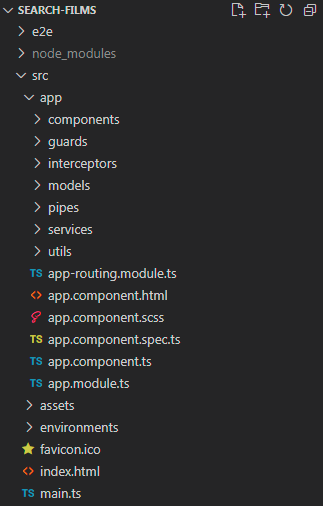
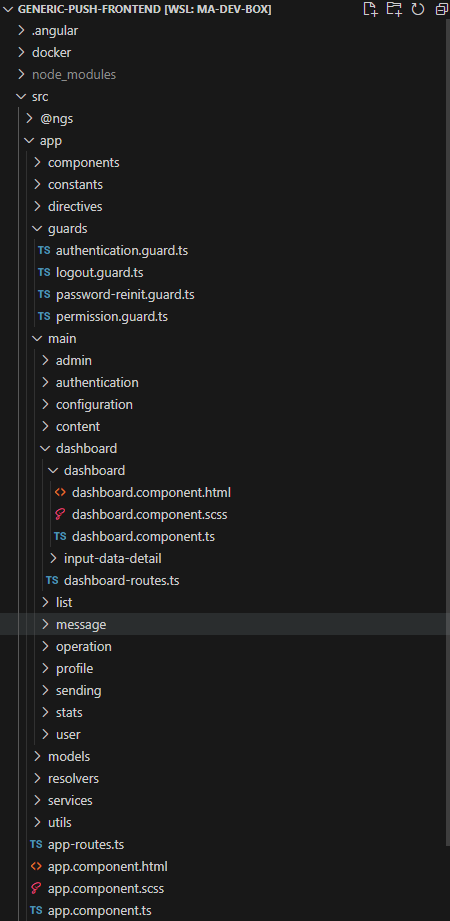

# Premiers pas 

Nous venons d'utiliser la commande du CLI Angular `ng new <my-project>`. Cette commande crée un workspace nommé *my-project* avec une application dans le dossier src et installe les packages Angular npm nécessaires dans le nouveau workspace. Le dossier racine du workspace contient divers fichiers de support et de configuration.

La création initiale d'un squelette d'application à la racine du workspace avec ses tests de bout en bout est le comportement par défaut de la commande `ng new`. Ce comportement convient à un style de développement **multi-repo** où chaque application réside dans son propre workspace. C'est également la façon de faire recommandée pour les utilisateurs débutants et intermédiaires.

Angular prend également en charge les workspaces avec plusieurs projets. Ceci est approprié pour un style de développement **monorepo** où il y a un seul dépôt git et une configuration globale pour tous les projets Angular qu'il contient. Il convient également aux utilisateurs avancés qui, par exemple, développent des librairies à partager.

Pour commencer à développer avec un workspace multi-projets, la génération initiale de l'application à la racine doit être ignorée.

``` bash
ng new my-workspace --create-application false
```

Vous pouvez ensuite générer des applications et des librairies avec des noms uniques dans le workspace.

``` bash
cd my-workspace
ng generate application my-first-app
```
Les applications générées vont dans le dossier `projects/` au lieu d'un dossier `src` à la racine.

## Structure des fichiers

Notre projet précédemment créé contient les dossiers et fichiers suivants :
- `tsconfig.json`: la configuration TypeScript de base pour les projets dans le workspace
- `tsconfig.app.json`: le fichier de configuration TypeScript de l'application racine qui hérite de celui de base
- `tsconfig.spec.json`: le fichier de configuration TypeScript des tests e2e qui hérite de celui de base
- `README.md`: documentation d'introduction pour l'application racine
- `package.json`: cconfigure les dépendances des packages npm qui sont disponibles pour tous les projets de l'espace de travail
- `package-lock.json`: fournit des informations de version pour tous les packages installés dans node_modules par le client npm
- `angular.json`: Configuration du CLI, y compris des options de configuration pour les commandes build, serve et pour les outils de tests utilisés par le CLI
- `.gitignore`: Spécifie les fichiers intentionnellement non suivis que Git doit ignorer
- `.editorconfig`: Configuration pour les éditeurs de code
- `src`: Fichiers sources pour l'application racine
- `node_modules`: Fournit des packages npm à l'ensemble du workspace
- `public`: Contient la favicon et est le dossier où mettre les images et autres fichiers d'assets à copier tel quel lors du build de l'application
- `.angluar`: Fichiers de cache

:::tip
Pour s'assurer que tous les développeurs travaillant sur un projet utilisent les mêmes versions de librairies, il est possible de [bloquer les numéros de version](https://docs.npmjs.com/cli/v7/configuring-npm/package-json#dependencies) via le fichier `package.json`.
:::

Le dossier `src` contient :
- `styles.scss`: Liste les fichiers CSS qui fournissent des styles pour un projet. L'extension reflète le préprocesseur de style que vous avez configuré pour le projet.
- `main.ts`: Le point d'entrée principal de votre application
- `index.html`: La page HTML principale qui est diffusée lorsqu'un internaute visite votre site. Le CLI ajoute automatiquement tous les fichiers JavaScript et CSS lors de la création de votre application, vous n'avez donc généralement pas besoin d'ajouter manuellement de balises `<script>` ou `<link>` ici.
- `app`: Contient les fichiers de composants dans lesquels la logique et les données de votre application sont définies

Le dossier `app` contient :
- `app.config.ts`: Définit la configuration de l'application qui dit à Angular comment assembler l'application
- `app.routes.ts`: Définit la configuration de routage pour l'application
- `app.html`: Définit le template HTML associé au composant racine `App`
- `app.scss`: Définit la feuille de style de base pour le composant racine `App`
- `app.ts`: Définit la logique du composant racine de l'application, nommé `App`. La vue associée à ce composant racine est la racine de la hiérarchie des vues.
- `app.spec.ts`: Définit un test unitaire pour le composant racine `App`


## Interpolation de texte dans les templates

Comme tout autre composant, le composant shell App est réparti sur trois fichiers.
Ouvrez le fichier typescript du composant (`app.ts`) et modifiez la valeur de la propriété title en 'Search films'

```typescript
// app.component.ts
import { Component, signal } from '@angular/core'

@Component({
  selector: 'app-root',
  templateUrl: './app.html',
  styleUrls: ['./app.scss']
})
export class App {
  protected readonly title = signal('Search Films')
}
```

Ouvrez le fichier de template du composant (`app.html`) et supprimez le modèle par défaut généré par le CLI Angular. Remplacez-le par la ligne d'HTML suivante.
```html
<!-- app.html -->
<h1>{{title()}}</h1>
```
Les doubles accolades sont la *syntaxe d'interpolation binding* d'Angular. Cet interpolation binding présente la valeur de la propriété title du composant à l'intérieur de la balise h1.

Le navigateur s'actualise et affiche le nouveau titre de l'application.

Le moyen le plus simple d'insérer des données de manière dynamique dans vos composants consiste à interpoler du texte, en utilisant la syntaxe `{{myVariable}}`. À l'intérieur des accolades doubles, vous pouvez spécifier n'importe quelle expression JavaScript valide sauf:

- les opérations bitwise: `&`, `&=`, `~`, `|=`, `^=`, etc.
- la déstructuration d'objet: `const { name } = person`
- la destrucration de tableau: `const [firstItem] = items`
- l'opérateur virgule: `x = (x++, x)`
- instanceof: `movie instanceof Film`
- new: `new Film()`
- les regex
- les déclarations


Ajoutez deux champs après la variable de titre dans le fichier `app.ts` :
```typescript
// app.component.ts
protected readonly title = signal('Search Films')
protected readonly orderReference = signal('ABCXYZ')
protected readonly price = signal(17.3)
```

Dans le template:
```html
<!--app.html-->
<h1>{{title()}}</h1>
<p>Order ref. {{ orderReference() }} - Total: {{ price().toFixed(2) + "€" }}</p>
```

Le template a accès à tous les membres non privés de la classe du composant. Changer la visibilité de `price` en `private` produira cette erreur: *Property 'price' is private and only accessible within class 'App'.*

L'interpolation ne fonctionne que sur le contenu textuel des éléments. Vous ne devriez pas l'utiliser pour modifier la valeur des attributs HTML et ne pouvez pas l'utiliser pour insérer du code HTML. Nous verrons des stratégies pour le faire plus tard dans la formation.

Dans cet exemple, nous avons formaté le prix manuellement. Nous verrons plus tard qu'Angular fournit un moyen de déclarer des formateurs réutilisables : les **pipes**.


## Travailler avec des composants

L'`App` n'est que le composant racine d'une application Angular. Une application Web est constituée de petits composants réutilisables, intégrés dans des composants de niveau supérieur pour former la mise en page, la disposition de vos éléments sur la page. Cette structure peut être décrite comme une arborescence de composants. Angular crée, met à jour et détruit les composants au fur et à mesure que l'utilisateur se déplace dans l'application. L'application peut agir à chaque instant de ce cycle de vie via des hooks de cycle de vie facultatifs, comme `ngOnInit()`.


Avant de générer un second composant, configurons la convention de nommage des composants et autres blocs de construction d'une application Angular. Depuis Angular 20, le type de bloc de construction (composant, service, directive) généré n'est pas automatiquement suffixé au nom du fichier et de la classe. Ceci donne plus de flexibilité aux équipes en terme de nommage, cependant ceci peut aussi facilement mener à des conflits de nommage entre le composant, le service et le DTO qui partagent tous le même nom de classe par exemple. C'est pour cela que nous allons ajouter la configuration suivante dans le fichier `angular.json` afin de restorer le fait que le CLI suffixe automatiquement les noms de fichier et les noms de classe.

```json{7-32}
// angular.json
  "cli": {
    "schematicCollections": [
      "angular-eslint"
    ]
  },
  "schematics": {
    "@schematics/angular:component": {
      "type": "component"
    },
    "@schematics/angular:directive": {
      "type": "directive"
    },
    "@schematics/angular:service": {
      "type": "service"
    },
    "@schematics/angular:guard": {
      "typeSeparator": "."
    },
    "@schematics/angular:interceptor": {
      "typeSeparator": "."
    },
    "@schematics/angular:module": {
      "typeSeparator": "."
    },
    "@schematics/angular:pipe": {
      "typeSeparator": "."
    },
    "@schematics/angular:resolver": {
      "typeSeparator": "."
    }
  }
```

Créons un second composant. Il est conseillé de générer les composants en utilisant le [CLI Angular](https://angular.dev/cli/generate#component).

```bash
ng g c child #shorthand for ng generate component child
```

La commande `ng g c` a ajouté un dossier `child` contenant les fichiers du composant `ChildComponent` dans le dossier `app`.

```typescript
// child.ts
import { Component, signal } from '@angular/core'

@Component({
  selector: 'app-child',
  imports: [],
  templateUrl: './child.component.html',
  styleUrls: ['./child.component.scss']
})
export class ChildComponent {

}
```

Pour lier les composants entre eux, les composants enfants sont déclarés dans le template de leur composant parent, en utilisant leur sélecteur comme balise. Le composant enfant doit aussi être ajouté au tableau des `imports` présent dans le décorateur du parent. Un composant peut être réutilisé autant de fois que souhaité. Le sélecteur de `ChildComponent` est `app-child`. L'inclusion de ce composant en tant qu'enfant du composant' `App` se fait comme suit :


<CodeGroup>
<CodeGroupItem title="app.html">

```html
<h1>{{title()}}</h1>
<app-child></app-child>
```
</CodeGroupItem>
<CodeGroupItem title="app.ts">

```ts{2,6}
import { Component, signal } from '@angular/core'
import { ChildComponent } from './child/child.component'

@Component({
  selector: 'app-root',
  imports: [ChildComponent],
  templateUrl: './app.html',
  styleUrl: './app.scss'
})
export class AppComponent {
  protected readonly title = signal('Search Films')
}
```
</CodeGroupItem>
</CodeGroup>

:::tip
Angular préfixe automatiquement les sélecteurs afin que les composants importés de librairies externes soient plus faciles à repérer. Par exemple, les composants de la librairie Material Angular sont tous préfixés par `mat-`. Vous pouvez modifier le préfixe de l'application dans le fichier de configuration `angular.json` afin qu'il reflète le nom de votre application.
:::

::: details NgModules (avant Angular 17 et l'architecture en composant autonome)
De nos jours, les composants sont déclarés comme autonomes par défaut. C'est pourquoi la propriété `standalone` n'est plus présente dans le décorateur `@Component` par défaut. Avant la mise en œuvre des composants autonomes, l'architecture d'une application Angular dépendait des NgModules. Chaque composant devait être déclaré dans un NgModule pour être utilisable dans l'application. Chaque NgModule pouvait déclarer autant de composants que le développeur le souhaitait. Le module s'occupait de s'assurer que chaque composant avait accès aux dépendances dont il avait besoin, en effectuant tous les imports requis. Avec les composants autonomes, cette responsabilité est maintenant dévolue à chaque composant. C'est pourquoi il y a désormais un tableau `imports` dans la définition de `@Component`. Vous pouvez encore rencontrer des architectures utilisant des NgModules et étant dans la dernière version d'Angular car refactoriser une application complète pour utiliser des composants autonomes peut être une tâche longue et risquée.

En coulisse, la commande `ng g c` déclairait également le composant `Child` dans l'`AppModule` qui était le module racine de l'application.

```typescript {12}
// app.module.ts
import { NgModule } from '@angular/core'
import { BrowserModule } from '@angular/platform-browser'

import { AppRoutingModule } from './app-routing.module'
import { AppComponent } from './app.component'
import { ChildComponent } from './child/child.component'

@NgModule({
  declarations: [
    AppComponent,
    ChildComponent
  ],
  imports: [
    BrowserModule,
    AppRoutingModule
  ],
  providers: [],
  bootstrap: [AppComponent]
})
export class AppModule { }
```

Un NgModule est défini par une classe décorée avec `@NgModule()`. Le décorateur `@NgModule()` est une fonction qui prend un seul objet de métadonnées, dont les propriétés décrivent le module. Les propriétés les plus importantes sont les suivantes :

- `declarations`: Les composants, directives et pipes qui appartiennent à ce NgModule.
- `exports`: Le sous-ensemble de déclarations qui doit être visible et utilisable dans les templates des composants d'autres NgModules. (l'`AppModule` n'a aucune raison d'exporter quoi que ce soit car les autres modules n'ont pas besoin d'importer le NgModule racine)
- `imports`: D'autres modules dont les classes exportées sont nécessaires aux template des composants déclarés dans ce NgModule.
- `providers`: Créateurs de services que ce NgModule contribue à la collection globale de services ; ils deviennent accessibles dans toutes les parties de l'application. (Vous pouvez également spécifier des providers au niveau du composant.)
- `bootstrap`: La vue principale de l'application, appelée composant racine, qui héberge toutes les autres vues de l'application. Seul le NgModule racine doit définir la propriété bootstrap.

Bien qu'une petite application puisse n'avoir qu'un seul NgModule, au fur et à mesure que l'application grandit, il était recommandé de refactoriser le module racine en modules de fonctionnalités qui représentent des ensembles de fonctionnalités connexes. Vous pouviez ensuite soit importer ces modules dans le module racine (eagerly loaded) ou les charger de manière asynchrone via le routeur (lazily loaded).
:::

## Organiser vos fichiers
Voici la structure de dossiers que nous nous efforcerons d'atteindre dans l'application Search Films :

<!-- TODO replace image-->


Cette structure de dossiers est la mieux adaptée aux projets simples qui n'ont qu'une seule fonctionnalité dont les routes sont définies dans un seul fichier: `app.routes.ts`. Au fur et à mesure qu'un projet grandit, des dossiers de fonctionnalités seront introduits et la structure peut évoluer vers ceci :

<!-- TODO replace image-->


L'équipe Angular fournit un [guide de style](https://angular.dev/style-guide) où ils conseillent de suivre une telle structure plutôt que la structure simple. Si vous avez des doutes de nommage ou style, hésitez pas à vous y référer.

:::tip
Par défaut, le CLI toujours générera toujours dans le dossier `app`. Vous pouvez lui dire de générer dans un autre dossier en passant le chemin avant le nom de l'élément que vous souhaitez qu'il génère. Par exemple, `ng generate component components/dashboard` générera les quatre fichiers du composant `DashboardComponent` dans `app/components/dashboard`. Le dossier `components` est créé par le CLI s'il n'existait pas déjà, ainsi que le dossier `dashboard`.
:::

<!-- Au fur et à mesure que la complexité de la structure des dossiers de l'application augmente, il est recommandé d'ajouter des alias dans le fichier `tsconfig.json`. Faisons-le maintenant pour s'éviter un refactoring pénible plus tard :
```json
"compilerOptions": {
  //...
  "baseUrl": "./src",
  "paths": {
    "@models/*": ["src/app/models/*"],
    "@services/*": ["src/app/services/*"],
    "@guards/*": ["src/app/guards/*"],
    "@pipes/*": ["src/app/pipes/*"],
    "@components/*": ["src/app/components/*"]
  }
}
```
VsCode utilisera automatiquement ces chemins pour les imports au lieu de ceux relatifs qui peuvent être difficiles à lire ou à maintenir. -->


## TP: Premier composant

1. Si vous avez créé le composant `app-child`, supprimez-le car il n'est pas nécessaire dans la suite du TP et enlever son import dans le composant `App`. Une erreur risque d'apparaître dans la console d'où le projet a été lancé suite à la suppression. Dans ce cas-là, redémarrez le projet.

2. La plupart des applications s'efforcent d'avoir une apparence cohérente sur l'ensemble de l'application. Le CLI a généré un fichier `styles.scss` vide à cet effet. Copiez coller dedans le contenu de la feuille de style SCSS qui servira de base à tous les travaux pratiques, téléchargeable ici : [styles.scss](https://worldline.github.io/angular-training/styles.scss).

3. Créer un nouveau composant `login-form` contenant le formulaire d'authentification suivant (n'oubliez pas de le générer dans le dossier *components*):
```html
<form id="login-form">
  <h1>Authentication</h1>
  <p>Fill out this form to login.</p>

  <label for="email">Email</label>
  <input type="text" placeholder="Enter your email" id="email" name="email" required/>

  <label for="psw">Password</label>
  <input type="password" placeholder="Enter your password" id="psw" name="password" required/>

  <button type="submit">Login</button>
</form>

```

4. Supprimez le contenu existant dans le template du composant `App` (fichier html du composant) si pas déjà fait ainsi que les variables déclarées dans la classe de l'`App`. Affichez le `LoginFormComponent` à la place avec `<app-login-form></app-login-form>`. Si vous n'avez pas copié-collé la ligne d'html précédente mais utilisé l'autocomplétion de vscode pour écrire le nouveau template, alors VScode aura rajouté pour vous la classe `LoginFormComponent` au tableau des `imports` du decorateur `@Component` de la class `App`. Si ce n'est pas le cas, faites-le.

5. Complétez le fichier `login-form.component.ts` : ajoutez un champ `protected readonly title = signal('Authentication')`. Ensuite, utilisez l'*interpolation binding* dans le template pour passer le titre défini dans le fichier ts du composant à la balise h1 du template. N'oubliez pas qu'il faut invoquer un signal pour lire sa valeur.

6. Pensez à commiter

::: details Résultat attendu

:::
