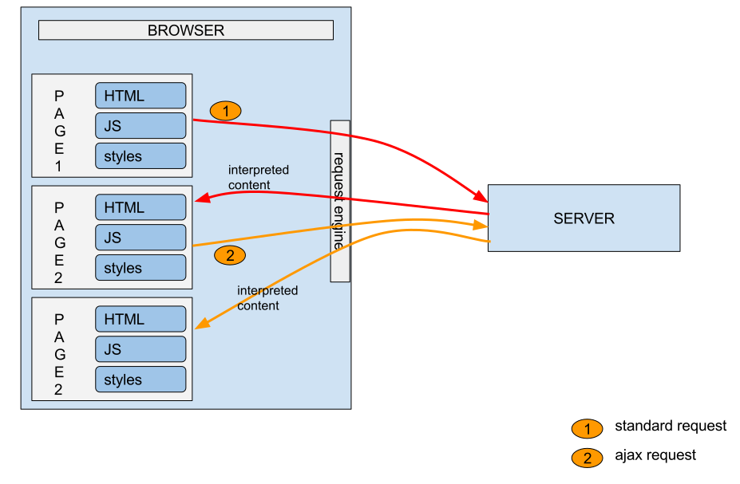

# Présentation de Angular

## Qu'est-ce que Angular ?
Angular est plus qu'un simple framework frontend avec lequel créer des applications à page unique (Single Page Applications : SPA). Il s'agit d'une plate-forme de développement à part entière construite sur TypeScript qui comprend :

- Un framework basé sur des composants pour créer des applications Web évolutives.
- Une collection de bibliothèques bien intégrées qui couvrent une grande variété de fonctionnalités, notamment le routage, la gestion des formulaires, la communication client-serveur, les applications Web progressives, etc.
- Une suite d'outils de développement pour vous aider à développer, créer, tester et mettre à jour votre code via Angular CLI.

## Pages générées par le serveur vs SPA + API

Il existe deux modèles courants de développement de sites Web :

- Pages générées par le serveur :
  - La présentation et les données de chaque page sont générées par le serveur avant de les livrer au client
  - Généralement avec état (cela signifie que les données sont partagées lors de la navigation sur les pages à l'aide de sessions et de cookies)
  - L'interface utilisateur et la logique métier sont couplées
  - Le corps de la réponse est généralement plus lourd car il contient à la fois l'interface utilisateur et les données
  - Également appelées applications multipages (puisque chaque vue est représentée par une page distincte)
  - Quelques exemples de frameworks : PHP, Symphony, JSP, Tapestry, ASP Razor pages

- Application à page unique (SPA) + API :
  - L'interface utilisateur se compose d'un seul fichier HTML statique. Le fichier est dit statique car le serveur ne modifie pas la page avant de la livrer
  - Les données sont extraites dynamiquement du serveur lorsque le client en a besoin
    - Le serveur qui sert les données est communément appelé un serveur API/backend
    - Les données sont généralement au format JSON
    - It is not necessary to provide an API Il n'est pas nécessaire de fournir une API (par exemple, un jeu vidéo sur SPA)
  - Le contenu de la page est modifié par le client via la manipulation du DOM. Cela permet par exemple de simuler un changement de vue ou de page
  - Le client utilise Javascript pour récupérer des données dynamiques et manipuler le DOM
  - Ce modèle est similaire à celui utilisé dans les applications mobiles (le SPA est analogue à l'application mobile)

Une application Angular est un *SPA* qui est complété par une API si besoin.
Il existe d'autres frameworks SPA tels que Vue.js, React et Ember.js (le dernier est le moins populaire).
Chaque cadre a ses propres forces et faiblesses.

## Les avantages d'utiliser Angular

Angular présente de nombreux avantages :

- Il est particulièrement bien adapté aux projets qui doivent évoluer et à cet effet, il est principalement utilisé pour les projets d'entreprise.
- Son riche écosystème de bibliothèques officielles permet une grande cohérence entre les projets, ce qui signifie que lors du transfert d'équipes ou de projets, vous n'aurez besoin que de vous renseigner sur le nouveau domaine d'activité et non sur une toute nouvelle façon de faire les choses, car un autre choix de bibliothèque a été fait.
- Il est très bien documenté et la cohérence dans la manière dont le cadre est utilisé signifie que vous êtes plus que susceptible de trouver une réponse à toutes les questions que vous pourriez rencontrer au cours de votre parcours d'apprentissage.
- L'équipe Angular est très fière de la facilité avec laquelle elle facilite la mise à jour des projets Angular, en fournissant des étapes faciles à suivre et une migration entièrement automatisée.