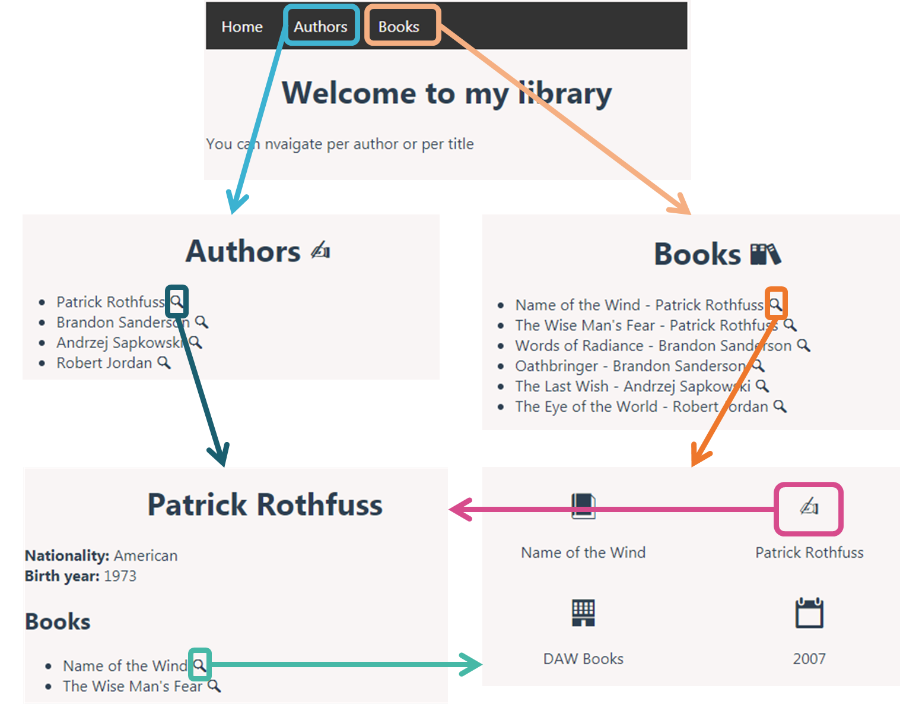
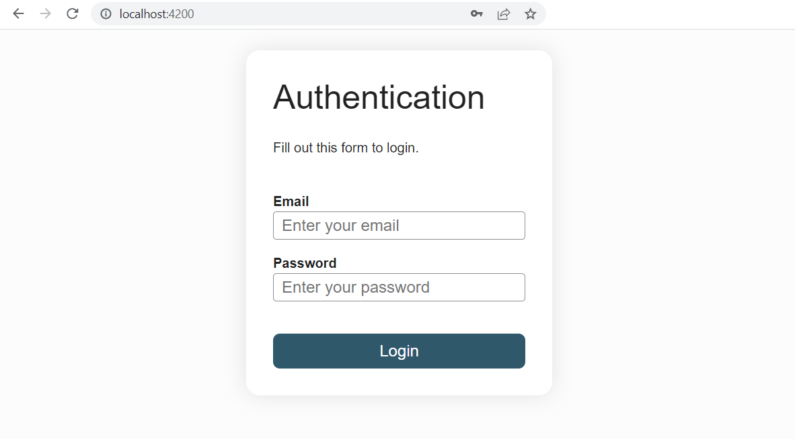
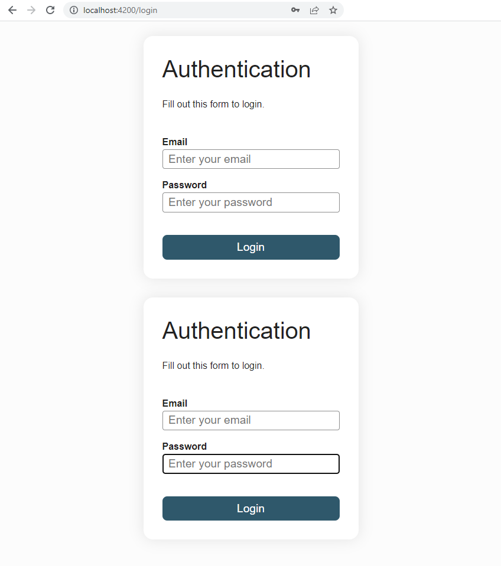
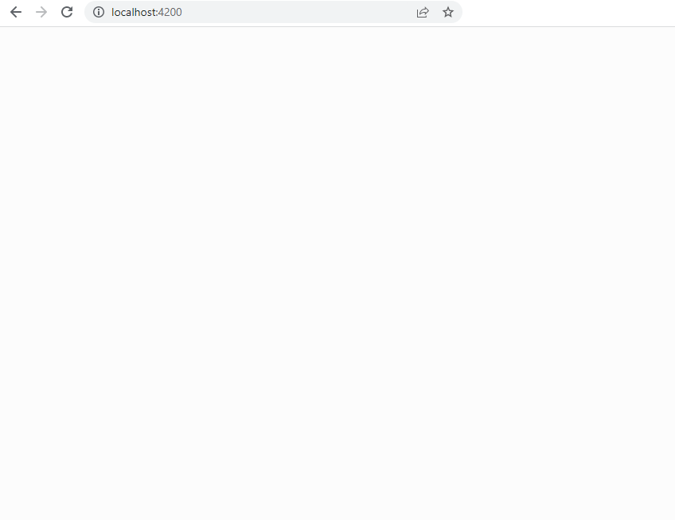
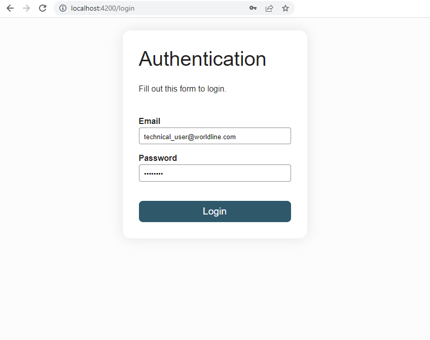

# Routage

Les applications Angular sont principalement des SPA (Single Page Application). Le serveur sert toujours une seule page HTML, et la navigation entre les pages/sections de l'application est gérée côté client en JavaScript. Cette approche permet des transitions plus fluides entre les pages et réduit le nombre d'appels au serveur nécessaires pour naviguer entre les pages, améliorant ainsi l'UX. Ceci est essentiel pour les applications Progressive Web Apps ou les applications Web qui souhaitent disposer de fonctionnalités hors ligne.

Le routage d'une SPA est donc géré côté client, et l'équipe Angular met à disposition une librairie à cet effet : `@angular/router`. Ce routeur vous permet d'associer des routes (URL) avec des composants Angular.

Pour ce chapitre, nous utiliserons l'application *Bibliothèque personnelle* comme exemple fil rouge. Outre l'`App` component qui contient un `NavbarComponent`, l'application a 5 "pages":
- Accueil
- Liste de livres
- Détail du livre
- Liste des auteurs
- Détails sur l'auteur

Le routage cible de l'application-exemple est le suivant :



Ce [Stackblitz](https://stackblitz.com/fork/github/ocunidee/atpw-routing/tree/master?file=src/app/app.routes.ts&title=Routing) servira de base pour l'exemple. Ouvrez ce stackblitz, on va mettre en place la navigation ensemble au fur et à mesure du chapitre.

## Module de routage

:::details Avant l'architecture en composants standalone
Dans Angular, une bonne pratique consiste à charger et à configurer le routeur dans un module distinct de premier niveau, dédié au routage et importé par la racine `AppModule`. Par convention, le nom de classe du module est `AppRoutingModule` et il se situe dans le fichier `app-routing.module.ts` dans le dossier `src/app`.

Dans l'exercice et dans les travaux pratiques, il a déjà été généré pour vous, au cas où il ne l'aurait pas été, voici comment le générer avec CLI :

```sh
ng generate module app-routing --flat --module=app
```

`--flat` signale au CLI de ne pas créer de dossier pour le module de routage afin qu'il soit placé au même niveau que le fichier `app.module.ts` et `--module=app` signifie que le module de routage est à ajouter aux importations du `AppModule`.

Une fois que votre application grandit et que vous commencez à la refactoriser en plusieurs modules, il est recommandé de définir un module de routage par module de fonctionnalité.

L'`AppRoutingModule` généré ressemble à ceci :

```ts
import { NgModule } from '@angular/core'
import { RouterModule, Routes } from '@angular/router'

const routes: Routes = []

@NgModule({
  imports: [RouterModule.forRoot(routes)],
  exports: [RouterModule]
})
export class AppRoutingModule { }
```
:::

Angular génère les projets avec un fichier `app.routes.ts`. C'est ici que les routes de l'application sont définies. Au fur et à mesure que l'application grossit, il est recommandé de diviser la définition des routes en plusieurs fichiers pour plus de clarté.

Voici ce à quoi ressemble le fichier `app.routes.ts`: 

```ts
import { Routes } from '@angular/router'

export const routes: Routes = []
```

Le tableau `routes` est l'endroit où nous indiquons au `Router` quel composant doit être affiché lorsque l'utilisateur clique sur un lien ou tape une URL dans la barre d'adresse.
Une [Route](https://angular.dev/api/router/Route) est principalement définie par un chemin et un composant. Elle peut également définir une redirection, des routes enfants, une stratégie de correspondance de chemin (path match strategy), des guards, des resolvers, des routes enfants lazy-loaded, etc...

Voici un exemple d'application avec un tableau de bord sécurisé par authentification :
```ts
export const routes: Routes = [
  { path: 'registration', component: RegistrationComponent },
  { path: 'forgotten-password', component: ForgottenPasswordComponent },
  { path: 'login', component: LoginComponent },
  { path: 'dashboard', component: DashboardComponent, canActivate: [AuthenticationGuard] },
  { path: '', pathMatch: 'full', redirectTo: '/dashboard' },
  { path: '**', redirectTo: '/dashboard' }
]
```
- `canActivate` vous permet de définir des route guards. Un route guard bloque l'activation de la route si la condition qu'il définit n'est pas vérifiée.
- `pathMatch: 'full'` force le chemin à être comparé à l'URL entière. Il est important de le faire lors de la redirection des routes à chemin vide. Sinon, parce qu'un chemin vide est un préfixe de n'importe quelle URL, le routeur appliquerait la redirection même lors de la navigation vers la destination de redirection, créant une boucle sans fin.
- `'**'`: est une wildcard qui signifie que le chemin correspond à n'importe quelle URL

**Exercice :** ouvrez le Stackblitz et définissez les routes suivants dans le tableau `Routes`:
- accueil: `/home` & route vide
- liste des livres : `/books`
- détail du livre avec dont l'id est 1 : `/books/1`
- liste des auteurs : `/authors`
- détail de l'auteur dont l'id 1 : `/authors/1`
- toute autre route doit conduire à la page d'accueil

::: tip Hint
`{ path: 'detail/:id', component: TransactionDetailComponent }` est une route *paramétrée* où les deux points (`:`) dans le chemin indiquent que `:id` est un espace réservé pour un identifiant de transaction spécifique.
:::

::: details Correction
```ts
import { Routes } from '@angular/router'
import { AuthorDetailsComponent } from './author-details/author-details.component'
import { AuthorListComponent } from './author-list/author-list.component'
import { BookDetailsComponent } from './book-details/book-details.component'
import { BookListComponent } from './book-list/book-list.component'
import { HomeComponent } from './home/home.component'

export const routes: Routes = [
  { path: 'home', component: HomeComponent },
  { path: 'authors', component: AuthorListComponent },
  { path: 'authors/:id', component: AuthorDetailsComponent },
  { path: 'books', component: BookListComponent },
  { path: 'books/:id', component: BookDetailsComponent },
  { path: '', pathMatch: 'full', redirectTo: '/home' }
  { path: '**', redirectTo: '/home' }
]
```
:::

L'utilisation de routes enfants rend l'imbrication entre les routes plus claire et ouvre la voie au lazy-loading. Voici comment cela s'appliquerait à l'application *Personal Library* :

::: details Correction avec les routes enfants
```ts
export const routes: Routes = [
  { path: 'home', component: HomeComponent },
  {
    path: 'authors',
    children: [
      { path: '', component: AuthorListComponent, pathMatch: 'full' },
      { path: ':id', component: AuthorDetailsComponent }
    ]
  },
  {
    path: 'books',
    children: [
      { path: '', component: BookListComponent, pathMatch: 'full' },
      { path: ':id', component: BookDetailsComponent }
    ]
  },
  { path: '', redirectTo: '/home', pathMatch: 'full' },
  { path: '**', redirectTo: '/home' }
]
```
:::

::: tip Hosting
Lors de l'utilisation de `ng serve`, Angular démarre automatiquement un serveur de développement configuré pour les spécificités d'une SPA. Dans un environnement de production, vous devrez configurer un serveur tel qu'un Nginx. Pour que le routage fonctionne correctement, la configuration du serveur doit avoir une règle de réécriture afin que le fichier `index.html` (produit en construisant l'application) soit servi pour toutes les "routes". Sinon, l'utilisateur rencontrerait une erreur 404. Pour Nginx, voici à quoi cela pourrait ressembler :
```
location / {
  try_files $uri $uri/ /index.html;
}
```
:::

## Directives du Router

Dans le Stackblitz, essayez de naviguer vers les composants en remplaçant l'URL dans la barre d'adresse. Comme vous pouvez le voir, à part le `NavbarComponent`, aucun autre composant n'est affiché même si nous venons de définir des routes dans le `app.routes.ts`. C'est parce que nous n'avons pas encore dit à Angular où ces composants doivent être insérés dans le DOM.

### router-outlet
C'est le but du `RouterOutlet`. Le `NavbarComponent` doit rester affiché à tout moment, ce qui signifie que les composants doivent être insérés en dessous. Ajoutons le `router-outlet` dans l'`App` component. N'oubliez pas l'import dans le fichier typescript.

<CodeGroup>
<CodeGroupItem title="app.html">

```html
<app-navbar></app-navbar>
<router-outlet></router-outlet>
```
</CodeGroupItem>

<CodeGroupItem title="app.ts">

```ts{2,7}
import { Component } from '@angular/core'
import { RouterOutlet } from '@angular/router'
import { NavbarComponent } from './navbar/navbar.component'

@Component({
  selector: 'app-root',
  imports: [RouterOutlet, NavbarComponent],
  templateUrl: './app.html',
  styleUrl: './app.scss'
})
export class App {

}
```
</CodeGroupItem>
</CodeGroup>

Essayez à nouveau d'afficher les différents composants en modifiant l'URL dans la barre d'adresse, cela devrait maintenant fonctionner. L'étape suivante consiste à activer la navigation via des liens directement au sein de l'application.

### routerLink

Tout d'abord, occupons-nous des liens dans le `NavbarComponent`. Ouvrez le fichier `navbar.component.html` et modifiez le code comme suit :

<CodeGroup>
<CodeGroupItem title="navbar.component.html">

```html
<nav>
  <ul>
    <li><a routerLink='/home'>Home</a></li>
    <li><a routerLink='/authors'>Authors</a></li>
    <li><a routerLink='/books'>Books</a></li>
  </ul>
</nav>
```
</CodeGroupItem>
<CodeGroupItem title="navbar.component.ts">

```ts{6}
import { Component } from '@angular/core'
import { RouterLink } from '@angular/router'

@Component({
  selector: 'app-navbar',
  imports: [RouterLink],
  templateUrl: './navbar.component.html',
  styleUrl: './navbar.component.scss'
})
export class NavbarComponent {

}
```
</CodeGroupItem>
</CodeGroup>

Vous pouvez maintenant naviguer via les liens de la barre de navigation. `routerLink` est le sélecteur de la [directive RouterLink](https://angular.dev/api/router/RouterLink) qui transforme les clics de l'utilisateur en navigations de routeur. C'est une autre des directives publiques du `RouterModule`.

La directive `routerLink` s'utilise comme l'attribute binding:
- sans `[]`, la partie droite de l'affectation est considérée comme étant un littéral
```html
<a routerLink='/home'>Home</a>
```
- avec `[]`, la partie droite de l'affectation est considérée comme une expression dynamique
```html
<a [routerLink]="homeAdress">Home</a>
```
- L'expression dynamique peut soit être une string soit un tableau de fragments
```html
<a [routerLink]="['../', 'customer', id]">Customer Detail</a>
```

::: danger
Habituellement, la destination d'un lien est spécifiée via l'attribut `href`. Cependant, ce n'est pas la voie à suivre pour la navigation au sein d'une SPA et ne doit être utilisé que pour la navigation vers des URL externes. En effet, naviguer via href dans une SPA fait recharger l'ensemble de l'application, ce qui est très inefficace et offre une très mauvaise expérience utilisateur.
:::

**Exercice :** Ajoutez la navigation vers les détails du livre et les détails de l'auteur dans leurs composants de liste respectifs.

:::tip
Ne pas oublier l'import de `RouterLink`
:::

::: details Correction
Vous avez deux options, soit utiliser un chemin absolu commençant par `/` ce qui signifie que le chemin entier doit être fourni (comme dans `book-list.component.html`) ou utiliser un chemin relatif vers l'emplacement actuel (comme dans `author-list.component.html`).

```html
<!-- author-list.component.html -->
<h1>Authors ✍️</h1>
<ul>
  @for(author of authors; track author.id) {
    <li>{{author.name}} <a [routerLink]="[author.id]">🔍</a></li>
  }
</ul>

<!-- book-list.component.html -->
<h1>Books 📚</h1>
<ul>
  @for(book of books; track book.id) {
    <li>{{book.title}} - {{book.author}} <a [routerLink]="[book.id]">🔍</a></li>
  }
</ul>
```

Pour le moment, seules les données du livre avec l'id 1 et les données de l'auteur avec l'id 1 sont affichées. Plus loin dans ce chapitre, nous verrons comment extraire l'identifiant présent dans l'URL pour sélectionner les données appropriées à afficher.
:::

**Exercice:** Ajoutez la navigation dans le `BookDetailComponent` au `AuthorDetailComponent` et vice versa.

::: details Correction

```html
<!-- author-details.component.html -->
@let books = details()?.books;

@if(books) {
  <h2>Books</h2>
  <ul>
    @for (book of books; track book.id) {
      <li>{{book.title}} <a [routerLink]="['/books', book.id]">🔍</a></li>
    }
  </ul>
}

<!-- book-details.component.html -->
<div class="info">
  <div><a [routerLink]="['/authors', details()?.author?.id]">✍️</a></div>
  <p> {{details()?.author?.name}}</p>
</div>
```
:::

La directive `RouterLink` a un `queryParams` `Input`. Cet `Input` permet de passer des paramètres facultatifs via des queries dans l'URL :
```html
<a routerLink="'/books" [queryParams]="{genre: 'Epic Fantasy'}">
  Epic Fantasy Books
</a>
```
L'exemple génère le lien : `/books?genre=Epic%20Fantasy`

### routerLinkActive

La navigation en cliquant sur les liens dans le `NavbarComponent` est maintenant fonctionnelle ; cependant, il n'y a rien d'afficher à l'utilisateur concernant quel lien est actif. C'est le but de la directive `routerLinkActive`. Elle vous permet de spécifier une ou plusieurs classes CSS à ajouter à l'élément lorsque la route liée est active.

<CodeGroup>
<CodeGroupItem title="navbar.component.html">

```html
<nav>
  <ul>
    <li><a routerLinkActive='active' routerLink='/home'>Home</a></li>
    <li><a routerLinkActive='active' routerLink='/authors'>Authors</a></li>
    <li><a routerLinkActive='active' routerLink='/books'>Books</a></li>
  </ul>
</nav>
```
</CodeGroupItem>
<CodeGroupItem title="navbar.component.css">

```css
li a:hover:not(.active) {
  background-color: #111;
}

.active {
  background-color: cadetblue;
}

.active:hover {
  background-color: #256264;
}
```
</CodeGroupItem>
<CodeGroupItem title="navbar.component.ts">

```ts{6}
import { Component } from '@angular/core'
import { RouterLink, RouterLinkActive } from '@angular/router'

@Component({
  selector: 'app-navbar',
  imports: [RouterLink, RouterLinkActive],
  templateUrl: './navbar.component.html',
  styleUrl: './navbar.component.scss'
})
export class NavbarComponent {

}
```
</CodeGroupItem>
</CodeGroup>

## Services du Router

Jusqu'à présent, nous avons principalement travaillé avec le `Router` Angular à partir du template. La librairie fournit également des services pour interagir avec elle à partir de la classe d'un composant.

### Service ActivatedRoute

Le service `ActivatedRoute` décrit l'état actuel du *router*. Grâce à lui, le composant associé à la route actuelle peut extraire des informations de l'URL via les propriétés `paramMap` et `queryParamMap`.

`paramMap` et `queryParamMap` sont des Observables, une notion que nous verrons plus en détail dans un chapitre ultérieur. Un Observable permet d'observer comment les informations évoluent dans le temps. Le service `ActivatedRoute` fournit également une propriété `snapshot` pour obtenir uniquement l'état du routeur à un moment donné. Cette propriété est suffisante pour couvrir la plupart des cas.

Pour extraire un paramètre d'une route, deux étapes sont nécessaires :
1. Injectez le service `ActivatedRoute` dans le composant qui en a besoin
2. Récupérez le paramMap depuis le snapshot dans le hook de cycle de vie `OnInit`

```ts{9,12}
import { Component, OnInit, inject } from '@angular/core'
import { ActivatedRoute } from '@angular/router'

@Component({
  selector: 'app-example',
  templateUrl: './exemple.component.html'
})
export class ExampleComponent implements OnInit {
  private route = inject(ActivatedRoute)

  ngOnInit(): void {
    const id: string = this.route.snapshot.paramMap.get('id')
  }
}
```

Revenons à l'application *Personal Library*. Avec l'aide de `ActivatedRoute`, montrez les détails de l'auteur et du livre appropriés en fonction de la route.

::: details Correction
```ts
// book-details.component.ts
export class BookDetailsComponent implements OnInit {
  private readonly route = inject(ActivatedRoute)
  protected readonly details = signal<BookDetail | undefined>(undefined)

  ngOnInit(): void {
    const id = this.route.snapshot.paramMap.get('id')
    this.details.set(bookDetails.get(Number(id)))
  }
}

// author-details.component.ts
export class AuthorDetailsComponent implements OnInit {
  private readonly route = inject(ActivatedRoute)
  protected readonly details = signal<AuthorDetail | undefined>(undefined)

  ngOnInit(): void {
    const id = this.route.snapshot.paramMap.get('id')
    this.details.set(authorDetails.get(Number(id)))
  }
}

```
:::

::: warning Quand utiliser snapshot
Les propriétés `paramMap` et `queryParamMap` sont des `Observables` à cause d'optimisations. En effet, lorsqu'on navigue sur la même route mais avec des paramètres différents (e.g. /books/123 => /books/456), Angular ne recharge pas le composant mais propage les nouveaux paramètres via ces `Observables`.

Qu'est-ce que ça veut dire ? Si vous ne permettez la navigation vers la même route que via la barre d'adresse, vous pouvez utiliser snapshot sans risque. Cependant, si vous fournissez un moyen de naviguer vers la même route via un lien (comme un mécanisme "Suivant" et "Précédent"), vous devez écouter les modifications de `paramMap`/`queryParamMap`.
:::

### Service Router

Parfois, il est nécessaire de déclencher certaines actions avant le routage. C'est ce qui se passe lorsque nous cliquons sur un bouton de connexion. Tout d'abord, un appel http est effectué et en fonction de la réponse, le routage a lieu. Le service `Router` permet de déclencher la navigation depuis la classe du composant.
1. Injecter le service 'Router' via la mtéthode *inject*
2. Utilisez la méthode `navigateByUrl` pour déclencher la navigation. `navigateByUrl` prend toujours un chemin absolu. Si vous souhaitez utiliser un chemin relatif, utilisez plutôt la méthode `navigate`.

```ts{6,9}
@Component({
  selector: 'app-example',
  templateUrl: './example.component.html'
})
export class ExampleComponent {
  private router = inject(Router)

  navigatePostLogin(): void {
    this.router.navigateByUrl('/dashboard')
  }
}
```

Une correction complète de l'application *Personal Library* est disponible dans ce [stackblitz](https://stackblitz.com/github/ocunidee/atpw-routing/tree/correction?file=src/app/app.routes.ts&title=Routing%20correction).

## TP : Navigation basée sur un routeur

Implémentons le routage de l'application Search Film.

1. Ajoutez une route `login` liée au `LoginFormComponent` et une route `search` liée au `FilmSearchComponent` dans le fichier `app.routes.ts`.

2. Ajoutez un `<router-outlet></router-outlet>` en haut du template `App` component. Vous devriez maintenant voir le composant LoginComponent deux fois lorsque vous naviguez vers `http://localhost:4200/login`. N'oubliez pas l'import.

::: details Résultat attendu



:::

3. Remplacez l'affichage conditionnel des `LoginFormComponent` et `FilmSearchComponent` actuellement basé sur un `@if` par une navigation d'une route à une autre. Vous devrez injecter le service Router dans le LoginFormComponent.

::: details Indice
Le fichier `app.html` ne devrait contenir plus qu'une seule ligne: `<router-outler></router-outlet>`
:::

::: details Résultat attendu





:::

**Question:** Pouvez-vous repérer un problème dans le fonctionnement de notre implémentation actuelle en ce qui concerne la sécurité ?

4. Ajouter une redirection sur la route vide `''` vers le `FilmSearchComponent`

**Question:** À votre avis, quel est le but d'une telle redirection ?

5. **Bonus:** Créez un `NotFoundComponent` (404) avec le CLI et ajoutez une route générique `'**'` qui redirige vers celui-ci. Le code ci-dessous est une proposition du contenu du composant 404. Ajoutez un `routerLink` sur la balise `<a>` pour revenir au composant de recherche.

<CodeGroup>
<CodeGroupItem title="HTML">

```html
<h1>404</h1>
<p>Seems you are lost</p>
<p>Get back in<a> known territory</a></p>
```
</CodeGroupItem>
<CodeGroupItem title="SCSS">

```scss
:host {
  text-align: center;
}
```
</CodeGroupItem>
</CodeGroup>

6. **Bonus:** Apprenez-en plus sur les [navigation guards](https://angular.dev/api/router/CanActivateFn?tab=description) pour sécuriser les routes. Nous allons en implémenter un dans le chapitre suivant.
