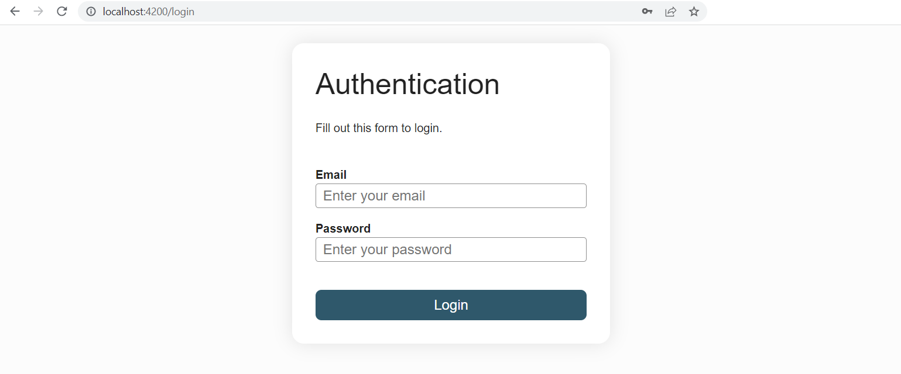
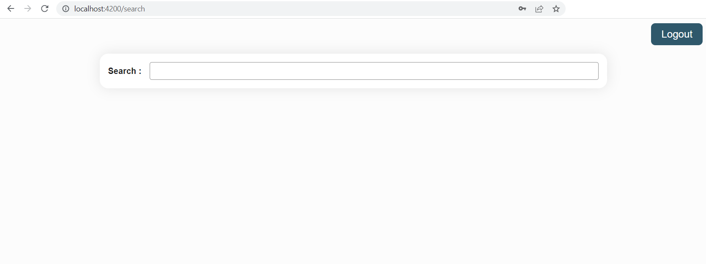
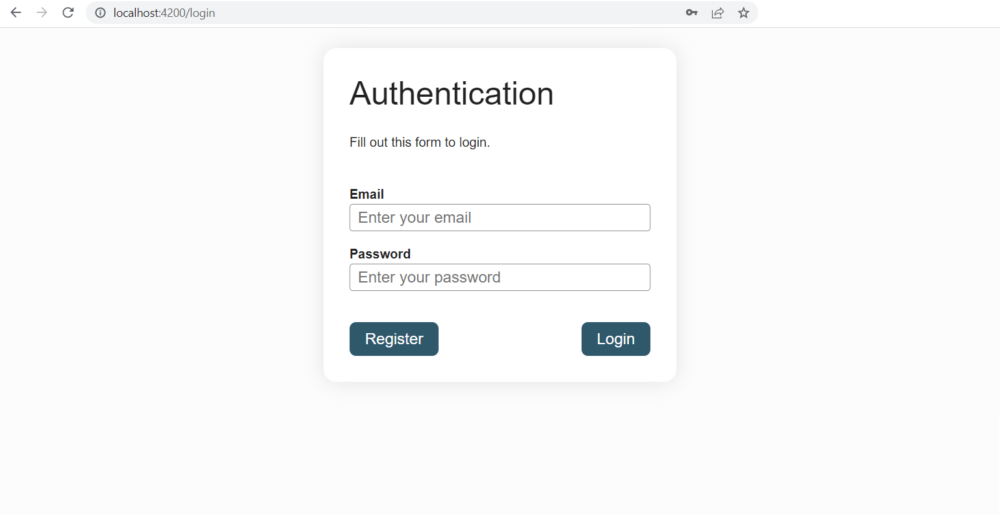
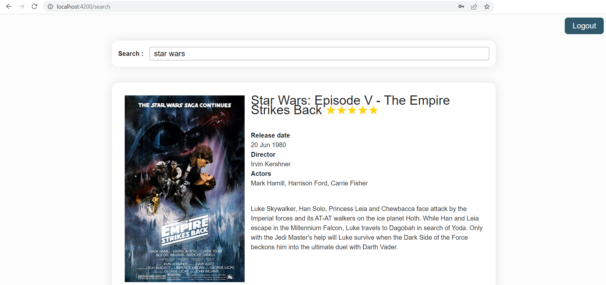

# Services

Avec les composants et les directives, les services sont l'un des principaux blocs de construction d'une application Angular.

La seule préoccupation d'un composant devrait être d'afficher des données et non de les gérer. Les services sont là où l'équipe Angular préconise de placer la logique métier et la gestion des données de l'application. Avoir une séparation claire entre la couche de présentation et les autres traitements de l'application augmente la réutilisabilité et la modularité.

La création d'un service avec le CLI se fait comme suit :
```sh
ng generate service services/example
```

Cela créera le service et sa classe de test associée dans le dossier `app/services`. Il est courant de placer les services dans un dossier de services, le CLI créera le dossier s'il n'existe pas déjà.

Le contenu suivant est généré automatiquement dans le fichier `example.service.ts` :
```ts
import { Injectable } from '@angular/core'

@Injectable({
  providedIn: 'root'
})
export class ExampleService {

}
```

Lorsqu'un composant nécessite un service, le service doit être injecté de la manière suivante :

```ts{1, 9}
import { Component, inject } from '@angular/core'
import { ExampleService } from 'app/services/example.service'

@Component({
  selector: 'app-example',
  templateUrl: './example.component.html'
})
export class ExampleComponent {
  private exampleService = inject(ExampleService)
}
```

:::tip
Déclarez toujours une dépendance à un service comme privée. En effet le template ne devrait jamais accéder directement à un service mais toujours passer par une propriété ou une méthode exposée par la classe composant.
:::

## Dependency Injection

Dans le chapitre précédent, nous avons injecté des services fournis par la librairie `@angular/router` dans les composants qui en ont besoin. Si vous êtes familier avec Spring, vous n'y avez peut-être pas beaucoup réfléchi car c'est l'un des mécanismes du framework.

Au démarrage, Angular crée un injecteur à l'échelle de l'application. Si d'autres injecteurs sont nécessaires, Angular les créera en cours de route. L'injecteur crée des dépendances (le plus souvent sous forme de services) et maintient un conteneur d'instances de dépendances qu'il réutilise si possible. L'injecteur obtient les informations sur la façon de créer ou de récupérer une dépendance auprès d'un fournisseur (provider). Un service agit généralement comme son propre fournisseur.

Vous ne l'avez peut-être pas réalisé, mais nous avons déjà fait appel à des fournisseurs. Dans le chapitre sur les pipes, pour utiliser le `UpperCasePipe` dans la classe du composant plutôt que dans le template, nous l'avons ajouté au tableau des providers du composant.

Lorsque Angular découvre qu'un composant dépend d'un service, il vérifie d'abord si l'injecteur a une instance existante de ce service. Si une instance du service demandé n'existe pas encore, l'injecteur en crée une à l'aide du provider enregistré et l'ajoute à l'injecteur avant de renvoyer le service à Angular. Lorsque tous les services demandés ont été résolus et renvoyés, Angular peut instancié le composant avec ces services.

Les dépendances peuvent être fournies à trois niveaux :
- **au niveau root:** c'est le comportement par défaut lors de la création d'un service avec le CLI. C'est ce que signifie `providedIn: 'root'`. La *même instance* de la dépendance est injectée partout où elle est nécessaire comme s'il s'agissait d'un singleton.
- **au niveau de la route:** la dépendance est ajoutée au tableau de providers de la `Route`. La route obtient sa propre instance de la dépendance
- **au niveau du composant:** la dépendance est ajoutée au tableau des providers du composant. Chaque instance de ce composant obtient sa propre instance de la dépendance.

## TP : Gestion de l'État
1. Générez un `AuthenticationService` avec le CLI dans le dossier `app/services`
2. Déplacez la logique du `loggedIn` de l'`AppComponent` vers le service
3. Injectez le service dans le `LoginFormComponent` et utilisez-le.
4. Implémentez une méthode de déconnexion dans le service d'authentification et ajoutez un bouton de déconnexion dans l'`AppComponent` qui l'appelle et provoque une navigation vers le `LoginFormComponent`. Voici l'html et le css :

<CodeGroup>
<CodeGroupItem title="app.component.html">

```html
<button class="logout">Logout</button>
<router-outlet></router-outlet>
```
</CodeGroupItem>
<CodeGroupItem title="app.component.scss">

```scss
.logout {
  align-self: end;
}
```
</CodeGroupItem>
</CodeGroup>

5. Afficher conditionnellement le bouton Logout en fonction du statut `loggedIn` de l'utilisateur. Utilisez un getter dans le fichier `app.component.ts` pour passer l'information du service au template (c'est une bonne pratique que de toujours déclaré un service comme private dans la classe d'un composant).
6. Utilisez un navigation guard pour rediriger l'utilisateur qui souhaite accéder à la page de recherche de films vers `/login` s'il n'est pas authentifié (rendez le CanActivate vrai si la route est accessible sinon retournez un `UrlTree` via la méthode `createUrlTree` du service `Router`). Pour prendre en considération des cas d'usage futur, ajoutez un returnUrl en tant que queryParam au `UrlTree` renvoyé afin que le `LoginFormComponent` sache où revenir après l'authentification et modifiez le `LoginFormComponent` en conséquence. Pour générer le navigation guard, utilisez la commande du CLI suivante :

```sh
ng generate guard guards/authentication
# ? Which interfaces would you like to implement? CanActivate
```

::: details Aide pour injecter un service dans la fonction guard
```ts
export const authenticationGuard: CanActivateFn = (route, state) => {
  const authenticationService = inject(AuthenticationService)
  // ...
}
```
:::

::: details Aide pour l'UrlTree
```ts
inject(Router).createUrlTree(['/login'], { queryParams: { returnUrl: state.url }})
```
:::

::: details Résultat attendu



:::

## Le HttpClient

Dans une Single Page Application (SPA), la communication avec le serveur se fait via des requêtes HTTP asynchrones (AJAX) ou des protocoles plus spécialisés tels que WebSocket. Nous allons voir comment faire ces requêtes réseau depuis une application Angular.

Angular fournit un module, le `HttpClientModule`, pour effectuer des appels HTTP. Le module fournit un service injectable, le `HttpClient`, pour faire des requêtes GET, POST, PATCH, DELETE et PUT. Pour injecter le `HttpClient` dans un service, ajoutez d'abord le `HttpClientModule` au tableau de `providers` de l'application dans le fichier `app.config.ts` en lui passant la fonction `provideHttpClient()`.

Voici quelques exemples:

<CodeGroup>
<CodeGroupItem title="Service">

```ts
import { Injectable, inject } from '@angular/core'
import { HttpClient } from '@angular/common/http'
import { Observable } from 'rxjs'
import { User } from 'app/models/user/user'
import { UserCreation } from 'app/models/user/user-creation'
import { UserEdition } from 'app/models/user/user-edition'

@Injectable({
  providedIn: 'root'
})
export class UserService {
  private httpClient = inject(HttpClient)

  private baseUrl = 'api/backoffice/users'

  create(user: UserCreation): Observable<User> {
    return this.httpClient.post<User>(this.baseUrl, user)
  }

  update(ref: string, user: UserEdition): Observable<User> {
    return this.httpClient.put<User>(`${this.baseUrl}/${ref}`, user)
  }

  getByUserReference(ref: string): Observable<User> {
    return this.httpClient.get<User>(`${this.baseUrl}/${ref}`)
  }
}
```
</CodeGroupItem>
<CodeGroupItem title="Component">

```ts
import { Component, inject } from '@angular/core'
import { User } from 'app/models/user/user'
import { UserService } from 'app/services/user.service'

@Component({
  selector: 'app-user',
  templateUrl: './user.component.html'
})
export class UserComponent {
  private userService = inject(UserService)

  user: User | undefined = undefined
  reference = ''

  getUser(): void {
    this.userService.getByUserReference(this.reference))
      .subscribe(user => this.user = user)
  }
}
```
</CodeGroupItem>
</CodeGroup>

Les méthodes du service `HttpClient` renvoient des Observables. Ils seront traités dans le prochain chapitre sur la librairie RxJS. Un Observable n'est exécuté qu'une fois souscrit via la méthode `subscribe`. La méthode subscribe s'attend à ce qu'au moins une callback lui soit passé. La callback est le plus souvent fournie sous forme d'une fonction flèche (arrow function).

## TP : Appeler un backend

Nous utiliserons une API (le *backend*) pour authentifier les utilisateurs et rechercher des films. Ce backend a déjà été développé et peut être déployé localement en utilisant les lignes de commande suivantes (cloner le repo dans votre dossier de dépôts git habituel):

```sh
git clone https://github.com/worldline/vuejs-training-backend.git
cd vuejs-training-backend
npm install
npm start
```

La commande `npm start` vous demandera une clé d'API. Attendez que votre instructeur vous la donne ou vous pouvez en générer une [ici](https://www.omdbapi.com/apikey.aspx?__EVENTTARGET=freeAcct&__EVENTARGUMENT=&__LASTFOCUS=&__VIEWSTATE=%2FwEPDwUKLTIwNDY4MTIzNQ9kFgYCAQ9kFgICBw8WAh4HVmlzaWJsZWhkAgIPFgIfAGhkAgMPFgIfAGhkGAEFHl9fQ29udHJvbHNSZXF1aXJlUG9zdEJhY2tLZXlfXxYDBQtwYXRyZW9uQWNjdAUIZnJlZUFjY3QFCGZyZWVBY2N0oCxKYG7xaZwy2ktIrVmWGdWzxj%2FDhHQaAqqFYTiRTDE%3D&__VIEWSTATEGENERATOR=5E550F58&__EVENTVALIDATION=%2FwEdAAU%2BO86JjTqdg0yhuGR2tBukmSzhXfnlWWVdWIamVouVTzfZJuQDpLVS6HZFWq5fYpioiDjxFjSdCQfbG0SWduXFd8BcWGH1ot0k0SO7CfuulHLL4j%2B3qCcW3ReXhfb4KKsSs3zlQ%2B48KY6Qzm7wzZbR&at=freeAcct&Email=)

::: tip
Le contrat d'interface backend est disponible ici : [api-docs](http://localhost:3030/api-docs)
:::

1. Ajoutez au dossier `src` le fichier `proxy.conf.json`.

<CodeGroup>
<CodeGroupItem title="proxy.conf.json">

```json
{
  "/api/**": {
    "target": "http://localhost:3030",
    "changeOrigin": true,
    "pathRewrite": {
      "^/api": ""
    }
  }
}
```
</CodeGroupItem>
</CodeGroup>

Le proxy détournera tous les appels à l'URL commençant par http://localhost:4200/api vers le serveur disponible à l'adresse http://localhost:3030. Cela garantit également que nous ne rencontrerons aucun problème lié aux CORS (dans le cas où le backend ne serait hébergé en local). Cette configuration concerne uniquement le serveur de développement webpack ou vite fourni par le CLI pour exécuter l'application sur votre machine dans un environnement de développement. Ce ne sera pas la configuration utilisée en production.


2. Dans le fichier de configuration CLI - `angular.json` - ajoutez l'option `proxyConfig` à la target serve :

```json{5,6,7}
...
"serve": {
  "builder": "@angular-devkit/build-angular:dev-server",
  ...
  "options": {
    "proxyConfig": "src/proxy.conf.json"
  },
  "defaultConfiguration": "development"
},
...
```

Redémarrez le projet comme la configuration du CLI a changé (`angular.json`).

3. Ajoutez `provideHttpClient()` au tableau de `providers` de l'object `appConfig` dans le fichier `app.config.ts`.

4. Créez les interfaces/classes pour les modèles utilisés par le backend, ajoutez un fichier par modèle dans le dossier `models/authentication` :

<CodeGroup>
<CodeGroupItem title="registration-request.ts">

```ts
export class RegistrationRequest {
  constructor(
    public email: string,
    public password: string,
    public firstname: string,
    public lastname: string
  ) {}
}
```
</CodeGroupItem>
<CodeGroupItem title="login-request.ts">

```ts
export class LoginRequest {
  constructor(
    public email: string,
    public password: string
  ) {}
}
```
</CodeGroupItem>
<CodeGroupItem title="user-response.ts">

```ts
import { User } from './user'

export class UserResponse {
  constructor(
    public user: User,
    public token: string
  ) {}
}
```
</CodeGroupItem>
<CodeGroupItem title="user.ts">

```ts
/* eslint-disable @typescript-eslint/naming-convention */
export class User {
  constructor(
    public id: number,
    public firstname: string,
    public lastname: string,
    public email: string,
    public created_at: string,
    public update_at: string
  ) {}
}
```
</CodeGroupItem>
</CodeGroup>

Prenez note du token dans la `UserResponse`, il servira à authentifier l'utilisateur via l'entête Authorization : `Authorization: Bearer <token>`. Apprenez-en plus sur les JWT [ici](https://jwt.io/introduction).

5. Implémentez les méthodes `register` et `login` dans `AuthenticationService` comme suit :

<CodeGroup>
<CodeGroupItem title="authentication.service.ts">

```ts
private httpClient = inject(HttpClient)
private baseUrl = 'api/user'

login(loginRequest: LoginRequest): Observable<UserResponse> {
  return this.httpClient.post<UserResponse>(`${this.baseUrl}/login`, loginRequest)
}

register(loginRequest: LoginRequest): Observable<UserResponse> {
  const registrationRequest = new RegistrationRequest(
    loginRequest.email,
    loginRequest.password,
    'John',
    'Smith'
  )

  return this.httpClient.post<UserResponse>(`${this.baseUrl}/register`, registrationRequest)
}
```
</CodeGroupItem>
</CodeGroup>

6. La modification de la signature d'appel de la méthode `login` va nécessiter un peu de refactorisation dans le `LoginFormComponent` :

<CodeGroup>
<CodeGroupItem title="login-form.component.ts">

```ts
private router = inject(Router)
private activatedRoute = inject(ActivatedRoute)
private authenticationService = inject(AuthenticationService)

login(): void {
  this.authenticationService.login(this.loginRequest)
    .subscribe({ next: () => {
      const postLoginRoute = this.activatedRoute.snapshot.queryParamMap.get('returnUrl')
      this.router.navigateByUrl(postLoginRoute ? `/${postLoginRoute}` : '')
    } })
}

register(): void {
  this.authenticationService.register(this.loginRequest)
    .subscribe()
}

get loginRequest(): LoginRequest {
  return new LoginRequest(this.email, this.password)
}
```
</CodeGroupItem>
</CodeGroup>

7. Une refactorisation est également nécessaire pour que l'`authenticationGuard` continue de fonctionner. Faites en sorte que le booléen `loggedIn` dans `AuthenticationService` dépende d'un champ `token` et faites en sorte que le `LoginFormComponent` sauvegarde le token qu'il obtient de l'appel de connexion dans ce champ.
Refactorez aussi la méthode `logout()` pour qu'elle remette le `token` à null.

<CodeGroup>
<CodeGroupItem title="authentication.service.ts">

```ts
token: string | null = null

get loggedIn(): boolean {
  return this.token != null
}
```
</CodeGroupItem>

<CodeGroupItem title="login-form.component.ts">

```ts{3, 4}
login(): void {
  this.authenticationService.login(this.loginRequest)
    .subscribe({ next: response => {
      this.authenticationService.token = response.token
      const postLoginUrl = this.activatedRoute.snapshot.queryParamMap.get('returnUrl')
      this.router.navigateByUrl(postLoginUrl ? `/${postLoginUrl}` : '')
    } })
}
```
</CodeGroupItem>
</CodeGroup>

8. Ajoutez un bouton d'enregistrement à côté du bouton de connexion dans le `LoginFormComponent`, donnez-lui l'attribut `type="button"` afin qu'Angular sache que ce n'est pas ce bouton qui déclenche l'événement `ngSubmit` sur le formulaire et faites-lui appeler le méthode d'enrôlement.
Vous devriez maintenant pouvoir enregistrer un utilisateur et vous connecter.
Si l'enrôlement semble ne pas fonctionner, vérifiez l'onglet network des outils de développement de votre navigateur (onglet preview de l'appel réseau en erreur), votre mail ou mot de passe ne respectent peut-être pas les règles de validation du back.

<CodeGroup>
<CodeGroupItem title="HTML">

```html
<div class="button-container">
  <button type="button">Register</button>
  <button type="submit">Login</button>
</div>
```
</CodeGroupItem>
<CodeGroupItem title="SCSS">

```scss
.button-container {
  display: flex;
  justify-content: space-between;
}
```
</CodeGroupItem>
</CodeGroup>

9. Il est temps de gérer les erreurs. La méthode subscribe peut prendre un objet qui propose trois callbacks: une *next*, une *error* et une *complete* (nous verrons cela plus en détail dans le chapitre suivant). Déclarer un champ `errorMessage` sur le `LoginFormComponent` et le mettre à jour en vous servant de l'argument renvoyé par la callback `error`. Afficher le message d'erreur sur le formulaire. Vérifier que le message d'erreur s'affiche bien lorsqu'on saisit des identifiants incorrects.

<CodeGroup>
<CodeGroupItem title="login-form.component.ts">

```ts
errorMessage = ''

private errorHandler(errorResponse: HttpErrorResponse): void {
  this.errorMessage = errorResponse.error.error ?? `${errorResponse.error.status} - ${errorResponse.error.statusText}`
}

// subscribe syntax
this.authenticationService.login(this.loginRequest)
  .subscribe({
    next: response => { /*  */},
    error: errorResponse => { /*  */ }
  })
```
</CodeGroupItem>
</CodeGroup>

::: tip hint
Pour une meilleure UX (User eXperience), penser à vider le champ `errorMessage` soit avant de lancer une nouvelle requête d'authentification ou d'enregistrement, soit dès que celles-ci se terminent en succès.
:::

10. Appelons maintenant le backend pour obtenir la liste des films. La route est sécurisée, ce qui signifie que le passage du token dans l'en-tête est nécessaire. Angular fournit un mécanisme - les intercepteurs http - pour intercepter systématiquement les requêtes http, permettant de définir les en-têtes en un seul endroit.

a. Utilisez le CLI pour en générer un : `ng generate interceptor interceptors/authentication`.

b. Voici son implémentation :

```ts
import { HttpInterceptorFn } from '@angular/common/http'
import { AuthenticationService } from 'app/services/authentication.service'
import { inject } from '@angular/core'

export const authenticationInterceptor: HttpInterceptorFn = (req, next) => {
  const token = inject(AuthenticationService).token
  if (token) {
    const cloned = req.clone({
      headers: req.headers.set('Authorization', `Bearer ${token}`)
    })

    return next(cloned)
  }

  return next(req)
}
```

S'il y a un token dans l'`AuthenticationService`, l'intercepteur l'ajoutera aux en-têtes de la requête http.

c. Ajouter l'intercepteur au provider de l'`HttpClient` de l'objet `appConfig`:

```ts
provideHttpClient(withInterceptors([authenticationInterceptor]))
```

11. Créez un `FilmService` à l'aide du CLI et implémentez l'appel au endpoint `api/movies/search`. Notez que le queryParam `title` n'est pas facultatif. Pour ajouter des query params à une requête, utilisez le paramètre `options` de la méthode get.

```ts
const options = {
  params: new HttpParams().set('title', title)
}
```

12. Apportez des modifications au `FilmSearchComponent` pour appeler ce nouveau service avec le titre renseigné par l'utilisateur, enregistrez la réponse dans le champ `films` du `FilmSearchComponent`.

13. Vérifiez que le token est envoyé sous forme d'en-tête HTTP via les outils de développement de votre navigateur.

::: details Résultat attendu



:::