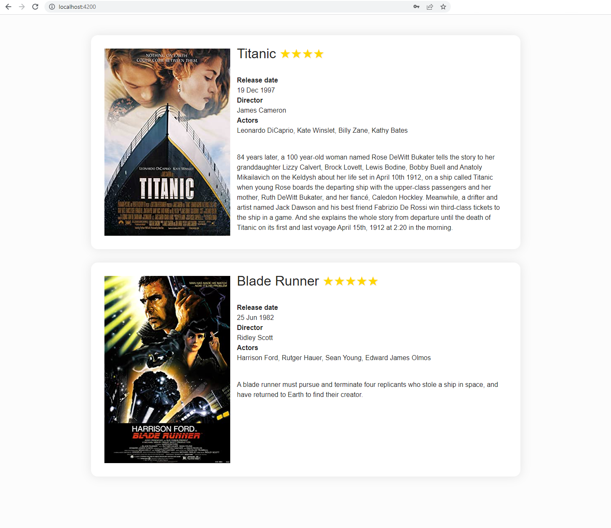

# Dynamisez votre HTML

Angular apporte une syntaxe puissante aux templates. Dans le chapitre précédent, nous avons vu l'interpolation de texte `{{}}`. Dans ce chapitre, nous aborderons quelques éléments de ce système de syntaxe : le *property binding*, l'*event binding*, le *class et style binding*, ainsi que les blocs de contrôle de flux.

## Property binding

Pour lier un élément HTML à la propriété d'un composant, placez-le entre crochets `[]`. Les crochets, `[]`, obligent Angular à évaluer le côté droit de l'affectation en tant qu'expression dynamique. Sans les crochets, Angular traite le côté droit comme un littéral et donne pour valeur à la propriété cette valeur statique. `[]` est la syntaxe pour le one-way data binding avec les données circulant du composant vers le template.

Voici un exemple où les propriétés du DOM *href* et *disabled* sont définies à partir de variable de la classe du composant.

<CodeGroup>
<CodeGroupItem title="app.html">

```html
<a [href]="url()">Search on google</a>
<button [disabled]="isUnchanged()">Edit</button>
```
</CodeGroupItem>
<CodeGroupItem title="app.ts">

```ts
import { Component, signal } from '@angular/core'

@Component({
  selector: 'app-root',
  imports: [],
  templateUrl: './app.html',
  styleUrl: './app.scss'
})
export class AppComponent {
  protected readonly url = signal('google.com')
  protected readonly isUnchanged = signal(false)
}
```
</CodeGroupItem>
</CodeGroup>

**Exercice: Essayez de lier les attributs `src` et `width` de l'image aux variables de la classe du composant**
<iframe height='500' width='100%' src="https://stackblitz.com/fork/github/ocunidee/atpw-attributes?ctl=1&embed=1&file=src/app/app.component.html&hideNavigation=1&title=Property%20binding"></iframe>

## Class et style binding
### Class binding
Vous pouvez utiliser le class binding pour ajouter et supprimer des noms de classe CSS à l'attribut `class` d'un élément. Pour créer un *class binding* pour une seule classe, utilisez le préfixe `class` suivi d'un point et du nom de la classe CSS, par exemple, `[class.emphasis]="onSale()"`. Angular ajoute la classe `emphasis` lorsque l'expression liée, `onSale()`, est vraie et supprime la classe `emphasis` lorsque l'expression est fausse.

<CodeGroup>
<CodeGroupItem title="app.html">

```html
<p [class.my-class-1]="isWarning()">This is a warning text</p> <!--Le texte est en rouge-->
```
</CodeGroupItem>
<CodeGroupItem title="app.css">

```css
.my-class-1 {
  color: red;
}
```
</CodeGroupItem>
<CodeGroupItem title="app.ts">

```ts
import { Component, signal } from '@angular/core'

@Component({
  selector: 'app-root',
  imports: [],
  templateUrl: './app.html',
  styleUrl: './app.scss'
})
export class App {
  protected readonly isWarning = signal(true)
}
```
</CodeGroupItem>
</CodeGroup>

Plusieurs classes peuvent également être liées avec la syntaxe `[class]` :

<CodeGroup>
<CodeGroupItem title="app.html">

```html
<p [class]="classExpression()"></p>
```
</CodeGroupItem>
<CodeGroupItem title="app.css">

```css
.warning {
  color: red;
}

.center {
  text-align: middle;
}

.big {
  font-size: 24px;
}
```
</CodeGroupItem>
<CodeGroupItem title="app.ts">

```ts
import { Component, signal } from '@angular/core'

@Component({
  selector: 'app-root',
  imports: [],
  templateUrl: './app.html',
  styleUrl: './app.scss'
})
export class App {
  protected readonly classExpression = signal({ warning: true, center: false, big: true }) // syntaxe objet
  // Ces autres syntaxes sont aussi légales:
  // classExpression = signal('warning center big') // syntaxe chaine de caractère
  // classExpression = signal(['warning', 'center', 'big']) // syntaxe tableau
}
```
</CodeGroupItem>
</CodeGroup>


### Style binding
Vous pouvez utiliser le *style binding* pour définir des styles de manière dynamique. Pour créer un *style binding* pour une seule propriété de style CSS, utilisez le préfixe `style` suivi d'un point et du nom de la propriété de style CSS, par exemple, `[style.width]="slimWidth()"` avec `protected readonly  slimWidth = signal('100px')` (`slimWidth` est un signal de chaîne de caractères). Falcutativement, vous pouvez ajouter une unité comme `em` ou `%` lorsque pertinent: `[style.width.px]="slimWidth()"` avec `protected readonly slimWidth = signal(100)` (slimWidth est alors le signal d'un nombre).

<CodeGroup>
<CodeGroupItem title="app.html">

```html
<!-- Le nom de la propriété de style peut être écrité en dash-case ou camelCase -->
<nav [style.background-color]="value()"></nav>
<nav [style.backgroundColor]="value()"></nav>
```
</CodeGroupItem>
<CodeGroupItem title="app.ts">

```ts
import { Component, signal } from '@angular/core'

@Component({
  selector: 'app-root',
  imports: [],
  templateUrl: './app.html',
  styleUrl: './app.scss'
})
export class AppComponent {
  protected readonly value = signal('white')
}
```
</CodeGroupItem>
</CodeGroup>

Pour activer plusieurs styles sur une même balise html, utiliser l'attribut `[style]`:

<CodeGroup>
<CodeGroupItem title="app.html">

```html
<p [style]="styleExpression()"></p>
```
</CodeGroupItem>
<CodeGroupItem title="app.ts">

```ts
import { Component, signal } from '@angular/core'

@Component({
  selector: 'app-root',
  imports: [],
  templateUrl: './app.html',
  styleUrl: './app.scss'
})
export class AppComponent {
  protected readonly styleExpression = signal({width: '100px', height: '100px', backgroundColor: 'red'}) // Syntaxe objet
  // La syntaxe chaine de caractères est également légale:
  // protected readonly styleExpression = signal('width: 100px; height: 100px; background-color: red;')
}
```
</CodeGroupItem>
</CodeGroup>

**Exercise: attribuer une classe et une couleur à chaque fantôme en utilisant [class] ou [style]**
<iframe height='500' width='100%' src="https://stackblitz.com/fork/github/ocunidee/atpw-class-style-binding?ctl=1&embed=1&file=src/app/app.component.html&hideNavigation=1&title=Class%20and%20style%20binding"></iframe>

## Directive ngModel

La directive `ngModel` vous permet de lier la valeur d'un champ de formulaire à une propriété du composant. Il s'agit d'une liaison bidirectionnelle : la propriété est mise à jour lorsque le contenu du champ change (typiquement par l'utilisateur) et vice versa. La syntaxe pour la liaison de données bidirectionnelle est `[()]` (bananes dans la boite).

<CodeGroup>
<CodeGroupItem title="app.html">

```html{3}
<label>
  What is your name ?
  <input [(ngModel)]="name">
</label>

<p>Hello {{ name() }} !</p>
```
</CodeGroupItem>
<CodeGroupItem title="app.ts">

```ts
import { Component, signal } from '@angular/core'
import { FormsModule } from '@angular/forms'

@Component({
  selector: 'app-root',
  imports: [FormsModule],
  templateUrl: './app.html',
  styleUrl: './app.scss'
})
export class AppComponent {
  protected readonly name = signal('')
}
```
</CodeGroupItem>
</CodeGroup>

Testez-le vous-même :
<v-model-example />

::: warning Import
La directive `ngModel` ne fait pas partie des imports par défaut du composant. Vous devez l'ajouter vous-même : ajoutez `FormsModule` au tableau d'imports du décorateur `@Component` du composant.
:::

**Exercice : utilisez [(ngModel)] sur les balises input, select, radio et checkbox**
<iframe height='500' width='100%' src="https://stackblitz.com/fork/github/ocunidee/atpw-ngmodel/tree/master?ctl=1&embed=1&file=src/app/app.component.html&hideNavigation=1&title=NgModel%20directive"></iframe>


## Bloc @if
Vous pouvez ajouter ou supprimer un élément en l'incluant dans un bloc `@if`. Lorsque la condition du `@if` est fausse, Angular supprime son contenu du DOM. Angular supprime ensuite les instances des classes de ces composants s'il en existe, ce qui libère de la mémoire et des ressources. Si vous souhaitez uniquement masquer l'élément sans le retirer du DOM, vous pouvez utiliser `[hidden]` qui ajoute/supprime uniquement la propriété CSS `display:none` sur l'élément. `@if` est utile comme moyen de se prémunir des valeurs nulles ou undefined.

<CodeGroup>
<CodeGroupItem title="app.html">

```html
<!-- Le message Hello, ... ne sera affiché que si selectedCustomer est ni null ni undefined-->
@if (selectedCustomer(); as customer) {
  <div>Hello, {{customer.name}}</div>
}
```
</CodeGroupItem>

<CodeGroupItem title="app.ts">

```ts
import { Component, signal } from '@angular/core'

@Component({
  selector: 'app-root',
  imports: [],
  templateUrl: './app.html',
  styleUrl: './app.scss'
})
export class AppComponent {
  protected readonly selectedCustomer = signal({ name: 'Smith', age: 45 })
}
```
</CodeGroupItem>
</CodeGroup>

Fournir une expression `as` n'est pas obligatoire, cependant cette expression permet de donner un alias à la condition fournie au @if et évite une ré-évaluation du signal si celui-ci est utilisé dans le template encapsulé.

::: warning
Soyez prudent lorsque vous utilisez `@if` pour tester la nullité sur des valeurs numériques car `0` est une valeur fausse.
:::

Vous pouvez fournir une instruction else if ou else comme suit :

```html
@if (a > b) {
  {{a}} is greater than {{b}}
} @else if (b > a) {
  {{a}} is less than {{b}}
} @else {
  {{a}} is equal to {{b}}
}
```

**Exercice: utilisez un bloc `@if` pour montrer/cacher le loader**

**Bonus: utilisez un `@if` et `@else` pour montrer soit les données soit le message comme quoi les données ne sont pas disponibles**
<iframe height='500' width='100%' src="https://stackblitz.com/fork/github/ocunidee/atpw-if?ctl=1&embed=1&file=src/app/app.component.html&hideNavigation=1&title=@if"></iframe>

::: details Syntaxe avant Angular 17 (directive *ngIf)

```html
<!--Le message Hello, ... ne sera affiché que si selectedCustomer est ni null ni undefined-->
<div *ngIf="selectedCustomer">Hello, {{selectedCustomer.name}}</div>
```

Avec l'ancienne syntaxe, il est possible de fournir un *else* mais pas un *else if*:

```html
<div *ngIf="condition; else elseBlock">Content to render when condition is true.</div>

<ng-template #elseBlock><div>Content to render when condition is false.</div></ng-template>
```

`<ng-template>` crée un fragment de template. Un fragment n'est pas affiché (rendered) par défaut. `#elseBlock` est une variable de template qui permet d'obtenir une référence au `<ng-template>` et de dire à la directive `*ngIf` quoi affiché en cas de *else*.
:::

## Bloc @switch
Le bloc `@switch` échange conditionnellement ce qui est affiché en sélectionnant l'un des template enfants en fonction de la valeur de la *condition*.

```html
@switch (condition()) {
  @case (caseA) {
    Case A.
  }
  @case (caseB) {
    Case B.
  }
  @default {
    Default case.
  }
}
```

La valeur de l'expression conditionnelle est comparé à la valeur du cas en utilisant l'opérateur `===`. `@switch` ne nécessite pas d'équivalent de break ou return.

::: details Syntaxe avant Angular 17 (directive ngSwitch)
```html
<div [ngSwitch]="myBeer">
  <div *ngSwitchCase="'Ale'">Short fermentation</div>
  <div *ngSwitchCase="'Lager'">Long fermentation</div>
  <div *ngSwitchCase="'Sour ale'">Crafted from wild yeasts</div>
  <div *ngSwitchDefault>No random knowledge for that type of beer, sorry.</div>
</div>
```
:::

## Bloc @for
Vous pouvez utiliser le bloc `@for` pour présenter une liste d'éléments. Le contenu du bloc `@for` est répété pour chaque élément de la collection.

<CodeGroup>
<CodeGroupItem title="app.html">

```html
@for (item of items(); track item.id) {
  <div>{{item.name}}</div>
}
@empty {
  <div>No item found</div>
}
```

</CodeGroupItem>

<CodeGroupItem title="app.ts">

```ts
import { Component, signal } from '@angular/core'

@Component({
  selector: 'app-root',
  imports: [],
  templateUrl: './app.html',
  styleUrl: './app.scss'
})
export class AppComponent {
  protected readonly items = signal([
    { id: 1, name: 'hammer' },
    { id: 2, name: 'nail' },
    { id: 3, name: 'lightbulb' },
  ])
}
```

</CodeGroupItem>
</CodeGroup>

- `item` est l'élément courant de la collection lors de l'itération
- `items` est la collection sur laquelle itérer
- `track` indique comment suivre les éléments de la collection. Il doit être un identifiant unique. C'est ce qui permet à Angular d'exécuter un ensemble minimal d'opérations DOM lorsque des élémentsde la collection sont ajoutés, supprimés ou déplacés. Pour les collections qui restent statiques, `track $index` fournit un mécanisme de suivi simple.

Un bloc optionnel `@empty` peut être inclus juste après le bloc `@for`. Le contenu du bloc `@empty` s'affiche lorsqu'il n'y a pas d'éléments dans la collection.

À l'intérieur du bloc `@for`, plusieurs variables contextuelles implicites sont toujours disponibles : `$count`, `$index`, `$first`, `$last`, `$odd` et `$even`. Elles peuvent être renommées via un segment `let`, ce qui peut être utile en cas d'utilisation de boucles `@for` imbriquées où les noms des variables contextuelles pourraient entrer en collision.

```html
@for (item of items(); track item.id) {
  <div>{{$index}}/{{$count}}: {{item.name}}</div>
}

<!-- Avec un alias pour $index -->
@for (item of items(); track item.id; let i = $index) {
  <div>{{i}}: {{item.name}}</div>
}

<!-- Avec un alias pour $even -->
@for (item of items(); track item.id; let isEven = $even) {
  <div>{{item.name}} is {{isEven ? 'even': 'odd'}}</div>
}
```

**Exercice : utilisez deux boucles `@for` pour afficher tout le contenu du panier (une boucle pour chaque type d'élément, et dans cette boucle une autre boucle pour afficher autant d'emojis de cet élément que sa quantité)**

**Bonus : Un intrus est dans la corbeille de fruits, cachez le maïs avec un bloc `@if`**
<iframe height='500' width='100%' src="https://stackblitz.com/fork/github/ocunidee/atpw-for?ctl=1&embed=1&file=src/app/app.component.html&hideNavigation=1&title=@for"></iframe>

:::details Syntaxe avant Angular 17 (directive *ngFor)
```html
<div *ngFor="let item of items">{{item.name}}</div>

<!-- Avec une variable locale pour l'index -->
<div *ngFor="let item of items; let i = index">{{i}}: {{item.name}}</div>

<!-- Avec une variable locale pour connaitre la parité de l'élément courant -->
<div *ngFor="let item of items; let isEven = even">
  {{item.name}} is {{isEven ? 'even': 'odd'}}
</div>
```

`*ngIf` et `*ngFor` ne peuvent pas être placés en même temps sur un élément HTML. Pour répéter un bloc d'HTML lorsqu'une condition particulière est vraie, soit un niveau supplémentaire d'HTML doit être introduit, ce qui n'est pas toujours souhaitable et peut casser le style, soit la balise `<ng-container>` fournie par Angular peut être utilisée . `<ng-container>` n'est pas présent dans le DOM.

```html
<!-- Sans ng-container -->
<div *ngIf="condition">
  <div *ngFor="let item of items">{{item.name}}</div>
</div>

<!-- Avec ng-container (solution à préférer) -->
<ng-container *ngIf="condition">
  <div *ngFor="let item of items">{{item.name}}</div>
</ng-container>
```
:::

## Event binding
L'*event binding* permet d'écouter et de répondre aux actions de l'utilisateur telles que les frappes, les mouvements de souris, les clics et les touchers ou un événement custom émis par un composant enfant. Pour lier le composant à un événement, utilisez la syntaxe d'event binding d'Angular `()`.

```html
<button (click)="delete()">Delete</button>
```

**Exercice : utilisez des événements pour ajouter un singe lorsque vous cliquez sur le bouton et faites-lui ouvrir les yeux au survol de la souris**
<iframe height='500' width='100%' src="https://stackblitz.com/fork/github/ocunidee/atpw-event-binding?ctl=1&embed=1&file=src/app/app.component.html&hideNavigation=1&title=Event%20binding"></iframe>

## Bloc @let
Le bloc `@let` sert à définir une variable locale qui peut être réutilisée dans l'ensemble du template. Elle sera réévaluée chaque fois que le cycle de détection du changement est exécuté. Les variables déclarées avec `@let` peuvent être utilisées après leur déclaration et dans le scope dans lequel elles ont été déclarées ainsi que dans ses scopes imbriqués. C'est un bloc particulièrement intéressant pour évaluer de la donnée une seule fois et se resservir du résultat plusieurs fois dans le template.

```html
<!-- Usage avec une variable de templace référençant un élément du DOM -->
<input #name>

@let greeting = 'Hello ' + name.value;
<p>{{greeting}}</p>

<!-- Usage avec un pipe async -->
@let user = this.user$ | async;
<p>{{user.firstname}} {{user.lastname}} is deactivated</p>
```

## À propos des directives
Dans ce chapitre, nous avons vu 1 directive intégrée (4 en utilisant la syntaxe prédatant Angular 17). Les directives sont des classes déclarées avec le décorateur `@Directive`.

Il existe trois types de directives :
- Les **composants** qui sont des directives avec un template (`@Component` hérite de `@Directive`)
- Les **directives d'attributs** qui modifient l'apparence ou le comportement d'un élément
- Les **directives structurelles** qui modifient la mise en page DOM en ajoutant et en supprimant des éléments DOM


Vous pouvez en savoir plus sur la création de vos propres directives [ici](https://angular.dev/guide/attribute-directives) et [ici](https://angular.dev/guide/structural-directives). Les directives customs ont de nombreux avantages, en voici quelques-uns :

- *Comportement réutilisable* : Les directives customs encapsulent des fonctionnalités qui peuvent être réutilisées dans plusieurs composants, aidant ainsi à éviter la duplication de code et à promouvoir une mise en œuvre cohérente de fonctionnalités telles que la validation, la gestion des événements ou le style.
- *Séparation des préoccupations* : En isolant des comportements spécifiques ou des manipulations du DOM au sein des directives, vous pouvez garder vos composants plus propres et plus centrés sur leurs tâches principales, ce qui conduit à une meilleure organisation et maintenabilité du code.
- *Manipulation dynamique du template* : Les directives structurelles personnalisées permettent d'ajouter ou de supprimer conditionnellement des éléments du DOM, offrant des capacités de rendu dynamique puissantes. Cela peut être utilisé pour créer des fonctionnalités telles que des affichages conditionnels (similaires à `@if`), des boucles (comme `@for`), ou toute logique personnalisée pour manipuler la mise en page en fonction de l'état de l'application.

**Quizz: Which type of directive is ngModel?**

## TP : Liste des films
1. Dans le composant LoginFormComponent, ajoutez deux variables de classe *email* (`protected readonly email = signal('')`) et *password* (`protected readonly password = signal()'')`) et utilisez la directive `[(ngModel)]` sur les inputs email et mot de passe dans l'html pour les lier. Rappelez-vous de l'avertissement dans le paragraphe sur le ngModel : n'oubliez pas d'importer le `FormsModule` dans le tableau d'imports du decorateur `@Component` pour utiliser la directive ngModel dans le template.
2. Ajoutez une variable `loggedIn` à la classe initialement définie à `protected readonly signal(false)`, puis utilisez l'event binding sur l'événement `(ngSubmit)` de la balise `<form>` pour la passer à `true` lorsque le formulaire est soumis (créez une méthode `login()` dans la classe du composant pour ça) et la méthode `set` du Signal (`loggedIn.set(true)`).
3. Dans `login-form.component.html`, ajoutez le code HTML suivant sous le formulaire d'authentification :

```html
<ul class="films">
  <li class="film card">
    
    <div>
      <p class="title">
        Titanic
        <span class="rating">★★★★</span>
      </p>
      <dl>
        <dt>Release date</dt>
        <dd>07/01/1998</dd>
        <dt>Director</dt>
        <dd>James Cameron</dd>
        <dt>Actors</dt>
        <dd>Leonardo DiCaprio, Kate Winslet, Billy Zane, Kathy Bates</dd>
      </dl>
      <p class="plot">
        84 years later, a 100 year-old woman named Rose DeWitt Bukater tells the
        story to her granddaughter Lizzy Calvert, Brock Lovett, Lewis Bodine,
        Bobby Buell and Anatoly Mikailavich on the Keldysh about her life set in
        April 10th 1912, on a ship called Titanic when young Rose boards the
        departing ship with the upper-class passengers and her mother, Ruth DeWitt
        Bukater, and her fiancé, Caledon Hockley. Meanwhile, a drifter and artist
        named Jack Dawson and his best friend Fabrizio De Rossi win third-class
        tickets to the ship in a game. And she explains the whole story from
        departure until the death of Titanic on its first and last voyage April
        15th, 1912 at 2:20 in the morning.
      </p>
    </div>
  </li>
</ul>
```

4. Utilisez un bloc `@if` pour afficher le formulaire d'authentification et masquer la liste des films lorsque `loggedIn() === false`, et vice versa.
5. Ajoutez le modèle suivant dans le dossier *src/app/models*, nommez le fichier *film.ts* :

```ts
export interface Film {
  title: string
  released: string
  director: string
  actors: string
  poster: string
  plot: string
  metascore: string
}
```

6. Ajoutez le champ suivant dans la classe du composant LoginFormComponent (VSCode devrait vous affichez un erreur et vous proposez d'importer le modèle Film dans le composant) :

```ts
protected readonly films: WritableSignal<Film[]> = signal([
  {
    title: 'Titanic',
    released: '19 Dec 1997',
    director: 'James Cameron',
    actors: 'Leonardo DiCaprio, Kate Winslet, Billy Zane, Kathy Bates',
    poster: 'https://m.media-amazon.com/images/M/MV5BMDdmZGU3NDQtY2E5My00ZTliLWIzOTUtMTY4ZGI1YjdiNjk3XkEyXkFqcGdeQXVyNTA4NzY1MzY@._V1_SX300.jpg',
    plot: `84 years later, a 100 year-old woman named Rose DeWitt Bukater tells the story to her granddaughter Lizzy Calvert, Brock Lovett, Lewis Bodine, Bobby Buell and Anatoly Mikailavich on the Keldysh about
    her life set in April 10th 1912, on a ship called Titanic when young Rose boards the departing ship with the upper-class passengers and her mother, Ruth DeWitt Bukater, and her fiancé, Caledon Hockley.
    Meanwhile, a drifter and artist named Jack Dawson and his best friend Fabrizio De Rossi win third-class tickets to the ship in a game. And she explains the whole story from departure until the death of Titanic
    on its first and last voyage April 15th, 1912 at 2:20 in the morning.`,
    metascore: '75'
  },
  {
    title: 'Blade Runner',
    released: '25 Jun 1982',
    director: 'Ridley Scott',
    actors: 'Harrison Ford, Rutger Hauer, Sean Young, Edward James Olmos',
    poster: 'https://m.media-amazon.com/images/M/MV5BNzQzMzJhZTEtOWM4NS00MTdhLTg0YjgtMjM4MDRkZjUwZDBlXkEyXkFqcGdeQXVyNjU0OTQ0OTY@._V1_SX300.jpg',
    plot: 'A blade runner must pursue and terminate four replicants who stole a ship in space, and have returned to Earth to find their creator.',
    metascore: '89'
  },
  {
    title: 'The Shining',
    released: '13 Jun 1980',
    director: 'Stanley Kubrick',
    actors: 'Jack Nicholson, Shelley Duvall, Danny Lloyd, Scatman Crothers',
    poster: 'https://m.media-amazon.com/images/M/MV5BZWFlYmY2MGEtZjVkYS00YzU4LTg0YjQtYzY1ZGE3NTA5NGQxXkEyXkFqcGdeQXVyMTQxNzMzNDI@._V1_SX300.jpg',
    plot: 'A family heads to an isolated hotel for the winter where an evil spiritual presence influences the father into violence, while his psychic son sees horrific forebodings from both past and future.',
    metascore: '63'
  }
])
```

7. En utilisant un bloc `@for`, répétez l'élément `.film.card` pour afficher autant de films qu'il y en a dans le tableau `films`. A ce stade, le Titanic est affiché trois fois, occupons-nous de ça dans l'étape suivante.
8. Complétez la carte avec les données de chaque film en utilisant le property binding et l'interpolation de texte.
9. **Bonus :** Utilisez la propriété `metascore` pour afficher un nombre d'étoiles (de 1 à 5 ★) à côté de chaque titre de film (créez une méthode `starRating` retournant une string comportant le bon nombre d'étoiles à cet effet).
10. **Bonus :** Utilisez un bloc `@if` pour afficher uniquement les films avec un score métacritique supérieur à 70. Faites attention à quel noeud du DOM vous incluez dans le bloc pour conserver la sémantique du HTML. Dans la suite du TP, nous n'aurons pas besoin de ce changement, ne le conservez pas une fois que vous êtes arrivé à le faire marcher.
11. N'oubliez pas de commiter.

::: details Résultat attendu



:::
