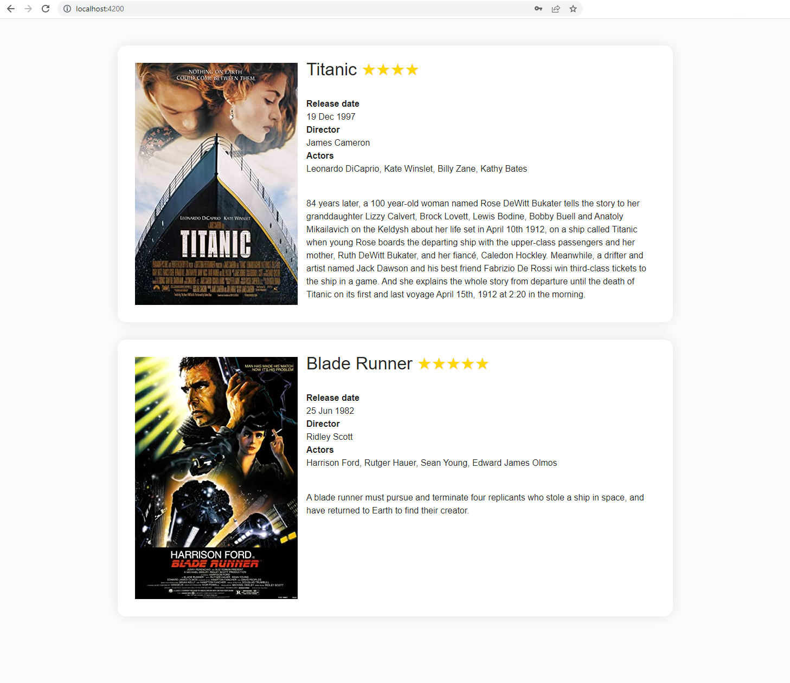

# Empower your HTML

Angular brings powerful syntax to templates. In the previous chapter, we've seen text interpolation binding `{{}}` to show dynamic text. In this chapter, we will tackle some elements of this syntax system: property, event, class and style binding as well as control flow blocks.

## Property binding

To bind a DOM property to a component's property, enclose the DOM property in square brackets `[]` in the template. The square brackets `[]` cause Angular to evaluate the right-hand side of the assignment as a dynamic expression. Without the brackets, the right-hand side is just a static string literal. `[]` is the syntax for one-way data binding with data flowing from the component to the template.

Here is an exemple where the *href* and *disabled* DOM property values are defined via variables in the component class.

<CodeGroup>
<CodeGroupItem title="app.html">

```html
<a [href]="url()">Search on google</a>
<button [disabled]="isUnchanged()">Edit</button>
```
</CodeGroupItem>
<CodeGroupItem title="app.ts">

```ts
import { Component, signal } from '@angular/core'

@Component({
  selector: 'app-root',
  imports: [],
  templateUrl: './app.html',
  styleUrl: './app.scss'
})
export class AppComponent {
  protected readonly url = signal('google.com')
  protected readonly isUnchanged = signal(false)
}
```
</CodeGroupItem>
</CodeGroup>

**Exercise: try to link the `src` and `width` DOM properties of the image to the component class variables**
<iframe height='500' width='100%' src="https://stackblitz.com/fork/github/ocunidee/atpw-attributes?ctl=1&embed=1&file=src/app/app.component.html&hideNavigation=1&title=Property%20binding"></iframe>

## Class and style binding
### Class binding
You can use *class binding* to add and remove CSS class names from an element's `class` attribute. To create a single *class binding*, use the prefix `class` followed by a dot and the name of the CSS class, for example, `[class.emphasis]="onSale()"`. Angular adds the CSS class `emphasis` when the bound expression, `onSale()`, is truthy and it removes the `emphasis` class when the expression is falsy.

<CodeGroup>
<CodeGroupItem title="app.html">

```html
<p [class.my-class-1]="isWarning()">This is a warning text</p> <!--Le texte est en rouge-->
```
</CodeGroupItem>
<CodeGroupItem title="app.css">

```css
.my-class-1 {
  color: red;
}
```
</CodeGroupItem>
<CodeGroupItem title="app.ts">

```ts
import { Component, signal } from '@angular/core'

@Component({
  selector: 'app-root',
  imports: [],
  templateUrl: './app.html',
  styleUrl: './app.scss'
})
export class App {
  protected readonly isWarning = signal(true)
}
```
</CodeGroupItem>
</CodeGroup>

Multiple classes can also be bound at the same time with the `[class]` syntax:

<CodeGroup>
<CodeGroupItem title="app.html">

```html
<p [class]="classExpression()"></p>
```
</CodeGroupItem>
<CodeGroupItem title="app.css">

```css
.warning {
  color: red;
}

.center {
  text-align: middle;
}

.big {
  font-size: 24px;
}
```
</CodeGroupItem>
<CodeGroupItem title="app.ts">

```ts
import { Component, signal } from '@angular/core'

@Component({
  selector: 'app-root',
  imports: [],
  templateUrl: './app.html',
  styleUrl: './app.scss'
})
export class App {
  protected readonly classExpression = signal({ warning: true, center: false, big: true }) // syntaxe objet
  // Ces autres syntaxes sont aussi légales:
  // classExpression = signal('warning center big') // syntaxe chaine de caractère
  // classExpression = signal(['warning', 'center', 'big']) // syntaxe tableau
}
```
</CodeGroupItem>
</CodeGroup>

### Style binding
You can use *style binding* to set styles dynamically just like classes. To create a single style binding, use the prefix `style` followed by a dot and the name of the CSS style property, for example, `[style.width]="slimWidth()"` in the template with `slimWidth = signal('100px')` (`slimWidth` is the signal of a string) in the component class. Optionally, you can add a unit extension like `em` or `%`: `[style.width.px]="slimWidth()"` with `slimWidth = signal(100)` (slimWidth is the signal of a number here).

<CodeGroup>
<CodeGroupItem title="app.html">

```html
<!-- Style properties can be written in dash-case or camelCase -->
<nav [style.background-color]="value()"></nav>
<nav [style.backgroundColor]="value()"></nav>
```
</CodeGroupItem>
<CodeGroupItem title="app.ts">

```ts
import { Component, signal } from '@angular/core'

@Component({
  selector: 'app-root',
  imports: [],
  templateUrl: './app.html',
  styleUrl: './app.scss'
})
export class AppComponent {
  value = signal('white')
}
```
</CodeGroupItem>
</CodeGroup>

To toggle multiple styles, bind to the `[style]` attribute:

<CodeGroup>
<CodeGroupItem title="app.html">

```html
<p [style]="styleExpression()"></p>
```
</CodeGroupItem>
<CodeGroupItem title="app.ts">

```ts
import { Component, signal } from '@angular/core'

@Component({
  selector: 'app-root',
  imports: [],
  templateUrl: './app.html',
  styleUrl: './app.scss'
})
export class AppComponent {
  styleExpression = signal({width: '100px', height: '100px', backgroundColor: 'red'}) // object syntax
  // Alternatively, a string syntax is also legal
  // styleExpression = signal('width: 100px; height: 100px; background-color: red;')
}
```
</CodeGroupItem>
</CodeGroup>

**Exercise: assign a class and a color to each ghost using [class] or [style]**
<iframe height='500' width='100%' src="https://stackblitz.com/fork/github/ocunidee/atpw-class-style-binding?ctl=1&embed=1&file=src/app/app.component.html&hideNavigation=1&title=Class%20and%20style%20binding"></iframe>

## NgModel directive

The ngModel directive allows you to bind the value of a form field to a component class variable. It is a two-way binding: the variable is updated when the content of the field changes (typically by the user) and vice versa. The syntax for two-way data binding is `[()]` (banana in the box). We introduce here a new type of WritableSignal: a model()

<CodeGroup>
<CodeGroupItem title="app.html">

```html {3}
<label>
  What is your name ?
  <input [(ngModel)]="name">
</label>

<p>Hello {{ name() }} !</p>
```
</CodeGroupItem>
<CodeGroupItem title="app.ts">

```ts
import { Component, signal } from '@angular/core'
import { FormsModule } from '@angular/forms'

@Component({
  selector: 'app-root',
  imports: [FormsModule],
  templateUrl: './app.html',
  styleUrl: './app.scss'
})
export class AppComponent {
  name = signal('')
}
```
</CodeGroupItem>
</CodeGroup>

Test it yourself:
<v-model-example />

::: warning Import
The `ngModel` directive is not part of the default imports of a component. You have to add it yourself: add `FormsModule` to the imports array of your component's `@Component` decorator to make it available.
:::

**Exercise: use [(ngModel)] on input, select, radio and checkbox tags**
<iframe height='500' width='100%' src="https://stackblitz.com/fork/github/ocunidee/atpw-ngmodel/tree/master?ctl=1&embed=1&file=src/app/app.component.html&hideNavigation=1&title=NgModel%20directive"></iframe>


## @if block
You can add or remove an element from the DOM by enclosing it in an `@if` block. When the condition of the `@if` block is false, Angular removes the element and its descendants from the DOM. Angular then disposes of their class instances if there are any, which frees up memory and resources. If you only want to hide the element without removing it from the DOM, you can use `[hidden]` which only adds/removes the `display:none` CSS property on the element. `@if` is helpful in providing a way to guard against null or undefined values.

<CodeGroup>
<CodeGroupItem title="app.html">

```html
<!--Will only show Hello, ... if selectedCustomer is not null or undefined-->
@if (selectedCustomer(); as customer) {
  <div>Hello, {{customer.name}}</div>
}
```
</CodeGroupItem>

<CodeGroupItem title="app.ts">

```ts
import { Component, signal } from '@angular/core'

@Component({
  selector: 'app-root',
  imports: [],
  templateUrl: './app.html',
  styleUrl: './app.scss'
})
export class AppComponent {
  selectedCustomer = signal({ name: 'Smith', age: 45 })
}
```
</CodeGroupItem>
</CodeGroup>

::: warning
Be careful when using `@if` to test nullability on numeric values as `0` is a falsy value.
:::

You can provide else if and else statements as follows:

```html
@if (a > b) {
  {{a}} is greater than {{b}}
} @else if (b > a) {
  {{a}} is less than {{b}}
} @else {
  {{a}} is equal to {{b}}
}
```

**Exercise: use an `@if` block to toggle the loader**

**Bonus: use `@if` and `@else` blocks to conditionnally show either the data or the no data message**
<iframe height='500' width='100%' src="https://stackblitz.com/fork/github/ocunidee/atpw-if?ctl=1&embed=1&file=src/app/app.component.html&hideNavigation=1&title=@if"></iframe>

::: details Syntax before Angular 17 (*ngIf directive)

```html
<!--Will only show Hello, ... if selectedCustomer is not null or undefined-->
<div *ngIf="selectedCustomer">Hello, {{selectedCustomer.name}}</div>
```

With the old syntax, you can provide an *else* statement but not an *else if*:

```html
<div *ngIf="condition; else elseBlock">Content to render when condition is true.</div>

<ng-template #elseBlock><div>Content to render when condition is false.</div></ng-template>
```

`<ng-template>` creates a template fragment. A fragment is not rendered by default. `#elseBlock` is a template variable that enables to gain a reference to the `<ng-template>` fragment to tell the `*ngIf` directive what to render.
:::

## @switch block
The `@switch` block conditionally swaps the content by selecting one of the embedded templates based on the current value of the `condition` expression.

```html
@switch (condition()) {
  @case (caseA) {
    Case A.
  }
  @case (caseB) {
    Case B.
  }
  @default {
    Default case.
  }
}
```
The value of the conditional expression is compared to the case expression using the `===` operator. `@switch` does not have fallthrough, so no need of an equivalent of a break or return.

::: details Syntax before Angular 17 (ngSwitch)
```html
<div [ngSwitch]="myBeer">
  <div *ngSwitchCase="'Ale'">Short fermentation</div>
  <div *ngSwitchCase="'Lager'">Long fermentation</div>
  <div *ngSwitchCase="'Sour ale'">Crafted from wild yeasts</div>
  <div *ngSwitchDefault>No random knowledge for that type of beer, sorry.</div>
</div>
```
:::

## @for block
You can use the @for block to present a list of items. The content of the `@for` block is repeated for each item in the collection.

<CodeGroup>
<CodeGroupItem title="app.html">

```html
@for (item of items(); track item.id) {
  <div>{{item.name}}</div>
}
@empty {
  <div>No item found</div>
}
```

</CodeGroupItem>

<CodeGroupItem title="app.ts">

```ts
import { Component, signal } from '@angular/core'

@Component({
  selector: 'app-root',
  imports: [],
  templateUrl: './app.html',
  styleUrl: './app.scss'
})
export class AppComponent {
  items = signal([
    { id: 1, name: 'hammer' },
    { id: 2, name: 'nail' },
    { id: 3, name: 'lightbulb' },
  ])
}
```

</CodeGroupItem>
</CodeGroup>

- `item` is the current element of the collection during the iteration
- `items` is the collection on which to iterate
- `track` indicates how to track the elements of the collection. It should be a unique identifier. It is what enables Angular to execute a minimal set of DOM operations as items are added, removed or moved in a collection. For collections that remain static, `track $index` provides a straightforward tracking mechanism.

An optional `@empty` block can be included right after the `@for` block. The content of the `@empty` block displays when there are no items in the collection.

Inside the `@for` block, several implicit contextual variables are always available: `$count`, `$index`, `$first`, `$last`, `$odd` and `$even`. They can be aliased via a `let` segment which can be useful in case of using nested `@for` loops where contextual variable names could collide.

```html
@for (item of items(); track item.id) {
  <div>{{$index}}/{{$count}}: {{item.name}}</div>
}

<!-- With an alias for $index -->
@for (item of items(); track item.id; let i = $index) {
  <div>{{i}}: {{item.name}}</div>
}

<!-- With an alias for $even -->
@for (item of items(); track item.id; let isEven = $even) {
  <div>{{item.name}} is {{isEven ? 'even': 'odd'}}</div>
}
```

**Exercise: use two `@for` blocks to display all the content of the basket (one block for each type of item, and within that block another block to display as many emojis of that item as its quantity)**

**Bonus: An intruder is in the fruit basket, hide the corn with an `@if` block**
<iframe height='500' width='100%' src="https://stackblitz.com/fork/github/ocunidee/atpw-for?ctl=1&embed=1&file=src/app/app.component.html&hideNavigation=1&title=@for"></iframe>

:::details Syntax before Angular 17 (*ngFor) 
```html
<div *ngFor="let item of items">{{item.name}}</div>

<!-- With a local variable for the index -->
<div *ngFor="let item of items; let i = index">{{i}}: {{item.name}}</div>

<!-- With a local variable to know whether it is an even item -->
<div *ngFor="let item of items; let isEven = even">
  {{item.name}} is {{isEven ? 'even': 'odd'}}
</div>
```

`*ngIf` and `*ngFor` cannot be placed at the same time on an HTML element. To repeat a block of HTML when a particular condition is true, either an extra level of HTML needs to be introduced which isn't always desirable and can break the styling or the `<ng-container>` tag provided by Angular can be used. `<ng-container>` is not present in the DOM.

```html
<!-- Without ng-container -->
<div *ngIf="condition">
  <div *ngFor="let item of items">{{item.name}}</div>
</div>

<!-- With ng-container -->
<ng-container *ngIf="condition">
  <div *ngFor="let item of items">{{item.name}}</div>
</ng-container>
```

:::

## Event binding
Event binding allows you to listen for and respond to user actions such as keystrokes, mouse movements, clicks, and touches or a custom event emitted by a child component. To bind to an event you use the Angular event binding syntax `()`.

```html
<button (click)="delete()">Delete</button>
```

**Exercise: use events to add a monkey when clicking the button, and make them open their eyes on mouse hover**
<iframe height='500' width='100%' src="https://stackblitz.com/fork/github/ocunidee/atpw-event-binding?ctl=1&embed=1&file=src/app/app.component.html&hideNavigation=1&title=Event%20binding"></iframe>

## @let block
The `@let` block serves to define a local variable that can be reused across the template. It will be re-evaluated everytime change detection is executed. The variables declared with `@let`, can be used after they have been declared and within the bound of the same scope and nested scopes.

```html
<!-- Use with a template variable referencing an element -->
<input #name>

@let greeting = 'Hello ' + name.value;
<p>{{greeting}}</p>

<!-- Use with an async pipe -->
@let user = this.user$ | async;
<p>{{user.firstname}} {{user.lastname}} is deactivated</p>
```

## About directives
In this chapter, we have seen 1 built-in directive (4 with the syntax from before Angular 17). Directives are classes declared with the `@Directive` decorator.

There are three types of directives:
- **Components** which are directives with a template (`@Component` inherits from `@Directive`)
- **Attribute directives** which change the appearance or behavior of an element
- **Structural directives** which change the DOM layout by adding and removing DOM elements

You can find more about building your own directives [here](https://angular.dev/guide/directives/attribute-directives) and [here](https://angular.dev/guide/directives/structural-directives). Custom directives have a lot of benefits and here are a few:

- *Reusable behavior*: Custom directives encapsulate functionality that can be reused across multiple components, helping to avoid code duplication and promote a consistent implementation of features like validations, event handling, or styling.
- *Separation of concerns*: By isolating specific behaviors or DOM manipulations within directives, you can keep your components cleaner and more focused on their core tasks, leading to better organization and maintainability of your codebase.
- *Dynamic template manipulation*: Custom structural directives allow you to conditionally add or remove elements from the DOM, enabling powerful dynamic rendering capabilities. This can be used to create features like conditional displays (similar to @if), loops (like @for), or any custom logic for manipulating the layout based on application state.

**Quizz: Which type of directive is ngModel?**

## Practical work: Film list
1. In the LoginFormComponent, add two class variables *email* (`protected readonly email = signal('')`) and *password* (`protected readonly password = signal('')`) and use the `[(ngModel)]` directive on the email and password inputs in the html to bind them. Remember the warning in the ngModel section of the chapter: don't forget to import the `FormsModule` in the imports array of the component to use the ngModel directive.
2. Add another `loggedIn` class variable initially set to `signal(false)`, then use event binding with `(ngSubmit)` on the `<form>` tag to set it to `true` when the form is submitted (create a method `login()` in the component's class for that and use the set method of the Signal: `loggedIn.set(true)`).
3. In `login-form.component.html`, add the following HTML under the authentication form :

```html
<ul class="films">
  <li class="film card">
    
    <div>
      <p class="title">
        Titanic
        <span class="rating">★★★★</span>
      </p>
      <dl>
        <dt>Release date</dt>
        <dd>07/01/1998</dd>
        <dt>Director</dt>
        <dd>James Cameron</dd>
        <dt>Actors</dt>
        <dd>Leonardo DiCaprio, Kate Winslet, Billy Zane, Kathy Bates</dd>
      </dl>
      <p class="plot">
        84 years later, a 100 year-old woman named Rose DeWitt Bukater tells the
        story to her granddaughter Lizzy Calvert, Brock Lovett, Lewis Bodine,
        Bobby Buell and Anatoly Mikailavich on the Keldysh about her life set in
        April 10th 1912, on a ship called Titanic when young Rose boards the
        departing ship with the upper-class passengers and her mother, Ruth DeWitt
        Bukater, and her fiancé, Caledon Hockley. Meanwhile, a drifter and artist
        named Jack Dawson and his best friend Fabrizio De Rossi win third-class
        tickets to the ship in a game. And she explains the whole story from
        departure until the death of Titanic on its first and last voyage April
        15th, 1912 at 2:20 in the morning.
      </p>
    </div>
  </li>
</ul>
```

4. Use an `@if` block to display the authentication form and hide the films list when `loggedIn() === false`, and vice versa.
5. Add the following model in the *src/app/models* folder, name the file *film.ts*:

```ts
export interface Film {
  title: string
  released: string
  director: string
  actors: string
  poster: string
  plot: string
  metascore: string
}
```

6. Add the following field in the class of the LoginFormComponent (you should get an error and be offered a fix suggestion to import the Film model in the component):

```ts
protected films: WritableSignal<Film[]> = signal([
  {
    title: 'Titanic',
    released: '19 Dec 1997',
    director: 'James Cameron',
    actors: 'Leonardo DiCaprio, Kate Winslet, Billy Zane, Kathy Bates',
    poster: 'https://m.media-amazon.com/images/M/MV5BMDdmZGU3NDQtY2E5My00ZTliLWIzOTUtMTY4ZGI1YjdiNjk3XkEyXkFqcGdeQXVyNTA4NzY1MzY@._V1_SX300.jpg',
    plot: `84 years later, a 100 year-old woman named Rose DeWitt Bukater tells the story to her granddaughter Lizzy Calvert, Brock Lovett, Lewis Bodine, Bobby Buell and Anatoly Mikailavich on the Keldysh about
    her life set in April 10th 1912, on a ship called Titanic when young Rose boards the departing ship with the upper-class passengers and her mother, Ruth DeWitt Bukater, and her fiancé, Caledon Hockley.
    Meanwhile, a drifter and artist named Jack Dawson and his best friend Fabrizio De Rossi win third-class tickets to the ship in a game. And she explains the whole story from departure until the death of Titanic
    on its first and last voyage April 15th, 1912 at 2:20 in the morning.`,
    metascore: '75'
  },
  {
    title: 'Blade Runner',
    released: '25 Jun 1982',
    director: 'Ridley Scott',
    actors: 'Harrison Ford, Rutger Hauer, Sean Young, Edward James Olmos',
    poster: 'https://m.media-amazon.com/images/M/MV5BNzQzMzJhZTEtOWM4NS00MTdhLTg0YjgtMjM4MDRkZjUwZDBlXkEyXkFqcGdeQXVyNjU0OTQ0OTY@._V1_SX300.jpg',
    plot: 'A blade runner must pursue and terminate four replicants who stole a ship in space, and have returned to Earth to find their creator.',
    metascore: '89'
  },
  {
    title: 'The Shining',
    released: '13 Jun 1980',
    director: 'Stanley Kubrick',
    actors: 'Jack Nicholson, Shelley Duvall, Danny Lloyd, Scatman Crothers',
    poster: 'https://m.media-amazon.com/images/M/MV5BZWFlYmY2MGEtZjVkYS00YzU4LTg0YjQtYzY1ZGE3NTA5NGQxXkEyXkFqcGdeQXVyMTQxNzMzNDI@._V1_SX300.jpg',
    plot: 'A family heads to an isolated hotel for the winter where an evil spiritual presence influences the father into violence, while his psychic son sees horrific forebodings from both past and future.',
    metascore: '63'
  }
])
```

7. Using an `@for` block, repeat the `.film.card` element to display as many films as there is in the `films` array. At this stage you are seeing Titanic three times, let's take care of this in the next step.
8. Complete the card with data from each film using property binding and text interpolation.
9. **Bonus:** Use the `metascore` property to display a number of stars (from 1 to 5 ★) next to each film title. (Create a method `starRating` returning a string containing the right number of stars)
10. **Bonus:** Use an `@if` block to only display movies with a metacritic score above 70. Be mindful of which node you are enclosing in the `@if` block to preserve the semantics of HTML. Moving forward we won't need this change so revert it once you have managed to make it work.
11. Don't forget to commit.

::: details Expected result



:::
