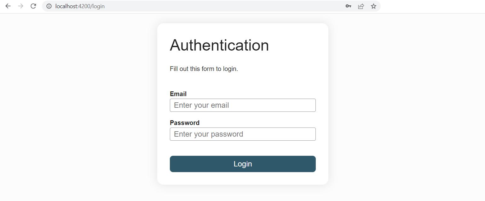
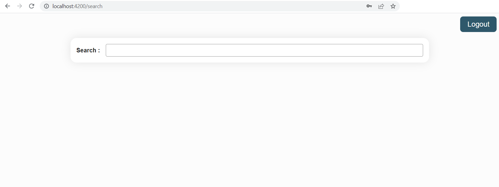
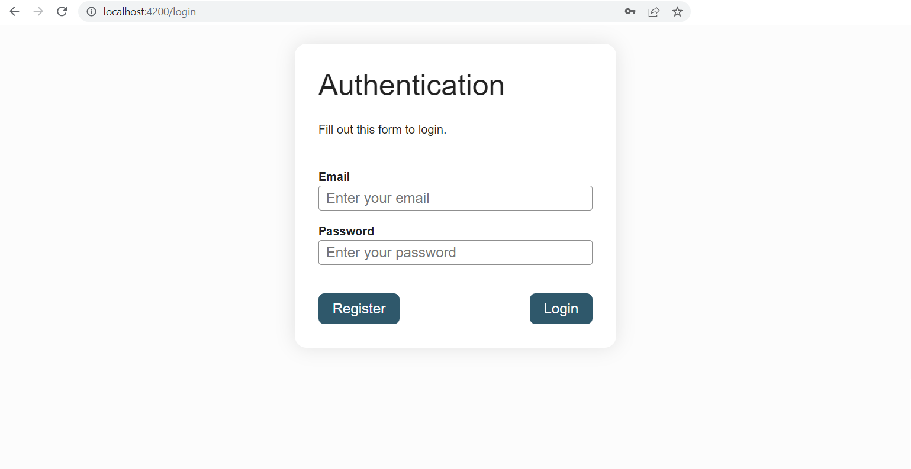

# Services

Along with components and directives, services are one of the main building blocks of an Angular application.

A component's only concern should be displaying data and not managing it. Services are where the Angular team advocates placing the business logic and data management of the application. Having a clear separation between the presentation layer and the other processings of the application increases reusability and modularity.

Creating a service with the CLI is done as follows:
```sh
ng generate service services/example
```

This will create the service and its associated test class in the `app/services` folder. It is a common practice to place services in a services folder, the CLI will create the folder if it doesn't already exists.

The following content is automatically generated in the `example.service.ts` file:
```ts
import { Injectable } from '@angular/core'

@Injectable({
  providedIn: 'root'
})
export class ExampleService {

}
```

When a component requires a service, the service should be added to its constructor in the following manner:

```ts{11}
import { Component } from '@angular/core'
import { ExampleService } from '@services/example.service'

@Component({
  selector: 'app-example',
  templateUrl: './example.component.html'
})
export class ExampleComponent {

  constructor(
    private exampleService: ExampleService
  ) {}
}
```

:::tip
Always declare a dependency to a service as private. Indeed the template should never directly access a service but always go through a property or a method exposed by the component class.
:::

## Dependency Injection

In the previous chapter, we've injected services provided by the `@angular/router` library in the components needing them. If you are familiar with Spring, you may not have thought much about it as it's one of the framework's mechanisms.

At bootstrap, Angular creates an application-wide injector. If other injectors are needed, Angular will create them along the way. The injector creates dependencies (most often in the form of services), and maintains a container of dependency instances that it reuses if possible. The injector gets the information about how to create or retrieve a dependency from a provider. A service usually acts as its own provider.

You may not have realised, but we have already used providers. In the pipe chapter, to use the `UpperCasePipe` in the component class instead of in the template, we added it to the providers array of the component.

When Angular discovers that a component depends on a service, it first checks if the injector has any existing instances of that service. If a requested service instance doesn't yet exist, the injector makes one using the registered provider, and adds it to the injector before returning the service to Angular. When all requested services have been resolved and returned, Angular can call the component's constructor with those services as arguments.

Dependencies can be provided at three levels:
- **root level:** this is the default behaviour when creating a service with the CLI. That is what `providedIn: 'root'` means. The *same instance* of the dependency is injected everywhere it is needed as if it were a singleton.
- **route level:** the dependency is added to the providers array of the `Route`. The route gets its own instance of the dependency
- **component level:** the dependency is added to the providers array of the component. Each instance of that component  gets its own instance of the dependency.

## Practical Work: State management
1. Generate an `AuthenticationService` with the CLI in the `app/services` folder
2. Move the `loggedIn` logic from the `AppComponent` to the service
3. Inject the service in the `LoginFormComponent` and use it.
4. Implement a logout method in the authentication service and add a logout button in the `AppComponent` that calls it and navigates back to the `LoginFormComponent`. Here is the html and css:

<CodeGroup>
<CodeGroupItem title="app.component.html">

```html
<button class="logout">Logout</button>
<router-outlet></router-outlet>
```
</CodeGroupItem>
<CodeGroupItem title="app.component.scss">

```scss
.logout {
  align-self: end;
}
```
</CodeGroupItem>
</CodeGroup>

5. Conditionally show the Logout button depending on the `loggedIn` status of the user. Use a getter in the `app.component.ts` file to pass data from the service to the template (it is good practive to always declare a service as private in the component class).
6. Use a navigation guard to redirect the user who wants to access the film search page to `/login` if they are not authenticated (make the CanActivate return true if the route can be accessed else return a `UrlTree` via the `createUrlTree` method of the `Router` service). To future-proof the guard, add a returnUrl as a queryParam to the returned `UrlTree` so that the `LoginFormComponent` knows where to navigate back to after authentication and modify the `LoginFormComponent` accordingly. To generate the navigation guard use the following CLI command:

```sh
ng generate guard guards/authentication
# ? Which interfaces would you like to implement? CanActivate
```

::: details Help for injecting services into the guard function
```ts
export const authenticationGuard: CanActivateFn = (route, state) => {
  const authenticationService = inject(AuthenticationService)
  // ...
}
```
:::

::: details Help for the UrlTree
```ts
inject(Router).createUrlTree(['/login'], { queryParams: { returnUrl: state.url }})
```
:::

::: details Expected result



:::

## The HttpClient

In a Single Page Application (SPA), communication with the server is done via asynchronous HTTP requests (AJAX) or more specialized protocols such as WebSocket. We will see how to make these network requests from an Angular application.

Angular provides a module, the `HttpClientModule`, to make HTTP calls. The module provides an injectable service, the `HttpClient`, to make GET, POST, PATCH, DELETE and PUT requests. To inject the `HttpClient` in a service, first add the `HttpClientModule` to the `AppModule`'s `imports` array.

Here are a few examples:

<CodeGroup>
<CodeGroupItem title="Service">

```ts
import { Injectable } from '@angular/core'
import { HttpClient } from '@angular/common/http'
import { Observable } from 'rxjs'
import { User } from '@models/user/user'
import { UserCreation } from '@models/user/user-creation'
import { UserEdition } from '@models/user/user-edition'

@Injectable({
  providedIn: 'root'
})
export class UserService {
  private baseUrl = 'api/backoffice/users'

  constructor(private httpClient: HttpClient) {}

  public create(user: UserCreation): Observable<User> {
    return this.httpClient.post<User>(this.baseUrl, user)
  }

  public update(ref: string, user: UserEdition): Observable<User> {
    return this.httpClient.put<User>(`${this.baseUrl}/${ref}`, user)
  }

  public getByUserReference(ref: string): Observable<User> {
    return this.httpClient.get<User>(`${this.baseUrl}/${ref}`)
  }
}
```
</CodeGroupItem>
<CodeGroupItem title="Component">

```ts
import { Component } from '@angular/core'
import { User } from '@models/user/user'
import { UserService } from '@services/user.service'

@Component({
  selector: 'app-user',
  templateUrl: './user.component.html'
})
export class UserComponent {
  user: User | undefined = undefined
  reference = ''

  constructor(private userService: UserService) {}

  getUser(): void {
    this.userService.getByUserReference(this.reference))
      .subscribe(user => this.user = user)
  }
}
```
</CodeGroupItem>
</CodeGroup>

The methods from the `HttpClient` service return Observables. They will be covered in the next chapter about the RxJS library. An Observable is only executed once subscribed to via the `subscribe` method. The subscribe method is expecting at least one callback. It is most often provided as an arrow function.

## Practical Work: Calling a backend

We will use an API (the *backend*) to authenticate users and search for films. This backend has already been developed and can be deployed locally using the following command line commands (clone in your usual repo folder):

```sh
git clone https://github.com/worldline/vuejs-training-backend.git
cd vuejs-training-backend
npm install
npm start
```

The `npm start` command will ask you for an API key. Either wait on the instructor to give it to you, alternatively, you can generate one [here](https://www.omdbapi.com/apikey.aspx?__EVENTTARGET=freeAcct&__EVENTARGUMENT=&__LASTFOCUS=&__VIEWSTATE=%2FwEPDwUKLTIwNDY4MTIzNQ9kFgYCAQ9kFgICBw8WAh4HVmlzaWJsZWhkAgIPFgIfAGhkAgMPFgIfAGhkGAEFHl9fQ29udHJvbHNSZXF1aXJlUG9zdEJhY2tLZXlfXxYDBQtwYXRyZW9uQWNjdAUIZnJlZUFjY3QFCGZyZWVBY2N0oCxKYG7xaZwy2ktIrVmWGdWzxj%2FDhHQaAqqFYTiRTDE%3D&__VIEWSTATEGENERATOR=5E550F58&__EVENTVALIDATION=%2FwEdAAU%2BO86JjTqdg0yhuGR2tBukmSzhXfnlWWVdWIamVouVTzfZJuQDpLVS6HZFWq5fYpioiDjxFjSdCQfbG0SWduXFd8BcWGH1ot0k0SO7CfuulHLL4j%2B3qCcW3ReXhfb4KKsSs3zlQ%2B48KY6Qzm7wzZbR&at=freeAcct&Email=)

::: tip
The backend interface contract is available here: [api-docs](http://localhost:3030/api-docs)
:::

1. Add to the `src` folder the `proxy.conf.json` file.

<CodeGroup>
<CodeGroupItem title="proxy.conf.json">

```json
{
  "/api/**": {
    "target": "http://localhost:3030",
    "changeOrigin": true,
    "pathRewrite": {
      "^/api": ""
    }
  }
}
```
</CodeGroupItem>
</CodeGroup>

The proxy will divert all calls for http://localhost:4200/api to the server running at http://localhost:3030. It also makes sure we don't encounter any CORS issues (in the case the backend is not hosted on your machine). This configuration is only for the webpack or vite dev server the CLI provides to run the application on your machine in a dev environment. It will not be the configuration used in production.

2. In the CLI configuration file - `angular.json` - add the `proxyConfig` option to the serve target:

```json{5,6,7}
...
"serve": {
  "builder": "@angular-devkit/build-angular:dev-server",
  ...
  "options": {
    "proxyConfig": "src/proxy.conf.json"
  },
  "defaultConfiguration": "development"
},
...
```

Restart the project as you have change the CLI config (`angular.json`).

3. Add `provideHttpClient()` to the `providers` array of the `appConfig` object in the `app.config.ts` file.

4. Create the interfaces/classes for the models used by the backend, add one file per model in the `models/authentication` folder:

<CodeGroup>
<CodeGroupItem title="registration-request.ts">

```ts
export class RegistrationRequest {
  constructor(
    public email: string,
    public password: string,
    public firstname: string,
    public lastname: string
  ) {}
}
```
</CodeGroupItem>
<CodeGroupItem title="login-request.ts">

```ts
export class LoginRequest {
  constructor(
    public email: string,
    public password: string
  ) {}
}
```
</CodeGroupItem>
<CodeGroupItem title="user-response.ts">

```ts
import { User } from './user'

export class UserResponse {
  constructor(
    public user: User,
    public token: string
  ) {}
}
```
</CodeGroupItem>
<CodeGroupItem title="user.ts">

```ts
/* eslint-disable @typescript-eslint/naming-convention */
export class User {
  constructor(
    public id: number,
    public firstname: string,
    public lastname: string,
    public email: string,
    public created_at: string,
    public update_at: string
  ) {}
}
```
</CodeGroupItem>
</CodeGroup>

Note the token in the `UserResponse`, it will serve to authenticate the user via the Authorization header: `Authorization: Bearer <token>`. Learn more about JWT [here](https://jwt.io/introduction).

5. Implement the `register` and `login` methods in the `AuthenticationService` as follows:

<CodeGroup>
<CodeGroupItem title="authentication.service.ts">

```ts
private baseUrl = 'api/user'

constructor(private httpClient: HttpClient) {}

login(loginRequest: LoginRequest): Observable<UserResponse> {
  return this.httpClient.post<UserResponse>(`${this.baseUrl}/login`, loginRequest)
}

register(loginRequest: LoginRequest): Observable<UserResponse> {
  const registrationRequest = new RegistrationRequest(
    loginRequest.email,
    loginRequest.password,
    'John',
    'Smith'
  )

  return this.httpClient.post<UserResponse>(`${this.baseUrl}/register`, registrationRequest)
}
```
</CodeGroupItem>
</CodeGroup>

6. The change in the call signature of the `login` method will require a bit of refactoring in the `LoginFormComponent`:

<CodeGroup>
<CodeGroupItem title="login-form.component.ts">

```ts
constructor(
  private router: Router,
  private activatedRoute: ActivatedRoute,
  private authenticationService: AuthenticationService
) {}

login(): void {
  this.authenticationService.login(this.loginRequest)
    .subscribe({ next: () => {
      const postLoginRoute = this.activatedRoute.snapshot.queryParamMap.get('returnUrl')
      this.router.navigateByUrl(postLoginRoute ? `/${postLoginRoute}` : '')
    } })
}

register(): void {
  this.authenticationService.register(this.loginRequest)
    .subscribe()
}

get loginRequest(): LoginRequest {
  return new LoginRequest(this.email, this.password)
}
```
</CodeGroupItem>
</CodeGroup>

7. Refactoring is also needed to keep the `authenticationGuard` working. Make the `loggedIn` boolean in the `AuthenticationService` depend on a `token` field and make the `LoginFormComponent` save the token that it gets from the login call in that field.
You will also need to refactor the logout to empty the `token`.

<CodeGroup>
<CodeGroupItem title="authentication.service.ts">

```ts
token: string | null = null

get loggedIn(): boolean {
  return this.token != null
}
```
</CodeGroupItem>

<CodeGroupItem title="login-form.component.ts">

```ts{3, 4}
login(): void {
  this.authenticationService.login(this.loginRequest)
    .subscribe({ next: response => {
      this.authenticationService.token = response.token
      const postLoginUrl = this.activatedRoute.snapshot.queryParamMap.get('returnUrl')
      this.router.navigateByUrl(postLoginUrl ? `/${postLoginUrl}` : '')
    } })
}
```
</CodeGroupItem>
</CodeGroup>

8. Add a register button next to the login button in the `LoginFormComponent`, give it the attribute `type="button"` so that Angular knows it is not this button that triggers the `ngSubmit` event on the form and make it call the register method.
You should now be able to register a user and login.
If you are having trouble, check the errors in the network tab of the developer tools (preview tab of the network call in error), your email or password may not comply with the policy.

<CodeGroup>
<CodeGroupItem title="HTML">

```html
<div class="button-container">
  <button type="button">Register</button>
  <button type="submit">Login</button>
</div>
```
</CodeGroupItem>
<CodeGroupItem title="SCSS">

```scss
.button-container {
  display: flex;
  justify-content: space-between;
}
```
</CodeGroupItem>
</CodeGroup>

9. It is time to handle errors. The subscribe method can be passed an object that takes three callbacks: a *next*, an *error* and a *complete* (we will look at this in more details in the next chapter). Declare an `errorMessage` field on the `LoginFormComponent` and update it with the error information retrieved from the argument of the `error` callback. Display the error message on the form. Check that the error message is actually shown when you login with incorrect credentials.

<CodeGroup>
<CodeGroupItem title="login-form.component.ts">

```ts
errorMessage = ''

private errorHandler(errorResponse: HttpErrorResponse): void {
  this.errorMessage = errorResponse.error.error ?? `${errorResponse.error.status} - ${errorResponse.error.statusText}`
}

// subscribe syntax
this.authenticationService.login(this.loginRequest)
  .subscribe({
    next: response => { /*  */},
    error: errorResponse => { /*  */ }
  })
```
</CodeGroupItem>
</CodeGroup>

::: tip hint
For a better UX (User eXperience), do not forget to clear the `errorMessage` field before launching a new login or registration request or as soon as a register or login succeeds.
:::

10. Let's now call the backend to get the list of films. The route is secured which means that passing the token in the header is necessary. Angular provides a mechanism - http interceptors - to systematically intercept http requests, allowing to define the headers in one place.

a. Use the CLI to generate one: `ng generate interceptor interceptors/authentication`.

b. Here is its implementation:

```ts
import { HttpInterceptorFn } from '@angular/common/http'
import { AuthenticationService } from '@services/authentication.service'
import { inject } from '@angular/core'

export const authenticationInterceptor: HttpInterceptorFn = (req, next) => {
  const token = inject(AuthenticationService).token
  if (token) {
    const cloned = req.clone({
      headers: req.headers.set('Authorization', `Bearer ${token}`)
    })

    return next(cloned)
  }

  return next(req)
}
```

If there is a token in the `AuthenticationService`, the interceptor will add it to the http request's headers.

c. Add the interceptor to the `HttpClient` provider in the `appConfig` object:

```ts
provideHttpClient(withInterceptors([authenticationInterceptor]))
```

11. Create a `FilmService` using the CLI and implement the call to the `api/movies/search` endpoint. Note that the `title` queryParam is not optional. To add query params to a request, use the `options` parameter of the get method.

```ts
const options = {
  params: new HttpParams().set('title', title)
}
```

12. Make changes to the `FilmSearchComponent` to call this new service with the title filled in by the user, save the response to the `films` field in the `FilmSearchComponent`.

13. Check that the token is sent as a HTTP header via the developer tools of your browser.

::: details Expected result



:::