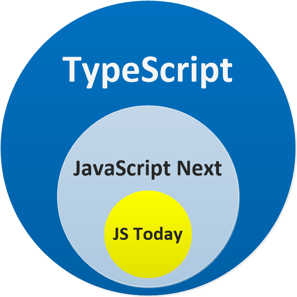

# TypeScript

TypeScript is a popular choice for programmers accustomed to other languages with static typing, such as Java. Angular, which is built entirely in TypeScript, not only supports it but treats it as its primary language.

TypeScript’s type system offers many of the same benefits as Java/C#'s, such as better code completion, earlier detection of errors, and clearer communication between parts of your program. While TypeScript provides many familiar features for OOP developers, it’s worth stepping back to see how JavaScript (and therefore TypeScript) differ from traditional OOP languages. Understanding these differences will help you write better JavaScript code, and avoid common pitfalls that programmers who go straight from C#/Java to TypeScript may fall in to.

## Rethinking Types

TypeScript’s understanding of a type is actually quite different from C# or Java’s. Let’s explore some differences.

### Nominal reified type systems: Java/C#

In Java or C#, any given value or object has one exact type - either null, a primitive, or a known class type. We can call methods like `value.GetType()` or `value.getClass()` to query the exact type at runtime. The definition of this type will reside in a class somewhere with some name, and we can’t use two classes with similar shapes in lieu of each other unless there’s an explicit inheritance relationship or commonly-implemented interface.

These aspects describe a *reified, nominal* type system. The types we write in the code are present at runtime, and the types are related via their declarations, not their structures.

### Structural type system: TypeScript

One of TypeScript’s core principles is that type checking focuses on the shape that values have. This is sometimes called “duck typing” or “structural typing”.

In a structural type system, if two objects have the same shape, they are considered to be of the same type. For example, if we construct an object that satisfies an interface, we can use that object where that interface is expected even though there was no declarative relationship between the two.

``` typescript
interface Point {
  x: number
  y: number
}

function logPoint(point: Point): void {
  console.log(`${point.x}, ${point.y}`)
}

// logs "12, 26"
const force = { x: 12, y: 26 }
logPoint(force)
```

The force variable is never declared to be a Point type. However, TypeScript compares the shape of force to the shape of Point in the type-check. They have the same shape, so the code passes.

TypeScript’s type system is also not *reified*: There’s nothing at runtime that will tell us that `force` is Point. In fact, the Point type is not present in any form at runtime.

The shape-matching only requires a subset of the object’s fields to match.

``` typescript
const point3 = { x: 12, y: 26, z: 89 }
logPoint(point3) // logs "12, 26"

const rect = { x: 33, y: 3, width: 30, height: 80 }
logPoint(rect) // logs "33, 3"

const color = { hex: '#187ABF' }
logPoint(color)
// Argument of type '{ hex: string; }' is not assignable to parameter of type 'Point'.
// Type '{ hex: string; }' is missing the following properties from type 'Point': x, y
```

There is no difference between how classes and objects conform to shapes:

```typescript
class VirtualPoint {
  x: number;
  y: number;

  constructor(x: number, y: number) {
    this.x = x;
    this.y = y;
  }
}

const newVPoint = new VirtualPoint(13, 56);
logPoint(newVPoint); // logs "13, 56"
```

If the object or class has all the required properties, TypeScript will say they match, regardless of the implementation details.

## Relationship to JavaScript

TypeScript stands in an unusual relationship to JavaScript. TypeScript offers all of JavaScript’s features, and an additional layer on top of these: TypeScript’s type system. This means that your existing working JavaScript code is also TypeScript code.



### Syntax

TypeScript is a language that is a superset of JavaScript: JS syntax is therefore legal TS. TypeScript doesn’t consider any JavaScript code to be an error because of its *syntax*. This means you can take any working JavaScript code and put it in a TypeScript file without worrying about exactly how it is written. However, if you move some code from a JavaScript file to a TypeScript file, you might see *type* errors depending on how the code is written.

### Runtime behavior

TypeScript is a programming language that preserves the runtime *behavior* of JavaScript. For example, dividing by zero in JavaScript produces `Infinity` instead of throwing a runtime exception. As a principle, TypeScript **never** changes the runtime behavior of JavaScript code and will also produce `Infinity`.

This means that if you move code from JavaScript to TypeScript, it is **guaranteed** to run the same way, even if TypeScript thinks that the code has type errors.

Keeping the same runtime behavior as JavaScript is a foundational promise of TypeScript because it means you can easily transition between the two languages without worrying about subtle differences that might make your program stop working.

### Erased Types

Roughly speaking, once TypeScript’s compiler is done with checking your code, it erases the types to produce the resulting “compiled” code. This means that once your code is compiled, the resulting plain JS code has no type information.

This also means that TypeScript never changes the behavior of your program based on the types it inferred. The bottom line is that while you might see type errors during compilation, the type system itself has no bearing on how your program works when it runs.

Finally, TypeScript doesn’t provide any additional runtime libraries. Your programs will use the same standard library (or external libraries) as JavaScript programs, so there’s no additional TypeScript-specific framework to learn.

## Playing around

::: tip
If you want to play around in TypeScript, you can either install it locally `npm install -g typescript`, put your code in a `.ts` file and run `tsc path/to/file.ts` to compile it or try directly online in a [playground](https://www.typescriptlang.org/play?#code)
:::

The following examples are available in this [playground](https://www.typescriptlang.org/play?strictFunctionTypes=false#code/PTAEEMCdPBPBYAUAGwKYBdTtQWwA6ozoCukqAzgFygB2xOARoQNoC6S2+h4JZ5oAXlDMATAAYANKACMADikiRU6SPaJOBIqQoA6PMXIALABRyAlEgDGAexrlraHcmsBzYxu68KZ0CFDOXflFJGXlQRWUlULUkP1Q6HCR4+lAAEQBLMkt0dNtQAG8kUFAAUXByTCEAIhKAQQBlABUqiSLQAHUKStAq9pKmlrb662J0Q0Ee+oB5AFVGgAlBxGKAOWtIMYmqlamAJQWlgF8rWwrQABNM1GzcmgmMrJzbHTKKk7sHVCdXY0vH258fgC-BqDWaSFiYBIeDQSDQmEspDINHQnR4hkI1GYFUg6RoLikCSYkCkD2uTxoakR0HiqNQ6MIE2YAHJyMQaDRYMyFFEyTdnsNRoYqadMOlyPV2ZyJtTkXSGZBmGJWIIBEJWVKuRDEH4AGbs-l3ciwFHgAAeSH1NENFwollxTDRY0IxgA7vTnZAsTi8QTaPRiaSrobWGZqAA3azpc4FNo2D6OALGAAGjQxoHdCtA4tAABJ8pnPUrWIcpK70ptwFhcJoeNpQNZdXmCx6MYrpCXkxZEMdEOc7Q7UE628ZZbTh4Ru-3yPb0o7Wy6-uSAdq-LUaLZYDgRvwrYb3md3agANbxc4TyBMllsjlcnlB-4CkZjVhSa-odY4O-hMJ8ik6QUXzUPxGlgAh6lnPAxRoXVCH4MYeCwdN0DA1AGybQs22zIIfXxQkA0IB9l1sFVdUgawcCQtD42wM10APTAj1PGhzkaGtPG0fghCYs8Lx0HBwDwN0F0vAQAD4MxE5gO27eN7ETH4eJYtiuC0PhATAAAZVwggicIABYYh1MApgYAArckGNAHBxXQGBkGofIl0Nag-1uKRyAIVBzmoIlCEOCZ8guYMKVckLbh0NYNkMDyvJ80B9IAVlAXs9wpW0Z0Hdo8XON0csc5zQrScLbFi1BvN8gjIEOMNQEjaNY2WUA5M+b43CqNM0PLFjQE88qYxzKpQAAagzHKdD67zu2KFqFLcVN026gb+BsGz8VAMiKKo5slp0QqIo-bT3UgABhcpUGMMxDi7JBe2nWdHRy4wbJxcBkG7JA8WwSBdXASw0OynrCia-bbDCx8aDaSb4r8yBbtXKFUI6HLAshYpgoh8HiMh4z0ehyrGEINHe0tA10vurKcvqOK8pY6hAfOWr6pjYGZtOVqkw6xaUeh7CehGsaWImuLu1Ssnbgyh6hxytzbFp+KGaZqMWbjdm5pTTrBeW5qKN9DbyMo50dvG0GaB0Q7rGOs7yAuq6bp7BHQBmGgJZQghyFJ610rwXEUQASVy6MCeJUAAB9ers30fFZnWEy+TmAE0RkvP3Uj5obRujUWkB9r6A9MMRpA0-wdJ6JPSFAVO+ekQuqhz330HzqpxBEKpi+BMvk8rtOcxbuvEFz-3cqCr9U+oRQAGZ9JEFLi5KaB1kdzSK24ZAsFQj3EDSiXB-QNi6OMKgI99v03vSFwaBwWlqCqNBdXQIbw6qXEXEMB+w56f6UUINvGuKPwdCAPhgPBu+90DGCqPMVAyBnBlnWMgc4LQeh3wft2XeYCIEAHFmTnDgFIAS2AkFVC-nZVAbdHapHpMgPW5ZNh0BgRAHq7J+y6jxBVUAKwoDkW6i4T2NpzjWGGFfMYvpjBmmoLhFwH9mGoFYTQKaBRfBgBtmhI2Bg0KNggKAdkrskZtlQG0dITYxGgAAIRqm0SxWRbDGaKL8DQLhltfRtDZnHNqECoEwOsFIDOoAzTm2sDMPAmhra22milYBaNKFn3WrQ8Y9C17gCYVYuR7CphQVuG9ZqhhwB4mcSgDAzUkTjnysjHq4cZGpPOAeDmPwxwogZntEqNBi7MBKLsXYKpTIWWyHzPA1hyDkDnMgWAoBmSVJscyHQNT1b1NRDlAA-E0iG7dS4TPkdU3GtRLAAEdiCZD1rg9AVZAHTMQHMhmgUMbYyxoaF45R0BlXYeICJ5y1bxzqcUhpizhb9Q0h3cQFCqE0IrPE4gDCkkxnWewlY4LqFGB1m9O0+T4Ra2pv1YOjIKkpJsTMj5bglrou8qABZCyxkbguDwKssAMDMlWYEWg1hKXHNADS+iWzdn7JPsyk5QDECErihMEQE88XuIFf1ElZLmQUqOdS2l9L+DCqQEAA)

## Type

### Common primitives
JavaScript has three very commonly used primitives: `string`, `number`, and `boolean`. Each has a corresponding type in TypeScript. As you might expect, these are the same names you’d see if you used the JavaScript `typeof` operator on a value of those types:

- `string` represents string values like `"Hello, world"`
- `number` is for numbers like `42`. JavaScript does not have a special runtime value for integers, so there’s no equivalent to int or float - everything is simply number
- `boolean` is for the two values `true` and `false`

``` typescript
let message: string
message = "hello!"

// TypeScript can infer types, here it infers from the context that it is a string
const obviousString = "hello!"
```

::: tip
TypeScript doesn’t use “types on the left”-style declarations like `int x = 0`. Type annotations will always go after the thing being typed.
:::

::: warning
The type names `String`, `Number`, and `Boolean` (starting with capital letters) are legal, but refer to some special built-in types that will very rarely appear in your code. *Always* use `string`, `number`, or `boolean` for types.
:::

### Basic types

- `any` an untyped value
- `object` a non-primitive value
- `undefinded` an uninitialized value
- `null` an explicitely empty value
- `void` represents the return value of functions which don’t return a value. It’s the inferred type any time a function doesn’t have any return statements, or doesn’t return any explicit value from those return statements
- `never` represents values which are *never* observed. In a return type, this means that the function throws an exception or terminates the execution of the program.
- `unknown` represents *any* value. This is similar to the `any` type, but is safer because it’s not legal to do anything with an unknown value
- `T[]` an array of type T, can also be written `Array<T>`
- `[T, U]` a tuple of type T and U
- `enum`

``` typescript
// array
let temperatures: number[]
temperatures = [20, 18, 22, 12]
temperatures.push(18)
console.log(temperatures) // logs [20, 18, 22, 12, 18]

// enum
enum Direction {
  East = "EAST",
  West = "WEST",
  South = "SOUTH",
  North = "NORTH",
}
const direction = Direction.East
console.log(direction) // logs "EAST"

// tuple
let currentWeather: [string, number, Direction]
currentWeather = ['sunny', 22, Direction.South]
const isSunny = currentWeather[0] === 'sunny'
```

::: warning
Enums are a feature added to JavaScript by TypeScript which allows for describing a value which could be one of a set of possible named constants. Unlike most TypeScript features, this is not a type-level addition to JavaScript but something added to the language and runtime. Because of this, it’s a feature which you should know exists, but maybe hold off on using unless you are sure. You can read more about enums in the [Enum reference page](https://www.typescriptlang.org/docs/handbook/enums.html).
:::

### const, let and var

Typescript allows to define two types of variables:

- Mutable variables which are declared using the `let` keyword. The legacy `var` keyword can also be used but is not recommended because of its way of handling scope can be misleading.
- Immutable variables or constants are declared with `const`. Please note that fields of constants can still be modified, constants just can't be reassigned.

```typescript
let x = 10;
var y = 200.0; // ! do not use var, use let instead

const t = [1, 2, 3];
t = ['a', 'b']; // ! error because it's a const
t.push(4); // ok

const meal = { name: "sandwich" }
const meal = { name: "soup" } // ! error
meal.name = "soup"; // ok
```

:::tip
Some programmers like to use `const` by default and then switch to `let` if necessary. This allows to have an optimized code by default and avoids modifying values by error.
:::

### Functions
Functions are the primary means of passing data around in JavaScript. TypeScript allows you to specify the types of both the input and output values of functions.

``` typescript
function describeWeather(weather: [string, number, Direction]): void {
  console.log(`The weather is ${weather[0]}, with a temperature of ${weather[1]}`)
}

describeWeather(currentWeather) //logs "The weather is sunny, with a temperature of 22"
describeWeather(direction) // Error
// Argument of type 'Direction' is not assignable to parameter of type '[string, number, Direction]'.
```

Anonymous functions are a little bit different from function declarations. When a function appears in a place where TypeScript can determine how it’s going to be called, the parameters of that function are automatically given types.

``` typescript
const weekendWeather = [['sunny', 22, Direction.South], ['stormy', 24, Direction.South]]
// TypeScript infers the type of weather is [string, number, Direction] from the context
const weekendTemperatures = weekendWeather.map(weather => weather[1])
console.log(weekendTemperatures) // Logs [22, 24]
```

### Object types
Apart from primitives, the most common sort of type you’ll encounter is an object type. This refers to any JavaScript value with properties, which is almost all of them! To define an object type, we simply list its properties and their types.

``` typescript
const mistral: {direction: Direction, speed: number} = {direction: Direction.North, speed: 45}
function describeWind(wind: {direction: Direction, speed: number}): void {
  console.log("The wind speed is " + wind.speed)
  console.log(`The wind is coming from the ${wind.direction.toLowerCase()}`)
}
describeWind(mistral)
```

To avoid repetition, object types can be named using either an interface

``` typescript
interface Wind {
  direction: Direction
  speed: number
}

function describeWindSpeed(wind: Wind): void {
  console.log("The wind speed is " + wind.speed)
}
```

or a type alias.
``` typescript
type Wind = {
  direction: Direction
  speed: number
}

function describeWindDirection(wind: Wind): void {
  console.log(`The wind is coming from the ${wind.direction.toLowerCase()}`)
}
```

Type aliases and interfaces are very similar, and in many cases you can choose between them freely. Almost all features of an interface are available with type aliases. The key distinction is that a type alias cannot be re-opened to add new properties while an interface is always extendable. We will favour Interfaces in the rest of the training.

### Union types
The first way to combine types you might see is a union type. A union type is a type formed from two or more other types, representing values that may be any one of those types. We refer to each of these types as the union’s members.

``` typescript
function printId(id: number | string) {
  console.log("Your ID is " + id)
}
printId(101) // logs "Your ID is 101"
printId("202") // logs "Your ID is 202"
printId({ myID: 22342 }) // Error
// Argument of type '{ myID: number; }' is not assignable to parameter of type 'string | number'.
// Type '{ myID: number; }' is not assignable to type 'number'.
```

### Literal types
In addition to the general types `string` and `number`, we can refer to *specific* strings and numbers in type positions. By combining literals into unions, you can express a useful concept - for example, functions that only accept a certain set of known values.

``` typescript
function printText(s: string, alignment: "left" | "right" | "center") {
  // ...
}
printText("Hello, world", "left")
printText("G'day, mate", "centre") // Error
// Argument of type '"centre"' is not assignable to parameter of type '"left" | "right" | "center"'.
```

## Dealing with null and undefined

How `null` and `undefined` behave depends on whether the `strictNullChecks` TypeScript compiler option is on or off

- `strictNullChecks` *off*

Values that might be `null` or `undefined` can still be accessed normally, and the values `null` and `undefined` can be assigned to a property of any type. This is similar to how languages without null checks (e.g. C#, Java) behave. The lack of checking for these values tends to be a major source of bugs; it is strongly recommanded to turn `strictNullChecks` on if it’s practical to do so in your codebase.

- `strictNullChecks` *on*

When a value is null or undefined, you will need to test for those values before using methods or properties on that value. Here are the various strategies available to you:

### Narrowing
``` typescript
function doSomething(x: string | undefined) { // see the use of a union type here
  if (x !== undefined) { // narrowing
    console.log("Hello, " + x.toUpperCase())
  }
}
```

### Optional chaining
At its core, optional chaining - the `?` operator - lets us write code where TypeScript can immediately stop running some expressions if we run into a `null` or `undefined`.
``` typescript
let currentWind: Wind | undefined
console.log(currentWind.direction) // [ERR] Object is possibly 'undefined'.
console.log(currentWind?.direction) // logs undefined
// Acquiring data ...
currentWind = { direction: Direction.East, speed: 20 }
console.log(currentWind?.speed) //logs 20
```

### Nullish coalescing
You can think of this feature - the `??` operator - as a way to “fall back” to a default value when dealing with null or undefined.
``` typescript
let windSpeed: number | undefined
console.log(windSpeed ?? 'no data yet') // logs no data yet
// Acquiring data ...
windSpeed = 23
console.log(windSpeed ?? 'no data yet') // logs 23
```

## Classes
TypeScript offers full support for the class keyword introduced in ES2015.

As with other JavaScript language features, TypeScript adds type annotations and other syntax to allow you to express relationships between classes and other types.

### Class members

```typescript
class Point {
  x: number
  y: number
  z = 0

  constructor(x: number, y: number = 0) {
    this.x = x
    this.y = y
  }

  scale(n: number): void {
    this.x = this.x * n
    this.y = this.y * n
  }
}

const pt = new Point(10)
console.log(pt.y) // logs 0
pt.x = 0
pt.y = 7
pt.y = "0" // Type 'string' is not assignable to type 'number'.
```

#### Fields

`x`, `y` and `z` are fields declarations, they create public writeable properties on the class. As with other locations, the type annotation is optional, but will be an implicit *any* if not specified. Fields can have *initilizers* like `z`. These will run automatically when the class is instantiated. Just like with `const`, `let`, and `var`, the initializer of a class property will be used to infer its type. Here this means that, even though it isn't explicitly written that `z` is of type `number`, the TypeScript compiler infers it from the fact that `0` was passed to `z`. Fields may be prefixed with the `readonly` modifier. This prevents assignments to the field outside of the constructor.

#### Constructors

Class constructors are very similar to functions. You can add parameters with type annotations, default values, and overloads. However they don't have return type annotations

#### Methods

A function property on a class is called a method. Methods can use all the same type annotations as functions and constructors. Note that inside a method body, it is still mandatory to access fields and other methods via `this`. An unqualified name in a method body will always refer to something in the enclosing scope

### Member visibility

You can use TypeScript to control whether certain methods or properties are visible to code outside the class.

There are 3 key words: `public`, `protected` and `private`.
- The default visibility of a class member is `public`. Public members can be accessed by anywhere. Because `public` is already the default visibility modifier, you don’t ever need to write it on a class member, but might choose to do so for style/readability reasons.
- `protected` members are only visible to subclasses of the class they’re declared in.
- `private` is like `protected`, but doesn’t allow access to the member even from subclasses

::: warning
Like other aspects of TypeScript’s type system, `private` and `protected` are only enforced during type checking. This means that JavaScript runtime constructs like in or simple property lookup can still access a `private` or `protected` member. If you need to protect values in your class from malicious actors, you should use mechanisms that offer hard runtime privacy, such as closures, weak maps, or private fields.
:::

### Class inheritance

Like other languages with object-oriented features, classes in JavaScript can inherit from base classes.

- `implements`: You can use an implements clause to check that a class satisfies a particular interface.
```typescript
interface Pingable {
  ping(): void
}

class Sonar implements Pingable {
  ping() {
    console.log("ping!")
  }
}

class Ball implements Pingable {
//Class 'Ball' incorrectly implements interface 'Pingable'.
//  Property 'ping' is missing in type 'Ball' but required in type 'Pingable'.
  pong() {
    console.log("pong!")
  }
}
```

- `extends`: Classes may extend from a base class. A derived class has all the properties and methods of its base class, and can also define additional members.
```typescript
class Animal {
  move() {
    console.log("Moving along!")
  }
}

class Dog extends Animal {
  woof(times: number) {
    for (let i = 0; i < times; i++) {
      console.log("woof!")
    }
  }
}

const d = new Dog()
d.move()// Base class method
d.woof(3) // Derived class method
```

## Modules
In TypeScript, just as in ECMAScript 2015 (ES6), any file containing a top-level import or export is considered a module.

Conversely, a file without any top-level import or export declarations is treated as a script whose contents are available in the global scope (and therefore to modules as well).

Modules are executed within their own scope, not in the global scope. This means that variables, functions, classes, etc. declared in a module are not visible outside the module unless they are explicitly exported using one of the export forms. Conversely, to consume a variable, function, class, interface, etc. exported from a different module, it has to be imported using one of the import forms.

A file can declare exports:
```typescript
// @filename: maths.ts
export var pi = 3.14
export let squareTwo = 1.41
export const phi = 1.61

export class RandomNumberGenerator {}

export function absolute(num: number) {
  return  num < 0 ? num * -1 : num
}
```
These can be used in another file via the import syntax:

```typescript
import { pi, phi, absolute } from "./maths.js"

console.log(pi)
const absPhi = absolute(phi)
```

## TypeScript and Angular

Like said before, TypeScript is Angular's primary language. Many of the language features seen above are fully leveraged by Angular. Let's take a look at a simple example of a component which is one of the main building blocks of an Angular app.

```typescript
import { Component, OnInit } from '@angular/core' //[3]

@Component({ //[2]
  selector:    'app-hero-list',
  templateUrl: './hero-list.component.html',
  styleUrls: ['./hero-list.component.scss']
})
export class HeroListComponent implements OnInit { //[1]
  heroes: Hero[]
  selectedHero: Hero
  constructor(private service: HeroService) { }

  ngOnInit() {
    this.heroes = this.service.getHeroes()
  }

  selectHero(hero: Hero) {
    this.selectedHero = hero
  }
}
```
### [1] Classes
The main building blocks of Angular (services, components, pipes, directives...) are classes. The constructor mainly serves dependency injection purposes. Here, we're seeing a syntax where the `service` argument is provided with a visibility modifier, it is a shorthand notation to declare a field on a class. The two following examples are stricly equivalent:
```typescript
class Cat {
  constructor(public name: string) {}
}
```
```typescript
class Cat {
  name: string
  constructor(name: string) {
    this.name = name
  }
}
```
The `HeroListComponent` implements the `ngOnInit()` method of the `OnInit` lifecycle hook.

### [2] Decorators
Decorators provide a way to add both annotations and a meta-programming syntax for class declarations and members. A Decorator is a special kind of declaration that can be attached to a class declaration, method, accessor, property, or parameter. Decorators use the form `@expression`, where `expression` must evaluate to a function that will be called at runtime with information about the decorated declaration. Angular makes extensive use of decorators: `@Component`, `@Directive`, `@Injectable`, `@Pipe`, `@Input`, `@Output`...

### [3] ES6 modules
ES6 modules are present in almost all, if not all, ts files of an Angular project. Angular adds its own module layer on top of those: NgModules. NgModules consolidate components, directives, and pipes into cohesive blocks of functionality, each focused on a feature area, application business domain, workflow, or common collection of utilities. We will see more about them later in the training.

## Sources

- [TypeScript Handbook](https://www.typescriptlang.org/docs/handbook/intro.html)
- [Angular documentation](https://angular.io/docs)

To go further you may be interested in these articles:
- [TypeScript 4.0 Cheat Sheet](https://www.sitepen.com/blog/typescript-cheat-sheet)
- [Variable declarations: var, let and const](https://www.typescriptlang.org/docs/handbook/variable-declarations.html)
- [TypeScript and ES2016 Decorators vs. Java Annotations](https://www.beyondjava.net/typescript-and-es2016-decorators-vs-java-annotations)
- [Exploring EcmaScript Decorators](https://medium.com/google-developers/exploring-es7-decorators-76ecb65fb841#.oug46ivhq)
